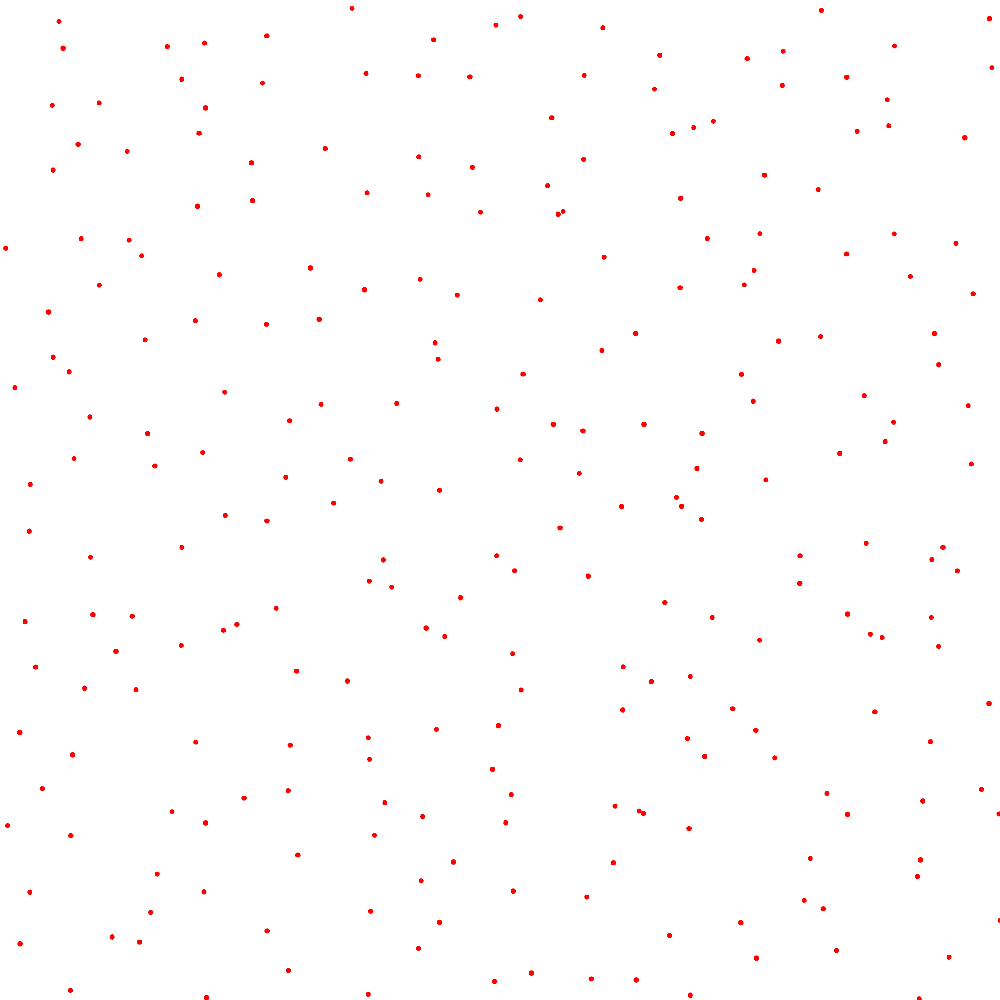
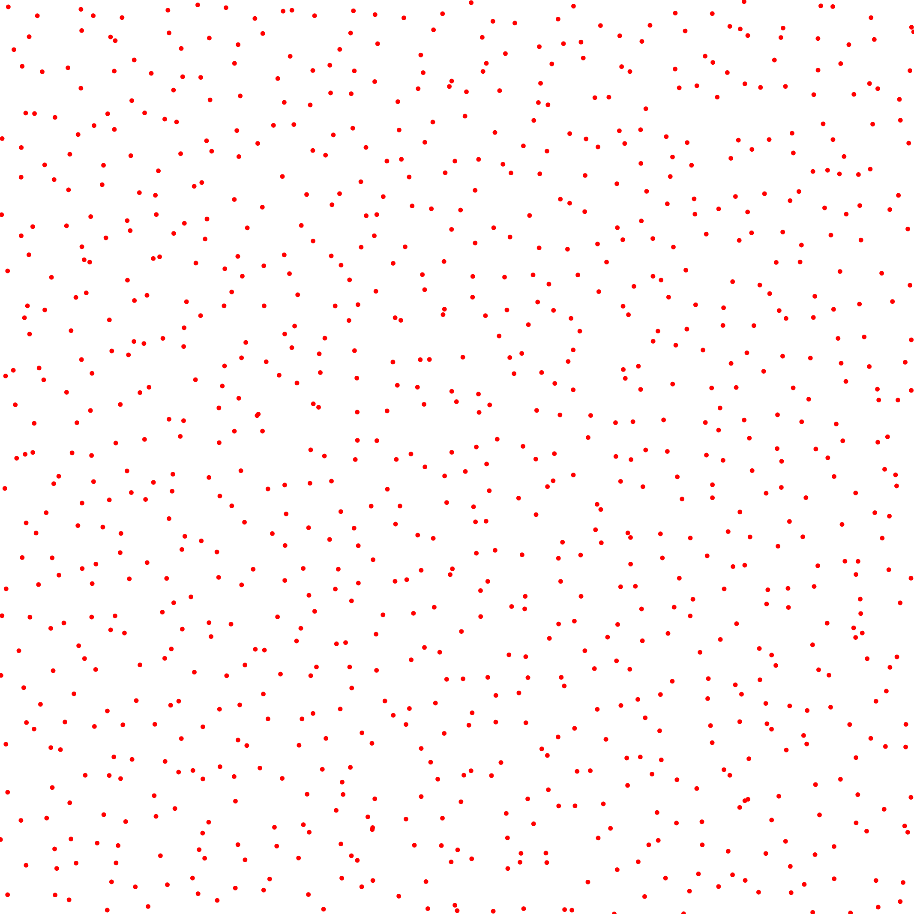
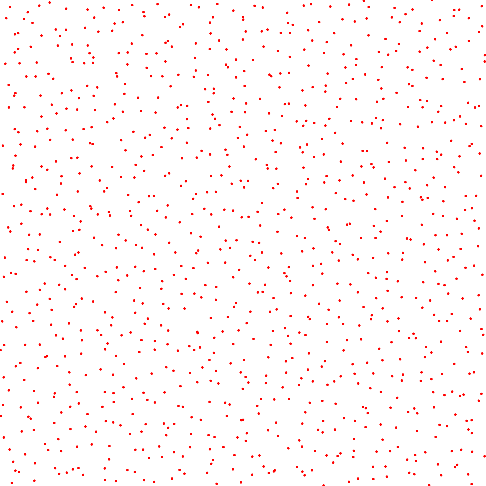
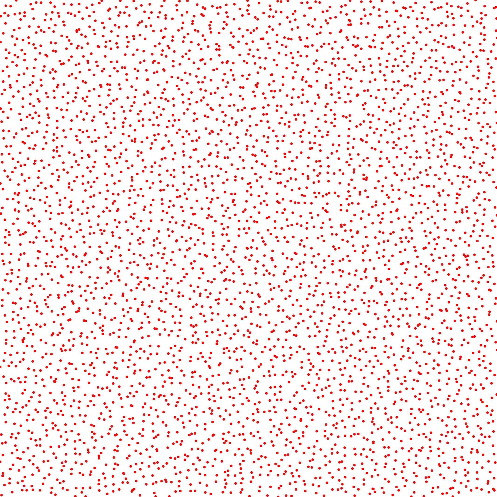
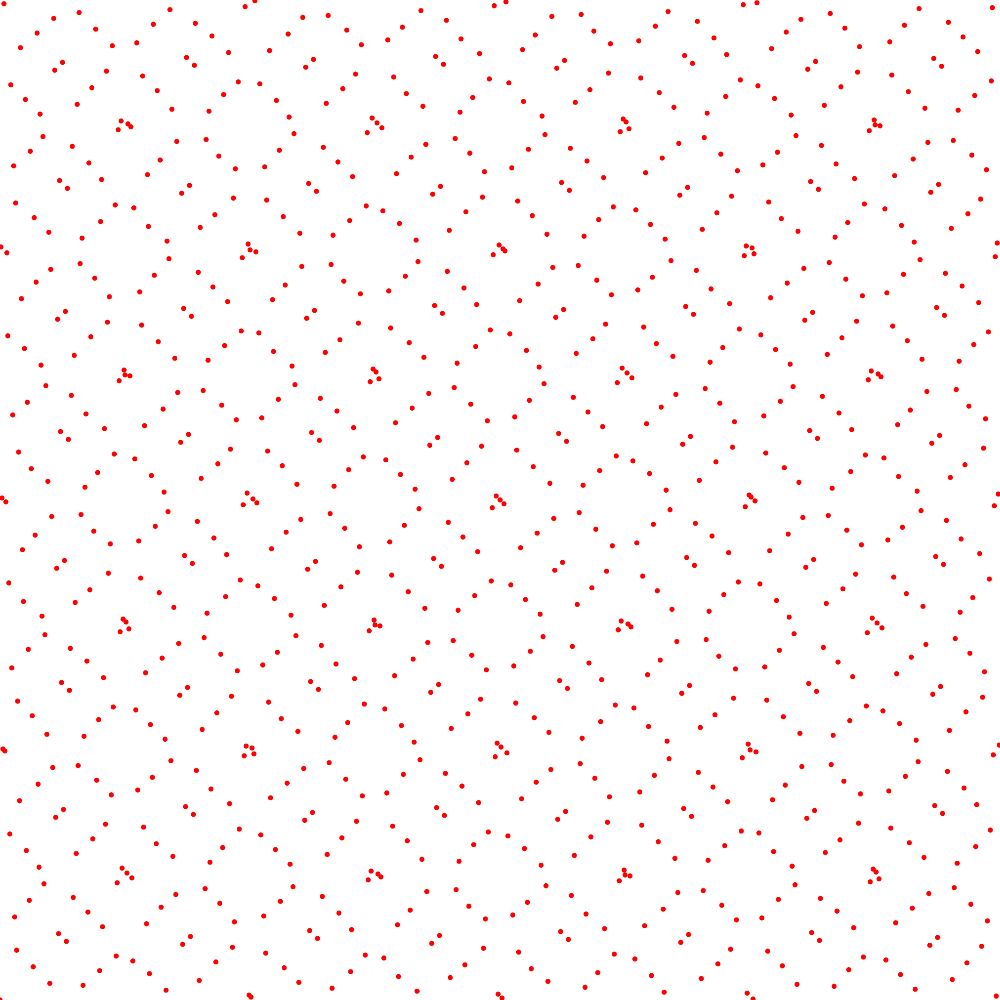
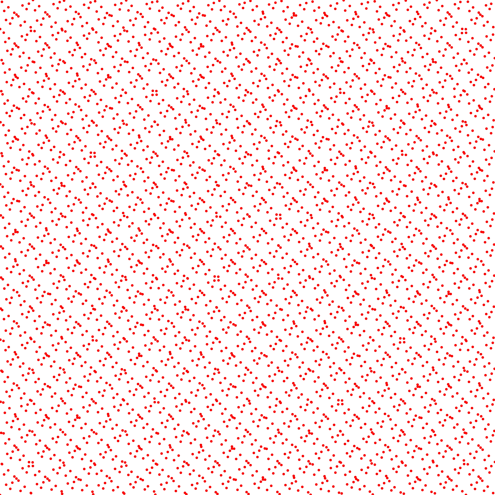

Boundaries Linf Discrepancy
---------------------------

<table class="files"><tbody><tr><td class="files" valign="middle">Files</td><td class="files" valign="middle">src/discrepancy/BoundariesStarDiscrepancy.hpp src/bin/discrepancy/BoundariesStarDiscrepancy_2dd.cpp</td></tr></tbody></table>

Description
===========

Code from [\[Thi01\]](https://www.sciencedirect.com/science/article/pii/S0885064X01906004). This tool approximates upper and lower boundaries on the Linf discrepancy. As those approximations can be computed faster than the true value, it allows to approximate the Linf discrepancy of higher dimensional point sets.

Execution
=========

Parameters:  

	\[HELP\]
	-h \[string\]		Displays this help message
	-i \[string\]		The input pointsets
	-o \[string\]		The output discrepancies
	-s \[uint\]		The number of samples to read (if computing from a sequence)
	--silent 		Silent mode
	--brute 		Output brute values instead of computing the statistics
	--epsilon \[double\]	Sets the epsilon to use for the boundary computation. Must be in \[0, 1\]
	--epsilon-auto 		Automatically sets the epsilon as log(N)^(d-1)/N
			

To evaluate the discrepancy of an input 2D point set, one can use the following client line command:

 ./bin/discrepancy/BoundariesStarDiscrepancy\_fromfile\_2dd --epsilon 0.01 -i toto.dat 

Or one can use the following C++ code:

    
    BoundariesStarDiscrepancy discrepancy_test;
    DiscrepancyStatistics statsBoundMin;
    DiscrepancyStatistics statsBoundMax;
    Pointset< D, double, Point > pts;
    //We assume pts is filled
    statsBoundMin.nbpts = pts.size();
    
    
    //Can be done several times if we need to average over
    //several stochastic pointsets
    std::array discrepancy;
    disc.compute< D, double, Point >(pts, param_epsilon, discrepancy)
    statsBoundMin.addValue(discrepancy[0]);
    statsBoundMax.addValue(discrepancy[1]);
    
    statsBoundMin.computeStatistics();
    std::cout << statsBoundMin << std::endl;
    statsBoundMax.computeStatistics();
    std::cout << statsBoundMax << std::endl;
    			

Results
=======

Illustration graph with the Whitenoise and the Halton sampler.

Stochastic sampler

./bin/discrepancy/BoundariesStarDiscrepancy\_fromfile\_2dd --epsilon 0.01 -i stratified\_256.dat
#Nbpts 	Epsilon	MinBoundMin	MaxBoundMax	Iter
256 	0.01 	0.027214 	0.0516146 	10 

   ...

./bin/discrepancy/BoundariesStarDiscrepancy\_fromfile\_2dd --epsilon 0.01 -i stratified\_1024.dat
#Nbpts	Epsilon	MinBoundMin	MaxBoundMax	Iter
1024	0.01	0.0107846	0.0238923	10 

   ...

./bin/discrepancy/BoundariesStarDiscrepancy\_fromfile\_2dd --epsilon 0.01 -i stratified\_4096.dat
#Nbpts 	Epsilon	MinBoundMin	MaxBoundMax	Iter
4096	0.01	0.00359415	0.0142907	10 

   ...

Deterministic sampler

./bin/discrepancy/BoundariesStarDiscrepancy\_fromfile\_2dd --epsilon 0.01 -i sobol\_1024.dat
#Nbpts 	Epsilon	MinBoundMin	MaxBoundMax	Iter
1024	0.01	0.00356102	0.0133135	1 

./bin/discrepancy/BoundariesStarDiscrepancy\_fromfile\_2dd --epsilon 0.01 -i sobol\_4096.dat
#Nbpts 	Epsilon	MinBoundMin	MaxBoundMax	Iter
4096	0.01	0.00103152	0.0110033	1 

Changing the Epsilon

./bin/discrepancy/BoundariesStarDiscrepancy\_fromfile\_2dd --epsilon 0.1 -i sobol\_4096.dat
#Nbpts	Epsilon	MinBoundMin	MaxBoundMax	Iter
4096	0.1	0.000883877	0.100749	1 

./bin/discrepancy/BoundariesStarDiscrepancy\_fromfile\_2dd --epsilon 0.005 -i sobol\_4096.dat
#Nbpts	Epsilon	MinBoundMin	MaxBoundMax	Iter
4096	0.005	0.00124788	0.0059875	1 

