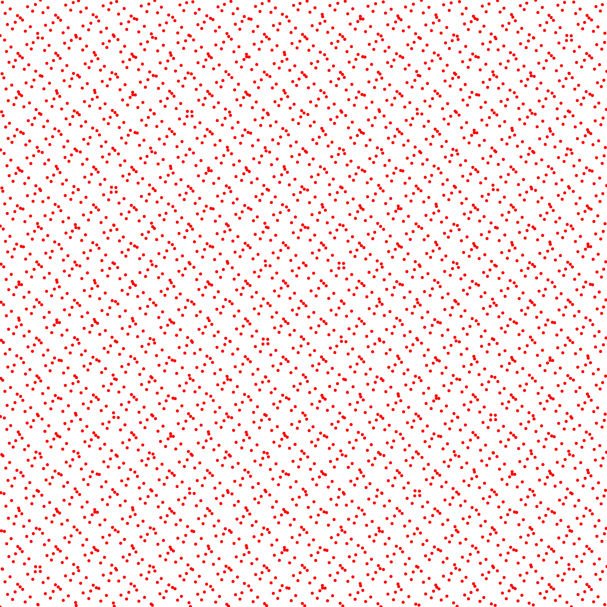

# Diaphony

## Files

    src/discrepancy/Diaphony.hpp
    src/bin/discrepancy/Diaphony_2dd.cpp
    src/bin/discrepancy/Diaphony_3dd.cpp
    src/bin/discrepancy/Diaphony_4dd.cpp

## Description

Diaphony is a metric of point set uniformity closely related to discrepancy.
This tool computes the diaphony in s(N^2) time, with N points in dimension s.

from
ZINTERHOF, P. 1976. Uber einige Absch~itzungen bei der Approximation von Funktionen mit Gleichverteilungsmethoden. Sitzungsber. Osterr. Akad. Wiss. Math.-Natur. K1. H 185, 121-132.

## License

BSD, see `Diaphony.hpp`

## Execution

```
Parameters:  

	[HELP]
	-h [string]		Displays this help message
	-i [string]		The input pointsets
	-o [string]		The output discrepancies
	-s [uint]		The number of samples to read (if computing from a sequence)
	--silent 		Silent mode
	--brute 		Output brute values instead of computing the statistics
```			

To evaluate the diaphony of an input 2D point set, one can use the following client line command:

      ./bin/discrepancy/Diaphony_fromfile_2dd -i toto.dat

Or one can use the following C++ code:

```cpp    
    Diaphony.hpp test;
    DiscrepancyStatistics stats;
    Pointset< D, double, Point > pts;
    //We assume pts is filled
    stats.nbpts = pts.size();

    //Can be done several times if we need to average over
    //several stochastic pointsets
    double diaphony = 0;
    test.compute< D, double, Point >(pts, diaphony)
    stats.addValue(diaphony);

    stats.computeStatistics();
    std::cout << stats << std::endl;
```    			

## Results

Stochastic sampler

```    			
./bin/discrepancy/Diaphony_fromfile_2dd -i stratified_1024.dat
#Nbpts		#Mean		#Var		#Min		#Max		#NbPtsets
1024.00000		0.00977		0.00000		0.00953		0.01014		10.00000
```    			

 [](data/diaphony/stratified_1024_3.png) ...

```    			
./bin/discrepancy/Diaphony_fromfile_2dd -i stratified_4096.dat
#Nbpts		#Mean		#Var		#Min		#Max		#NbPtsets
4096.00000		0.00347		0.00000		0.00342		0.00350		10.00000
```    			

[](data/diaphony/stratified_4096_3.png) ...

Deterministic sampler

```    			
./bin/discrepancy/Diaphony_fromfile_2dd -i sobol_1024.dat
#Nbpts		#Mean		#Var		#Min		#Max		#NbPtsets
1024.00000		0.00516		0.00000		0.00516		0.00516		1.00000
```    			

[](data/diaphony/sobol_1024.png)

```    			
./bin/discrepancy/Diaphony_fromfile_2dd -i sobol_4096.dat
#Nbpts		#Mean		#Var		#Min		#Max		#NbPtsets
4096.00000		0.00151		0.00000		0.00151		0.00151		1.00000
```    			

[](data/diaphony/sobol_4096.png)
