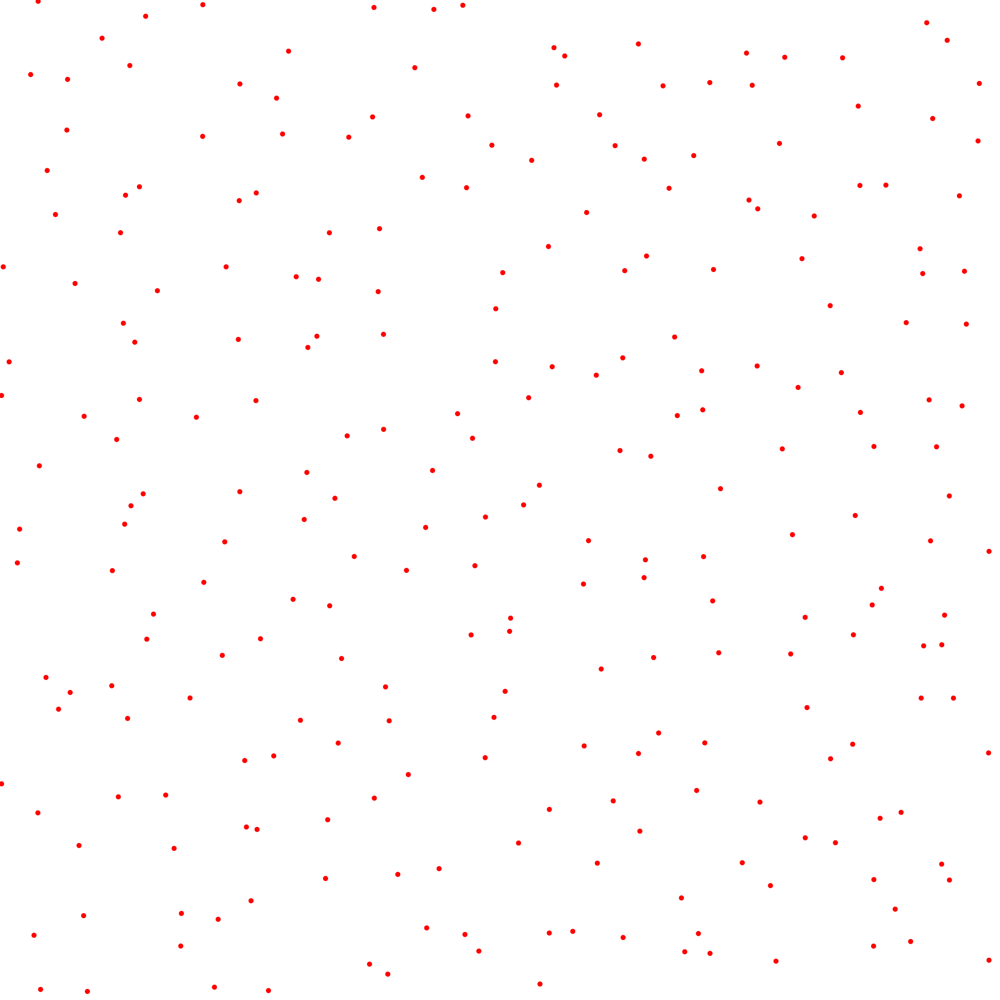
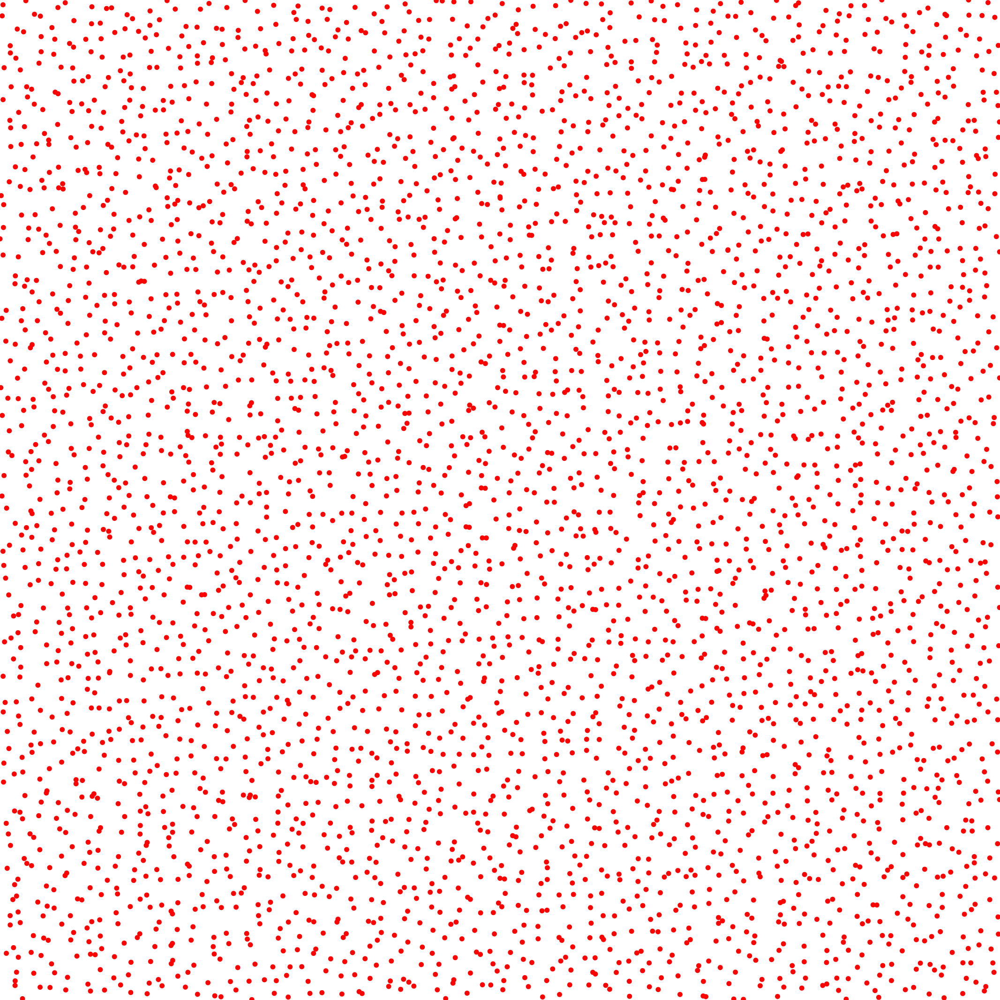
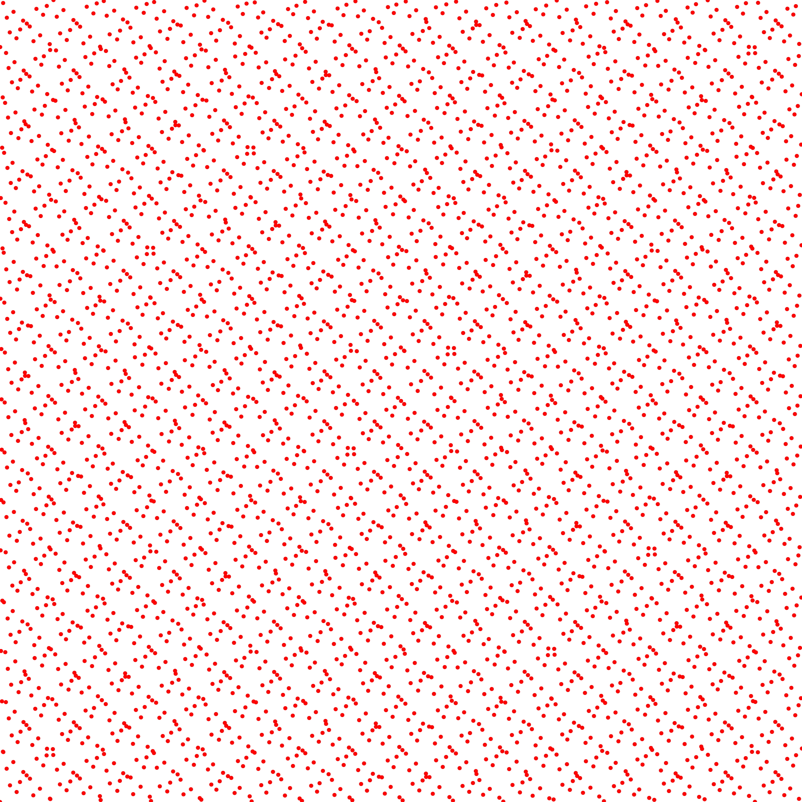

# Generalized L2 Discrepancy


## Files

    src/discrepancy/GeneralizedL2Discrepancy.hpp
    src/bin/discrepancy/GeneralizedL2Discrepancy_2dd.cpp

## Description

This tool computes the Generalized L2 discrepancy of an input pointset using the following formula  
[](data/generalized_l2_disc/discrepancy_generalized.png)  
from [\[Hic98\]](http://www.ams.org/journals/mcom/1998-67-221/S0025-5718-98-00894-1/S0025-5718-98-00894-1.pdf).

## License

BSD, see `GeneralizedL2Discrepancy.hpp`

## Execution

```
Parameters:  

	\[HELP\]
	-h \[string\]		Displays this help message
	-i \[string\]		The input pointsets
	-o \[string\]		The output discrepancies
	-s \[uint\]		The number of samples to read (if computing from a sequence)
	--silent 		Silent mode
	--brute 		Output brute values instead of computing the statistics
	--log 	Computes the discrepancy in log values
```			

To evaluate the discrepancy of an input 2D point set, one can use the following client line command:

      ./bin/discrepancy/GeneralizedL2Discrepancy\_fromfile\_2dd -i toto.dat

Or one can use the following C++ code:

```cpp    
    GeneralizedL2Discrepancy.hpp discrepancy_test;
    DiscrepancyStatistics stats;
    Pointset< D, double, Point > pts;
    //We assume pts is filled
    stats.nbpts = pts.size();

    //Can be done several times if we need to average over
    //several stochastic pointsets
    double discrepancy = 0;
    discrepancy_test.compute< D, double, Point >(pts, discrepancy)
    stats.addValue(discrepancy);

    stats.computeStatistics();
    std::cout << stats << std::endl;
```    			

## Results

Stochastic sampler

```
./bin/discrepancy/GeneralizedL2Discrepancy\_fromfile\_2dd -i stratified\_256.dat
#Nbpts		#Mean		#Var		#Min		#Max		#NbPtsets
256		0.0105272		5.96467e-07		0.00951201		0.0116941		10
```
[](data/generalized_l2_disc/stratified_256_1.png) [](data/generalized_l2_disc/stratified_256_2.png) [](data/generalized_l2_disc/stratified_256_3.png) ...

```
./bin/discrepancy/GeneralizedL2Discrepancy\_fromfile\_2dd -i stratified\_1024.dat
#Nbpts		#Mean		#Var		#Min		#Max		#NbPtsets
1024		0.00391803		5.39822e-08		0.00361717		0.00435023		10
```
[](data/generalized_l2_disc/stratified_1024_1.png) [](data/generalized_l2_disc/stratified_1024_2.png) [](data/generalized_l2_disc/stratified_1024_3.png) ...

```
./bin/discrepancy/GeneralizedL2Discrepancy\_fromfile\_2dd -i stratified\_4096.dat
#Nbpts		#Mean		#Var		#Min		#Max		#NbPtsets
4096		0.00139183		2.0377e-09		0.00129969		0.00146937		10
```
[](data/generalized_l2_disc/stratified_4096_1.png) [](data/generalized_l2_disc/stratified_4096_2.png) [](data/generalized_l2_disc/stratified_4096_3.png) ...

Deterministic sampler

```
./bin/discrepancy/GeneralizedL2Discrepancy\_fromfile\_2dd -i sobol\_1024.dat
#Nbpts		#Mean		#Var		#Min		#Max		#NbPtsets
1024		0.00117859		0		0.00117859		0.00117859		1
```
[](data/generalized_l2_disc/sobol_1024.png)

```
./bin/discrepancy/GeneralizedL2Discrepancy\_fromfile\_2dd -i sobol\_4096.dat
#Nbpts		#Mean		#Var		#Min		#Max		#NbPtsets
4096		0.000307601		0		0.000307601		0.000307601		1
```
[](data/generalized_l2_disc/sobol_4096.png)
