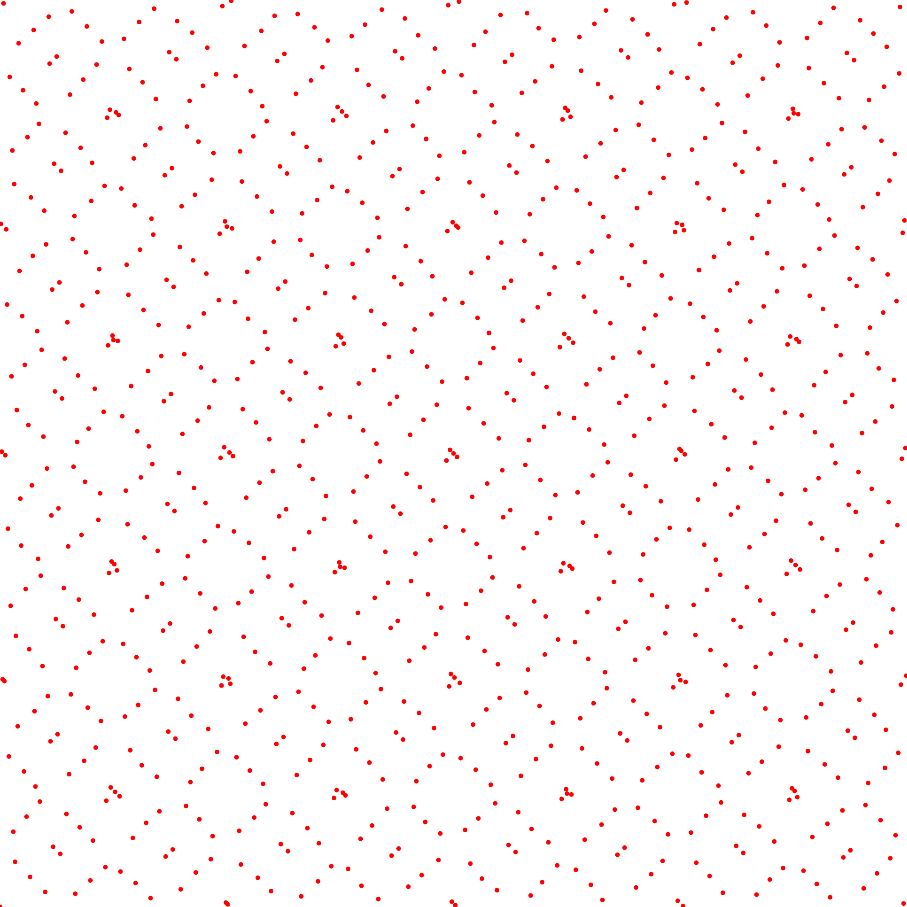
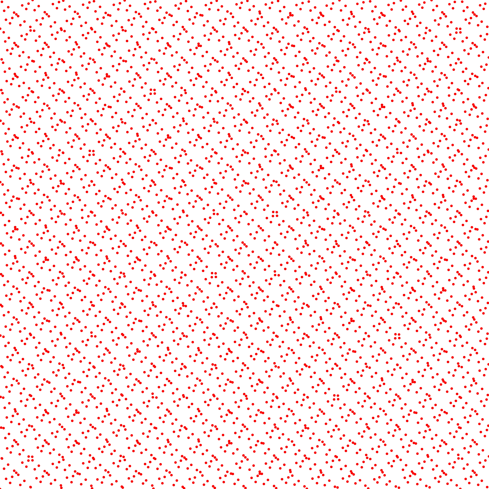

L2 Discrepancy
--------------

<table class="files"><tbody><tr><td class="files" valign="middle">Files</td><td class="files" valign="middle">src/discrepancy/L2Discrepancy.hpp.hpp src/bin/discrepancy/L2Discrepancy_2dd.cpp.cpp</td></tr></tbody></table>

Description
===========

This tool computes the L2 discrepancy of an input pointset using the following formula  
  
from [\[Hic98\]](http://www.ams.org/journals/mcom/1998-67-221/S0025-5718-98-00894-1/S0025-5718-98-00894-1.pdf).

Execution
=========

Parameters:  

	\[HELP\]
	-h \[string\]		Displays this help message
	-i \[string\]		The input pointsets
	-o \[string\]		The output discrepancies
	-s \[uint\]		The number of samples to read (if computing from a sequence)
	--silent 		Silent mode
	--brute 		Output brute values instead of computing the statistics
			

To evaluate the discrepancy of an input 2D point set, one can use the following client line command:

 ./bin/discrepancy/L2Discrepancy\_fromfile\_2dd -i toto.dat 

Or one can use the following C++ code:

    
    L2Discrepancy.hpp discrepancy_test;
    DiscrepancyStatistics stats;
    Pointset< D, double, Point > pts;
    //We assume pts is filled
    stats.nbpts = pts.size();
    
    //Can be done several times if we need to average over
    //several stochastic pointsets
    double discrepancy = 0;
    discrepancy_test.compute< D, double, Point >(pts, discrepancy)
    stats.addValue(discrepancy);
    
    stats.computeStatistics();
    std::cout << stats << std::endl;
    			

Results
=======

Stochastic sampler

./bin/discrepancy/L2Discrepancy\_fromfile\_2dd -i stratified\_256.dat
#Nbpts		#Mean		#Var		#Min		#Max		#NbPtsets
256		0.00633396		1.03228e-07		0.0058098		0.00677085		10 

   ...

./bin/discrepancy/L2Discrepancy\_fromfile\_2dd -i stratified\_1024.dat
#Nbpts		#Mean		#Var		#Min		#Max		#NbPtsets
1024		0.00225664		4.18443e-09		0.00213154		0.00233792		10 

   ...

./bin/discrepancy/L2Discrepancy\_fromfile\_2dd -i stratified\_4096.dat
#Nbpts		#Mean		#Var		#Min		#Max		#NbPtsets
4096		0.00081179		1.4945e-09		0.000766782		0.000901231		10 

   ...

Deterministic sampler

./bin/discrepancy/L2Discrepancy\_fromfile\_2dd -i sobol\_1024.dat
#Nbpts		#Mean		#Var		#Min		#Max		#NbPtsets
1024		0.000867928		0		0.000867928		0.000867928		1 

./bin/discrepancy/L2Discrepancy\_fromfile\_2dd -i sobol\_4096.dat
#Nbpts		#Mean		#Var		#Min		#Max		#NbPtsets
4096		0.000234269		0		0.000234269		0.000234269		1 

