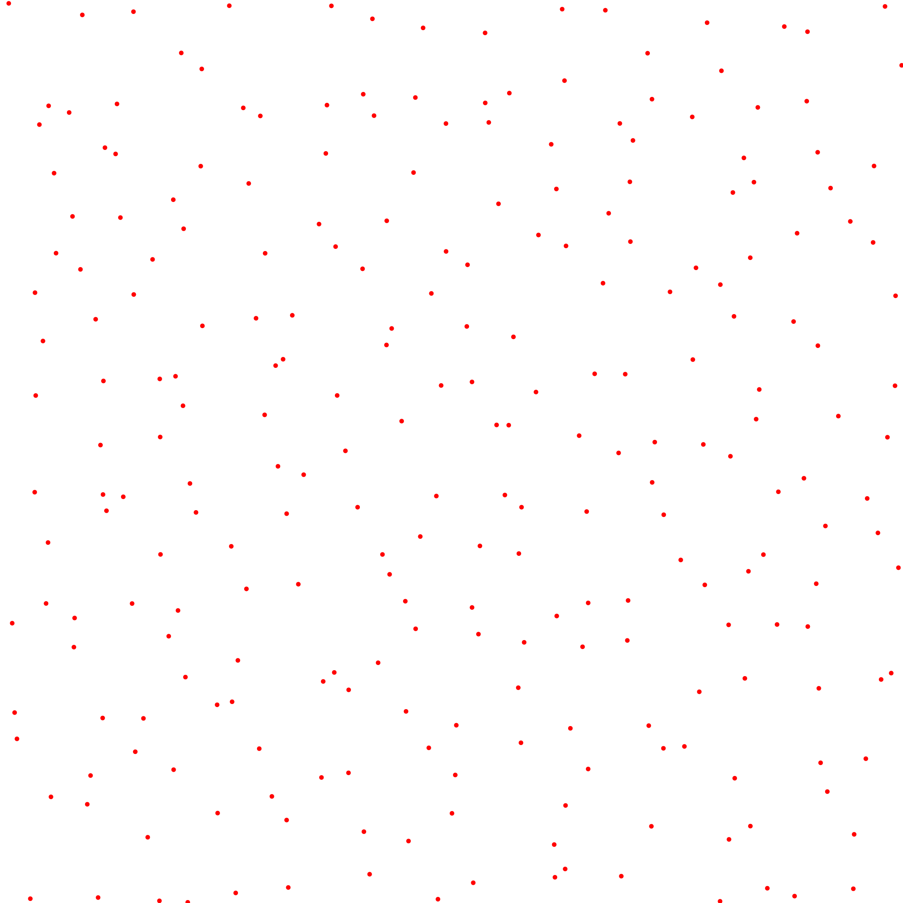
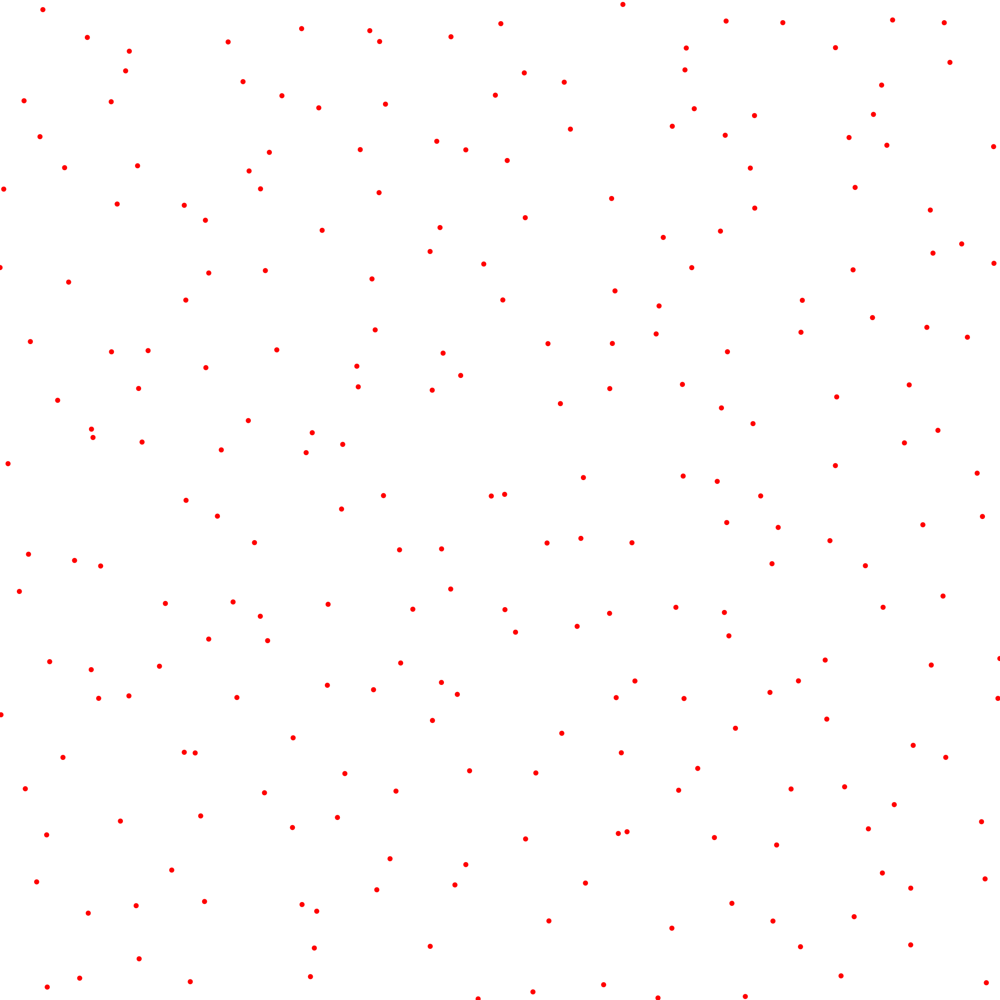
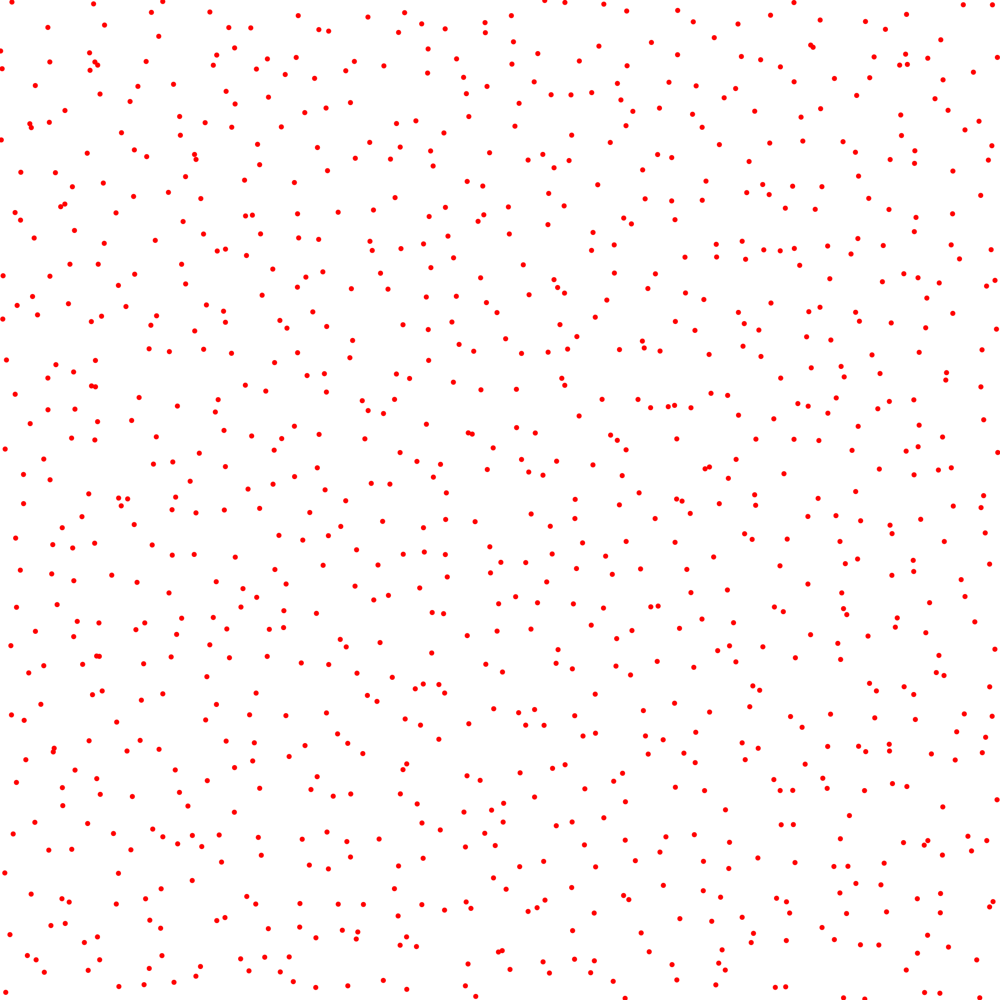
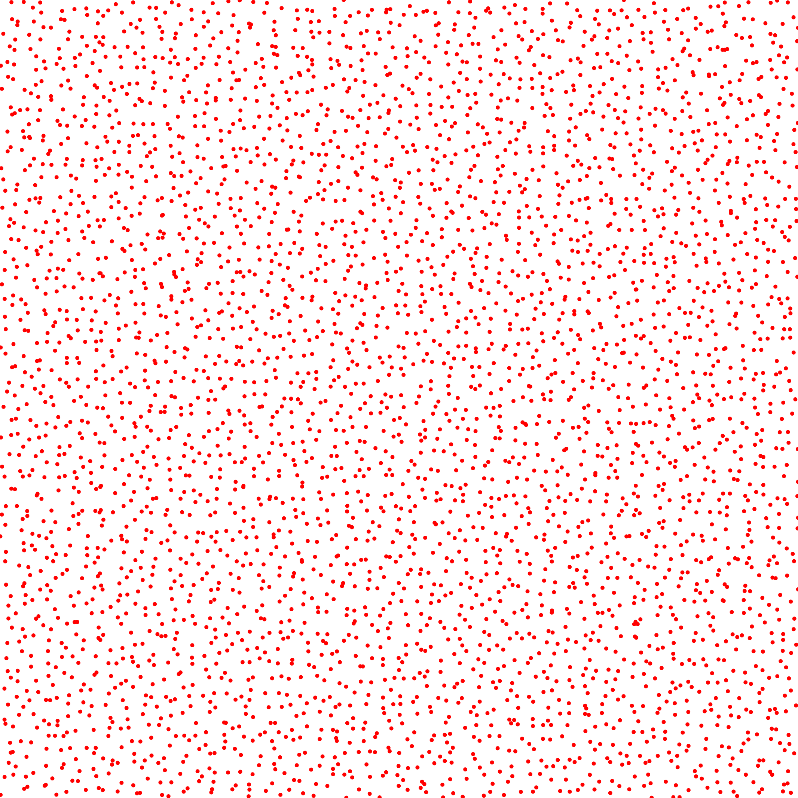
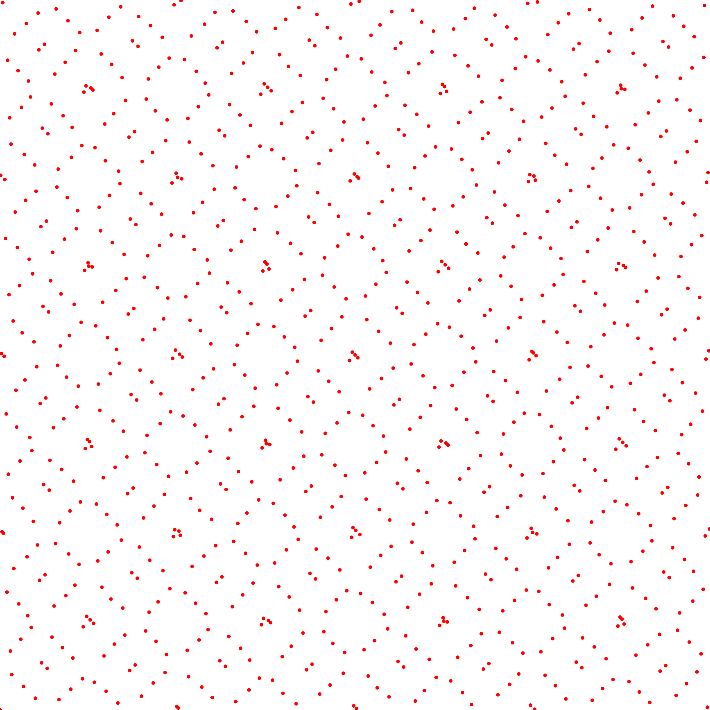

# Star Discrepancy

## Files

    src/discrepancy/StarDiscrepancy.hpp  
    src/bin/discrepancy/StarDiscrepancy_2dd.cpp

## Description

This tool computes the Star/Linf discrepancy of an input pointset using an $O(n^2)$ algorithm which returns the exact Linf discrepancy value.

## Execution

Parameters:  
```
	[HELP]
	-h [string]		Displays this help message
	-i [string]		The input pointsets
	-o [string]		The output discrepancies
	-s [uint]		The number of samples to read (if computing from a sequence)
	--silent 		Silent mode
	--brute 		Output brute values instead of computing the statistics		
```

To evaluate the discrepancy of an input 2D point set, one can use the following client line command:

     ./bin/discrepancy/StarDiscrepancy_fromfile_2dd -i toto.dat

Or one can use the following C++ code:

``` cpp   
    StarDiscrepancy.hpp discrepancy_test;
    DiscrepancyStatistics stats;
    Pointset< D, double, Point > pts;
    //We assume pts is filled
    stats.nbpts = pts.size();

    //Can be done several times if we need to average over
    //several stochastic pointsets
    double discrepancy = 0;
    discrepancy_test.compute< D, double, Point >(pts, discrepancy)
    stats.addValue(discrepancy);

    stats.computeStatistics();
    std::cout << stats << std::endl;
```    			

## License

BSD, see `StarDiscrepancy.hpp`

## Results

Stochastic sampler

```
./bin/discrepancy/StarDiscrepancy_fromfile_2dd -i stratified_256.dat
#Nbpts		#Mean		#Var		#Min		#Max		#NbPtsets
256		0.032341	7.52055e-06	0.0297618	0.0390747	10
```

[](data/star_disc/stratified_256_1.png) [](data/star_disc/stratified_256_2.png) [](data/star_disc/stratified_256_3.png) ...

```
./bin/discrepancy/StarDiscrepancy_fromfile_2dd -i stratified_1024.dat
#Nbpts		#Mean		#Var		#Min		#Max		#NbPtsets
1024		0.01356		3.72309e-07	0.0124115	0.0143659	10
```

[](data/star_disc/stratified_1024_1.png) [](data/star_disc/stratified_1024_2.png) [](data/star_disc/stratified_1024_3.png) ...

```
./bin/discrepancy/StarDiscrepancy_fromfile_2dd -i stratified_4096.dat
#Nbpts		#Mean		#Var		#Min		#Max		#NbPtsets
4096		0.00513415	2.27188e-07	0.00441079	0.00569296	10
```

[](data/star_disc/stratified_4096_1.png) [](data/star_disc/stratified_4096_2.png) [](data/star_disc/stratified_4096_3.png) ...

Deterministic sampler

```
./bin/discrepancy/StarDiscrepancy_fromfile_2dd -i sobol_1024.dat
#Nbpts		#Mean		#Var		#Min		#Max		#NbPtsets
1024		0.00429916	0		0.00429916	0.00429916	1
```

[](data/star_disc/sobol_1024.png)

```
./bin/discrepancy/StarDiscrepancy_fromfile_2dd -i sobol_4096.dat
#Nbpts		#Mean		#Var		#Min		#Max		#NbPtsets
4096		0.00132918	0		0.00132918	0.00132918	1
```

[](data/star_disc/sobol_4096.png)
