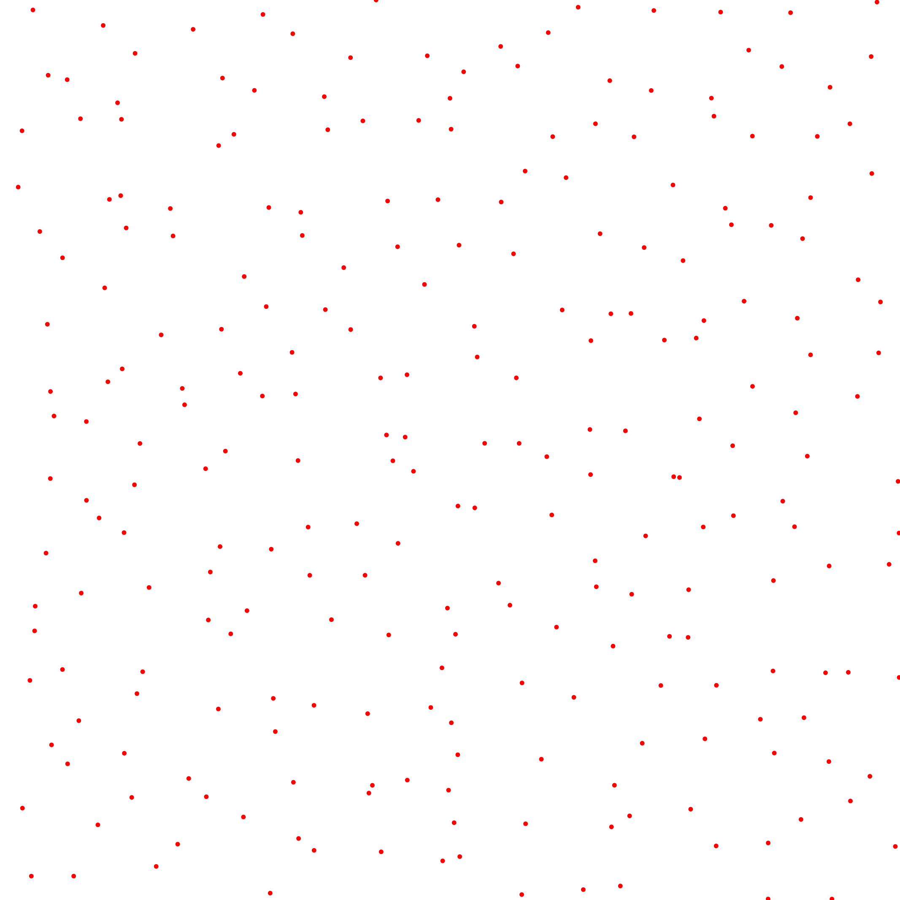
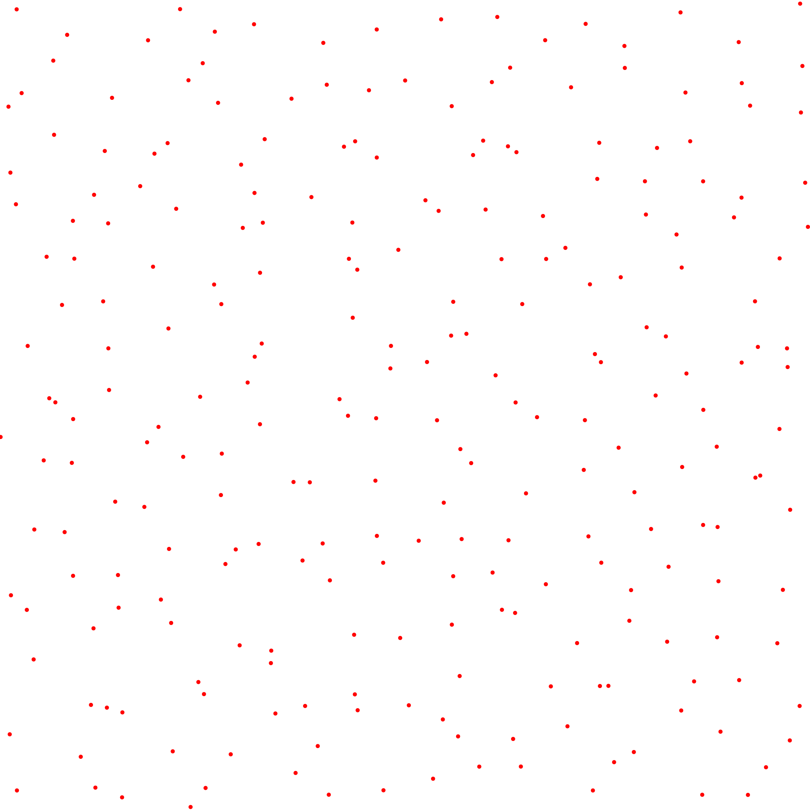
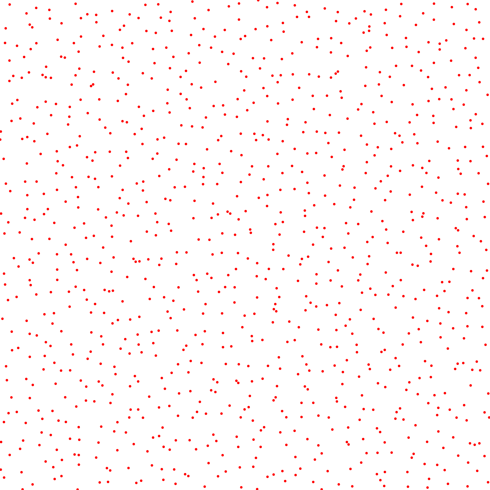

# Symmetric L2 Discrepancy

## Files

    src/discrepancy/SymmetricL2Discrepancy.hpp
    src/bin/discrepancy/SymmetricL2Discrepancy_2dd.cpp


## Description

This tool computes the Symmetric L2 discrepancy of an input pointset using the following formula  
[](data/symmetric_l2_disc/symmetric_discrepancy.png)  
from [[Hic98]](http://www.ams.org/journals/mcom/1998-67-221/S0025-5718-98-00894-1/S0025-5718-98-00894-1.pdf).

## License

BSD, see `SymmetricL2Discrepancy.hpp`

## Execution

```
Parameters:  

	[HELP]
	-h [string]		Displays this help message
	-i [string]		The input pointsets
	-o [string]		The output discrepancies
	-s [uint]		The number of samples to read (if computing from a sequence)
	--silent 		Silent mode
	--brute 		Output brute values instead of computing the statistics
```			

To evaluate the discrepancy of an input 2D point set, one can use the following client line command:

      ./bin/discrepancy/SymmetricL2Discrepancy_fromfile_2dd -i toto.dat

Or one can use the following C++ code:

``` cpp   
    SymmetricL2Discrepancy.hpp discrepancy_test;
    DiscrepancyStatistics stats;
    Pointset< D, double, Point > pts;
    //We assume pts is filled
    stats.nbpts = pts.size();

    //Can be done several times if we need to average over
    //several stochastic pointsets
    double discrepancy = 0;
    discrepancy_test.compute< D, double, Point >(pts, discrepancy)
    stats.addValue(discrepancy);

    stats.computeStatistics();
    std::cout << stats << std::endl;
```    			

## Results

Stochastic sampler

```    			
./bin/discrepancy/SymmetricL2Discrepancy_fromfile_2dd -i stratified_256.dat
#Nbpts		#Mean		#Var		#Min		#Max		#NbPtsets
256		0.0251765		2.66344e-06		0.0230421		0.0275544		10
```    			

[](data/symmetric_l2_disc/stratified_256_1.png) [](data/symmetric_l2_disc/stratified_256_2.png) [](data/symmetric_l2_disc/stratified_256_3.png) ...

```    			
./bin/discrepancy/SymmetricL2Discrepancy_fromfile_2dd -i stratified_1024.dat
#Nbpts		#Mean		#Var		#Min		#Max		#NbPtsets
1024		0.00883385		1.2468e-07		0.00825203		0.00937224		10
```    			

[](data/symmetric_l2_disc/stratified_1024_1.png) [](data/symmetric_l2_disc/stratified_1024_2.png) [](data/symmetric_l2_disc/stratified_1024_3.png) ...

```    			
./bin/discrepancy/SymmetricL2Discrepancy_fromfile_2dd -i stratified_4096.dat
#Nbpts		#Mean		#Var		#Min		#Max		#NbPtsets
4096		0.0032218		1.45414e-08		0.00309627		0.00343734		10
```    			

[](data/symmetric_l2_disc/stratified_4096_1.png) [](data/symmetric_l2_disc/stratified_4096_2.png) [](data/symmetric_l2_disc/stratified_4096_3.png) ...

Deterministic sampler

```    			
./bin/discrepancy/SymmetricL2Discrepancy_fromfile_2dd -i sobol_1024.dat
#Nbpts		#Mean		#Var		#Min		#Max		#NbPtsets
1024		0.00317465		0		0.00317465		0.00317465		1
```    			

[](data/symmetric_l2_disc/sobol_1024.png)

```    			
./bin/discrepancy/SymmetricL2Discrepancy_fromfile_2dd -i sobol_4096.dat
#Nbpts		#Mean		#Var		#Min		#Max		#NbPtsets
4096		0.000862486		0		0.000862486		0.000862486		1
```    			

[](data/symmetric_l2_disc/sobol_4096.png)
