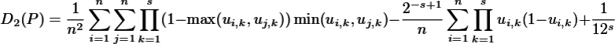
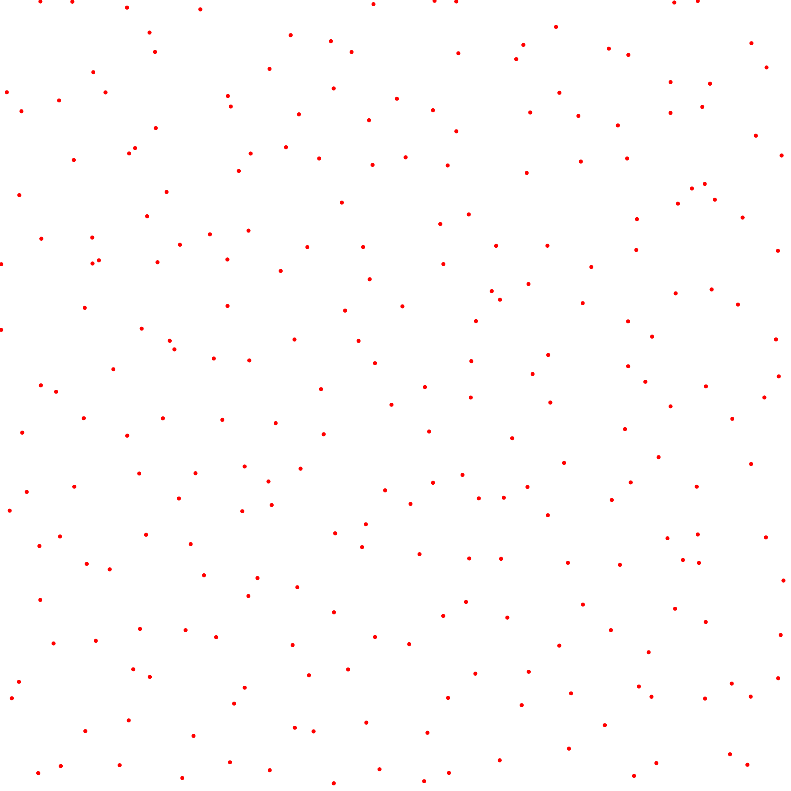
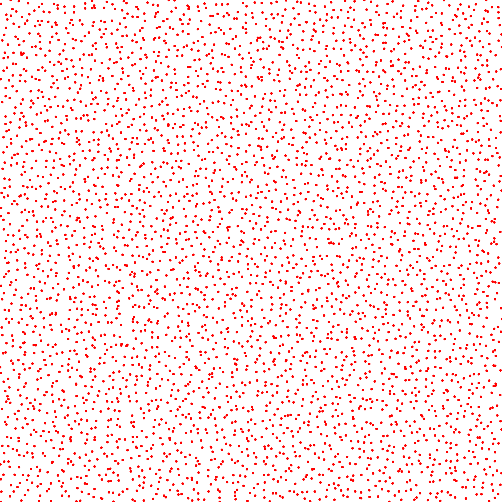
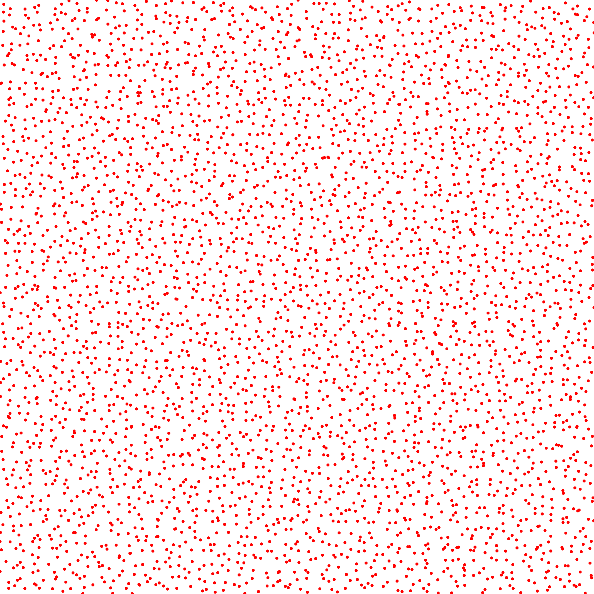
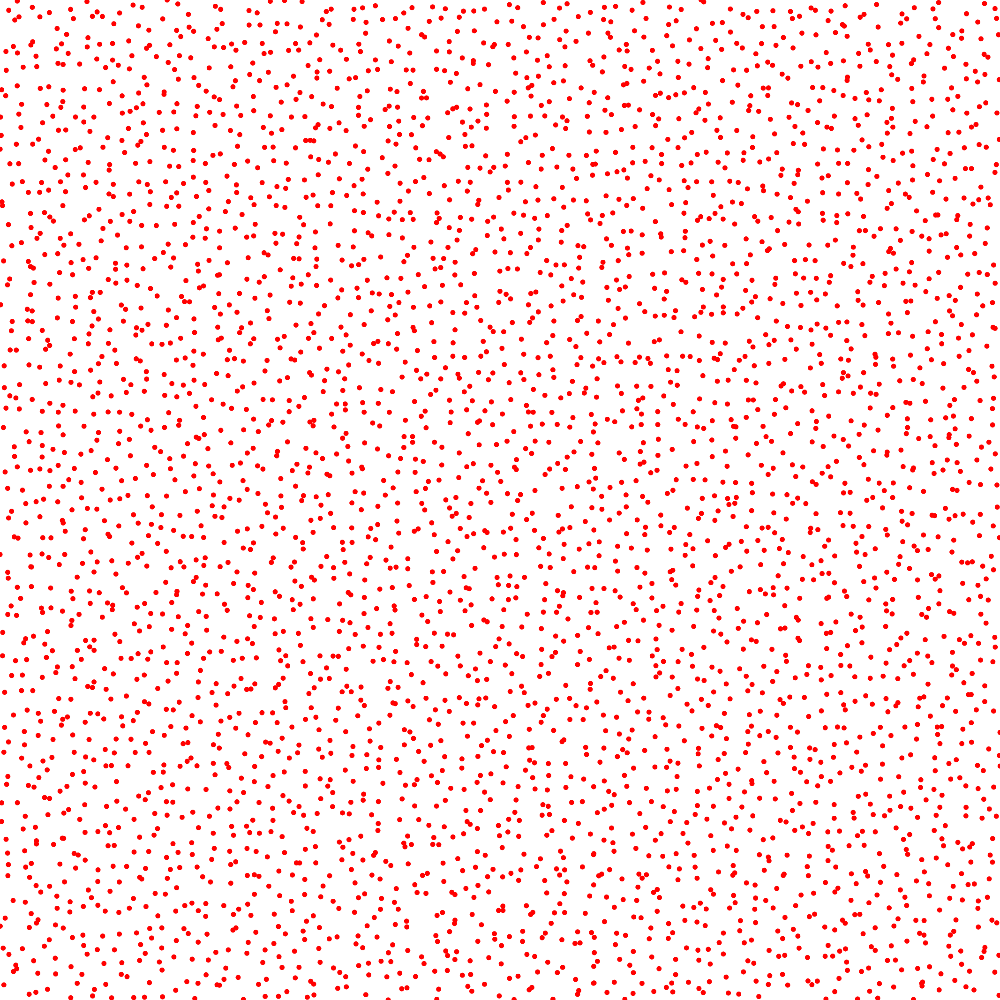
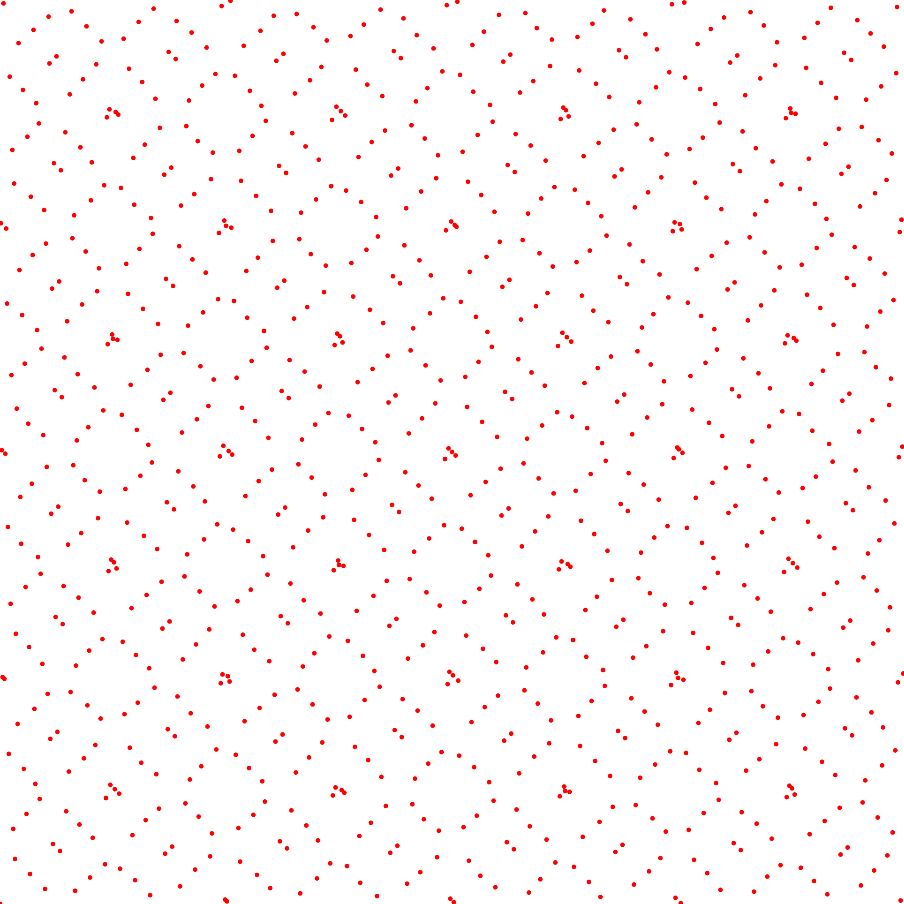

Unanchored L2 Discrepancy
-------------------------

<table class="files"><tbody><tr><td class="files" valign="middle">Files</td><td class="files" valign="middle">src/discrepancy/UnanchoredL2Discrepancy.hpp.hpp src/bin/discrepancy/UnanchoredL2Discrepancy_2dd.cpp.cpp</td></tr></tbody></table>

Description
===========

This tool computes the Unanchored L2 discrepancy of an input pointset using the following formula  
  
from [\[Lem09\]](http://www.springer.com/us/book/9780387781648).

Execution
=========

Parameters:  

	\[HELP\]
	-h \[string\]		Displays this help message
	-i \[string\]		The input pointsets
	-o \[string\]		The output discrepancies
	-s \[uint\]		The number of samples to read (if computing from a sequence)
	--silent 		Silent mode
	--brute 		Output brute values instead of computing the statistics
			

To evaluate the discrepancy of an input 2D point set, one can use the following client line command:

 ./bin/discrepancy/UnanchoredL2Discrepancy\_fromfile\_2dd -i toto.dat 

Or one can use the following C++ code:

    
    UnanchoredL2Discrepancy.hpp discrepancy_test;
    DiscrepancyStatistics stats;
    Pointset< D, double, Point > pts;
    //We assume pts is filled
    stats.nbpts = pts.size();
    
    //Can be done several times if we need to average over
    //several stochastic pointsets
    double discrepancy = 0;
    discrepancy_test.compute< D, double, Point >(pts, discrepancy)
    stats.addValue(discrepancy);
    
    stats.computeStatistics();
    std::cout << stats << std::endl;
    			

Results
=======

Stochastic sampler

./bin/discrepancy/UnanchoredL2Discrepancy\_fromfile\_2dd -i stratified\_256.dat
#Nbpts		#Mean		#Var		#Min		#Max		#NbPtsets
256		0.00352541		3.02457e-08		0.00317938		0.00378527		10 

   ...

./bin/discrepancy/UnanchoredL2Discrepancy\_fromfile\_2dd -i stratified\_1024.dat
#Nbpts		#Mean		#Var		#Min		#Max		#NbPtsets
1024		0.00126314		9.53465e-10		0.0012084		0.00130749		10 

   ...

./bin/discrepancy/UnanchoredL2Discrepancy\_fromfile\_2dd -i stratified\_4096.dat
#Nbpts		#Mean		#Var		#Min		#Max		#NbPtsets
4096		0.00046235		1.53657e-10		0.000438963		0.000485913		10 

   ...

Deterministic sampler

./bin/discrepancy/UnanchoredL2Discrepancy\_fromfile\_2dd -i sobol\_1024.dat
#Nbpts		#Mean		#Var		#Min		#Max		#NbPtsets
1024		0.000553279		0		0.000553279		0.000553279		1 

./bin/discrepancy/UnanchoredL2Discrepancy\_fromfile\_2dd -i sobol\_4096.dat
#Nbpts		#Mean		#Var		#Min		#Max		#NbPtsets
4096		0.000160965		0		0.000160965		0.000160965		1 

