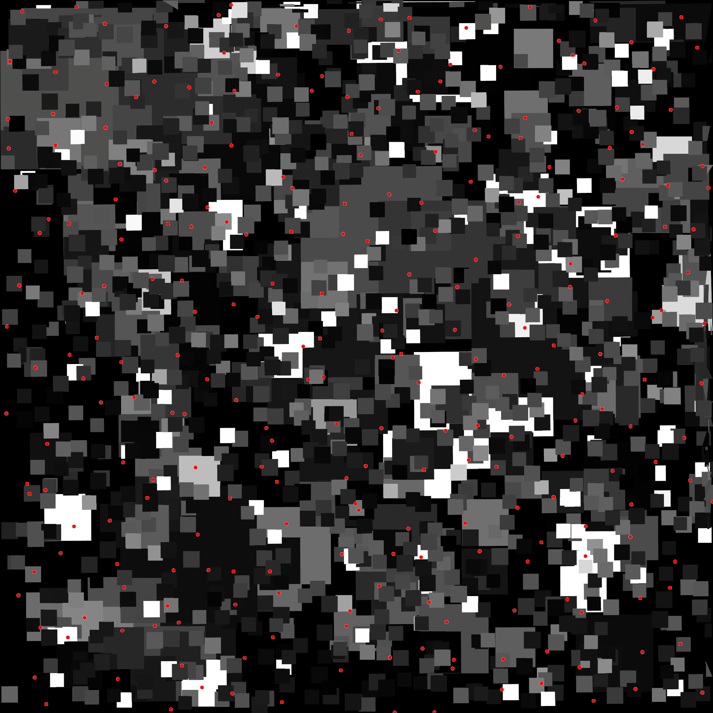
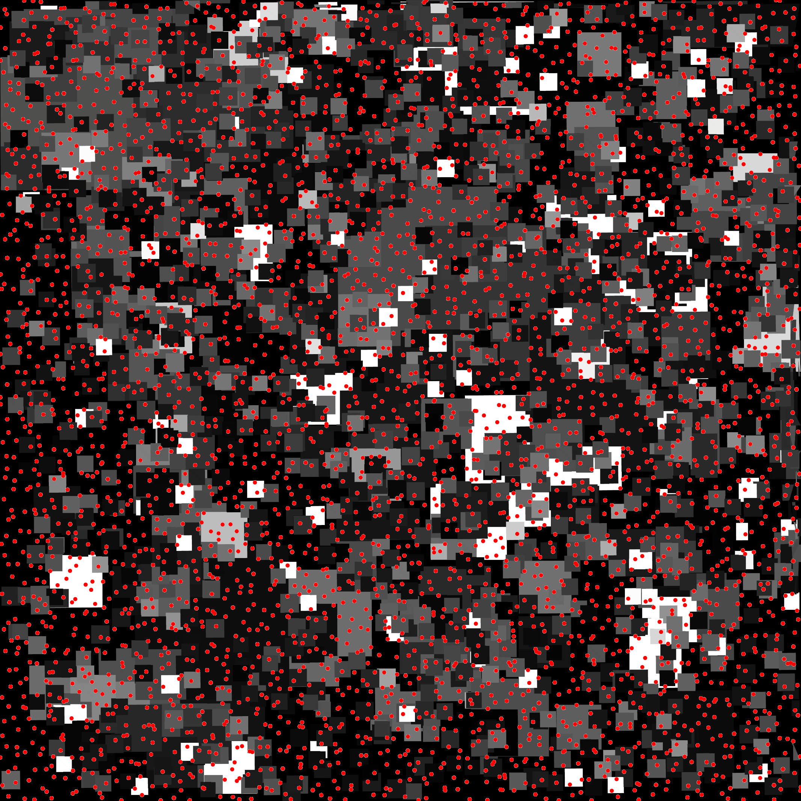

# Integration Box Arrangement

## Files

    src/integration/IntegrationBoxArrangement.hpp  
    src/integration/arrangement/TriangleArrangement.hpp  
    src/integration/arrangement/BoxesAligned.hpp  
    src/bin/integration/IntegrationBoxArrangement_fromfile_2dd.cpp

## Description

To palliate the absence of analytical expression for natural images, we instead try to integrate analytical arrangements of boxes or triangles. Such arrangement present analytical expression for their integrand and are therefore a better reference when testing the behavior of a sampler when used to approximate an integrand using a Monte Carlo estimator. Note that this test is not yet finished. Due to numerical imprecisions (?), we can't generate too many triangles and boxes within the arrangement. Furthermore, the Fourier spectrum of the arrangement is not yet controllable. However, this second issue might be solved by distributing shapes following colored noise distributions (green noise, pink noise, blue noise). as each color of noise seems to affect a particular range of frequencies.

## License

BSD, see `IntegrationBoxArrangement.hpp`

## Execution

```
Parameters:  

	[HELP]
	-h [string]		Displays this help message
	-i [string]		The input pointsets
	-o [string]		The output integration results
	-s [uint]		The number of samples to read (if integrating from a sequence)
	--silent 		Silent mode
	--brute 		Output brute values instead of computing the statistics
	-r [string]	 	Rasterized output
```


To integrate over a function using an input 2D point set, we can use the following client line command:

     ./bin/integration/IntegrationBoxArrangement_fromfile_2dd -i toto.dat

Or one can use the following C++ code:

``` cpp
    IntegrationBoxArrangement integration_test;
    IntegrationStatistics stats;
    Pointset< D, double, Point > pts;
    //We assume pts is filled
    stats.nbpts = pts.size();

    //Can be done several times if we need to average over
    //several stochastic pointsets
    double analytical = 0;
    double integration = 0;
    integration_test.compute< D, double, Point >(pts, integration, analytical)
    stats.setAnalytical(analytical);
    stats.addValue(integration);

    stats.computeStatistics();
    std::cout << stats << std::endl;
```


## Results

Stochastic sampler

```
./bin/integration/IntegrationBoxArrangement_fromfile_2dd -i stratified_256.dat
#Nbpts	#Mean		#Var		#Min		#Max		#Analytical	#MSE	#NbPtsets
256	173.794		117.155		154.68		192.285		176.922		115.223	10
```

[](data/box_arrangement/integration_1_256.png) [](data/box_arrangement/integration_2_256.png) [](data/box_arrangement/integration_3_256.png) ...

```
./bin/integration/IntegrationBoxArrangement_fromfile_2dd -i stratified_1024.dat
#Nbpts	#Mean		#Var		#Min		#Max		#Analytical	#MSE	#NbPtsets
1024	176.459		36.3116		165.905		184.707		176.922		32.8946	10
```

[](data/box_arrangement/integration_1_1024.png) [](data/box_arrangement/integration_2_1024.png) [](data/box_arrangement/integration_3_1024.png) ...

```
./bin/integration/IntegrationBoxArrangement_fromfile_2dd -i stratified_4096.dat
#Nbpts	#Mean		#Var		#Min		#Max		#Analytical	#MSE	#NbPtsets
4096	175.829		4.20551		172.211		178.462		176.922		4.97822	10
```

[](data/box_arrangement/integration_1_4096.png) [](data/box_arrangement/integration_2_4096.png) [](data/box_arrangement/integration_3_4096.png) ...

Deterministic sampler

```
./bin/integration/IntegrationBoxArrangement_fromfile_2dd -i sobol_1024.dat
#Nbpts	#Mean		#Var	#Min		#Max		#Analytical	#MSE	#NbPtsets
1024	168.114		0	168.114		168.114		176.922		77.5708	1
```

[](data/box_arrangement/integration_1024.png)

```
./bin/integration/IntegrationBoxArrangement_fromfile_2dd -i sobol_4096.dat
#Nbpts	#Mean		#Var	#Min		#Max		#Analytical	#MSE	#NbPtsets
4096	176.217		0	176.217		176.217		176.922		0.49652	1
```

[](data/box_arrangement/integration_4096.png)
