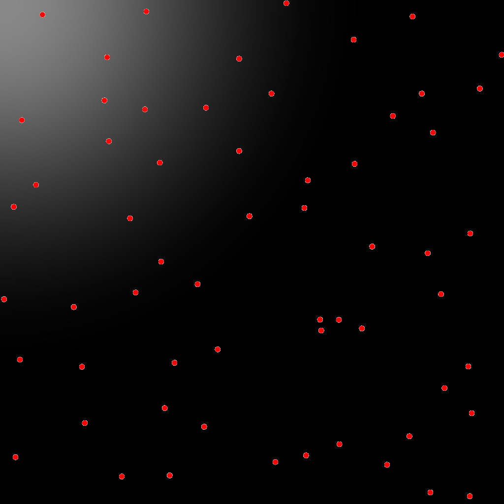
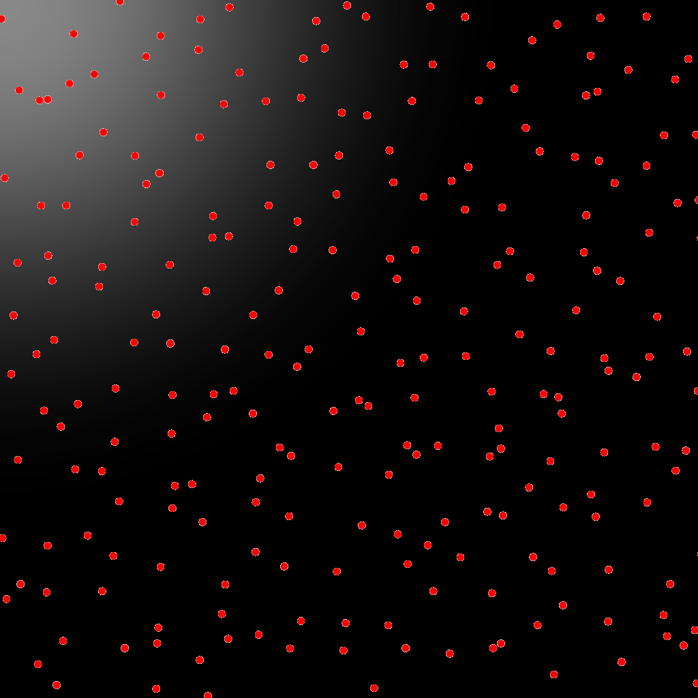
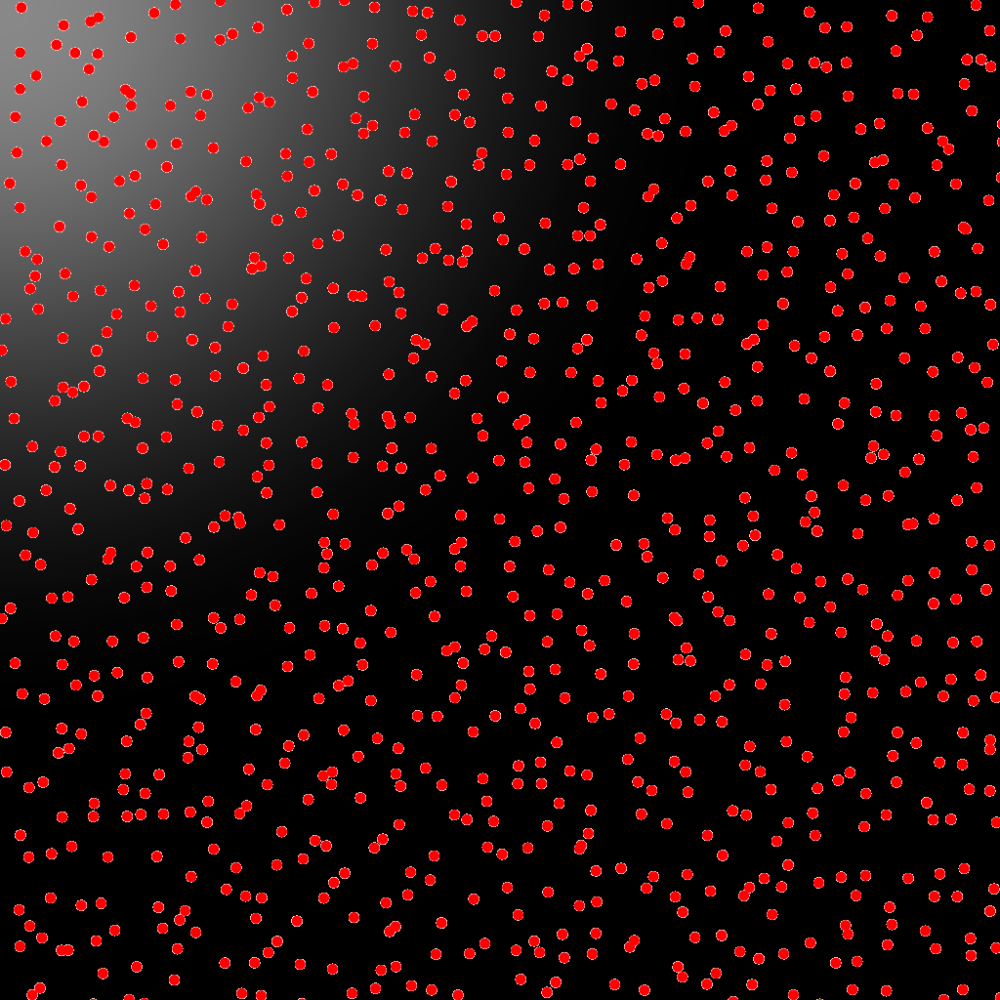
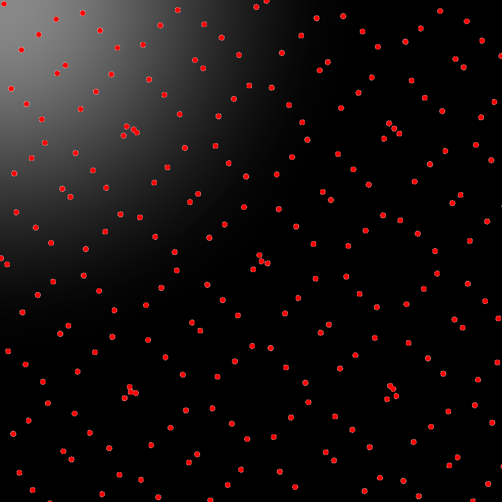
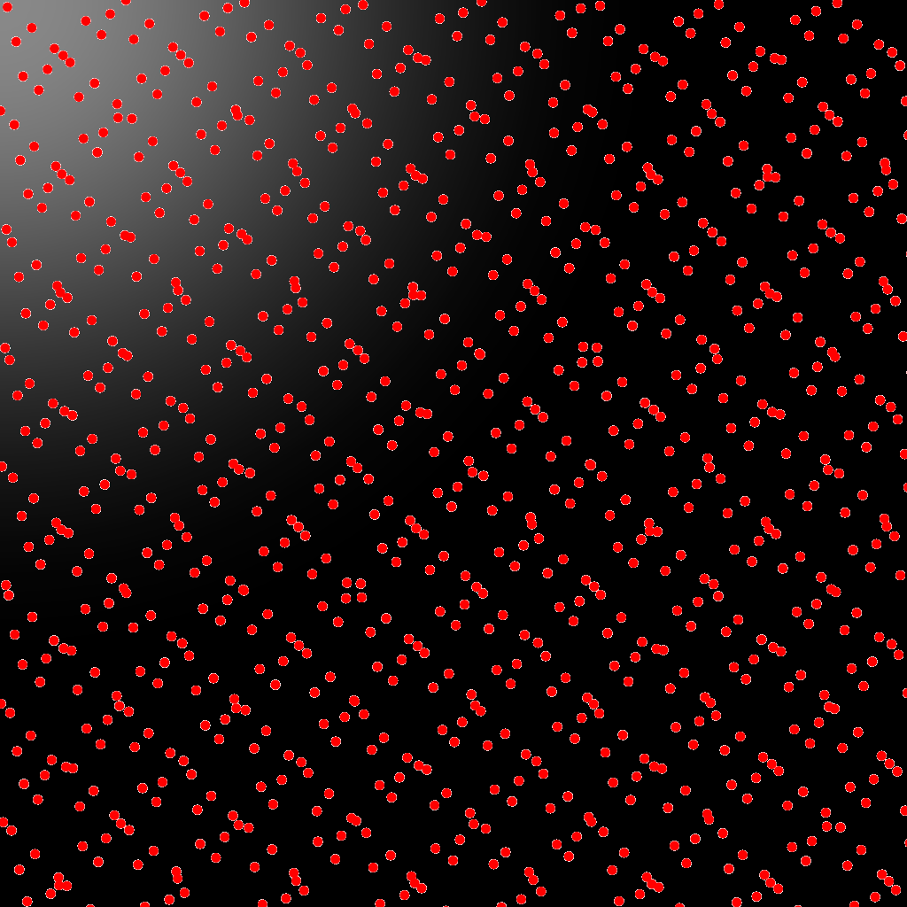

# Integration IntegrationCorneredGaussian

## Files

src/integration/IntegrationCorneredGaussian.hpp  
src/bin/integration/IntegrationCorneredGaussian_fromfile_2dd.cpp.cpp

## Description

This test uses an input pointset to approximate the CDF of a cropped Gaussian function using a Monte Carlo estimator. Note that in this test the gaussian is centered at $0^D$ (points are scaled to $[0, 1]^D$), for an analytical value of ~1/4. (as this gaussian is cropped to 1/4 of its real integrand). This test exists only in 2D. Note that due to our inability to find any analytical function to determine the area of a cropped gaussian, we devised independent tests for a centered uncropped gaussian and a 1/4 cropped gaussian (which both have exact analytical values) and a generic gaussian where the analytical value is estimated using a Monte Carlo estimator using 10e6 regular samples.

## License

BSD, see `IntegrationCorneredGaussian.hpp`

## Execution


```
Parameters:  

	[HELP]
	--outputfunc 	Outputs the integrated function in func.dat (plottable with gnuplot)
	--outputimg 	Outputs the integrated function in func.png
	-h [string]		Displays this help message
	-i [string]		The input pointsets
	-o [string]		The output integration results
	-s [uint]		The number of samples to read (if integrating from a sequence)
	--silent 		Silent mode
	--brute 		Output brute values instead of computing the statistics
```


To integrate over a function using an input 2D point set, we can use the following client line command:

     ./bin/integration/IntegrationCorneredGaussian_fromfile_2dd -i toto.dat

Or one can use the following C++ code:

``` cpp    
    IntegrationCorneredGaussian integration_test;
    IntegrationStatistics stats;
    Pointset< D, double, Point > pts;
    //We assume pts is filled
    stats.nbpts = pts.size();

    //Can be done several times if we need to average over
    //several stochastic pointsets
    double analytical = 0;
    double integration = 0;
    integration_test.compute< D, double, Point >(pts, integration, analytical)
    stats.setAnalytical(analytical);
    stats.addValue(integration);

    stats.computeStatistics();
    std::cout << stats << std::endl;
```


## Results

Stochastic sampler

```
./bin/integration/IntegrationCorneredGaussian_fromfile_2dd -i stratified_256.dat
#Nbpts	#Mean		#Var		#Min		#Max		#Analytical	#MSE		#NbPtsets
256	0.249767	1.78588e-05	0.240248	0.256679	0.25		1.61271e-05	10
```

[](data/cornered_gaussian/integration_1_256.png) [](data/cornered_gaussian/integration_2_256.png) [](data/cornered_gaussian/integration_3_256.png) ...

```
./bin/integration/IntegrationCorneredGaussian_fromfile_2dd -i stratified_1024.dat
#Nbpts	#Mean		#Var		#Min		#Max		#Analytical	#MSE		#NbPtsets
1024	0.249748	7.42086e-07	0.248584	0.251039	0.25		7.31222e-07	10
```

[](data/cornered_gaussian/integration_1_1024.png) [](data/cornered_gaussian/integration_2_1024.png) [](data/cornered_gaussian/integration_3_1024.png) ...

```
./bin/integration/IntegrationCorneredGaussian_fromfile_2dd -i stratified_4096.dat
#Nbpts	#Mean		#Var		#Min		#Max		#Analytical	#MSE		#NbPtsets
4096	0.249878	7.96447e-08	0.249494	0.250237	0.25		8.66692e-08	10
```

[](data/cornered_gaussian/integration_1_4096.png) [](data/cornered_gaussian/integration_2_4096.png) [](data/cornered_gaussian/integration_3_4096.png) ...

Deterministic sampler

```
./bin/integration/IntegrationCorneredGaussian_fromfile_2dd -i sobol_1024.dat
#Nbpts	#Mean		#Var	#Min		#Max		#Analytical	#MSE		#NbPtsets
1024	0.250991	0	0.250991	0.250991	0.25		9.82109e-07	1
```

[](data/cornered_gaussian/integration_1024.png)

```
./bin/integration/IntegrationCorneredGaussian_fromfile_2dd -i sobol_4096.dat
#Nbpts	#Mean		#Var	#Min		#Max		#Analytical	#MSE		#NbPtsets
4096	0.250259	0	0.250259	0.250259	0.25		6.72357e-08	1
```

[](data/cornered_gaussian/integration_4096.png)
