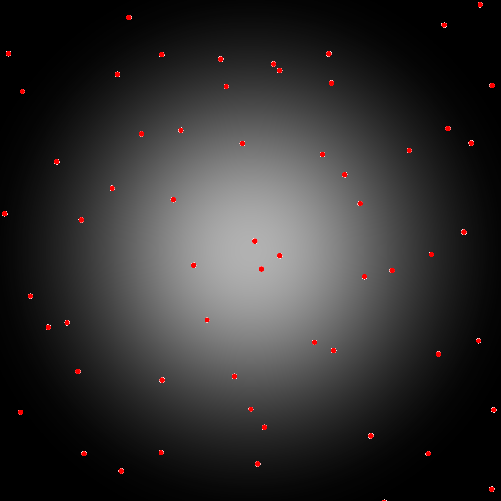
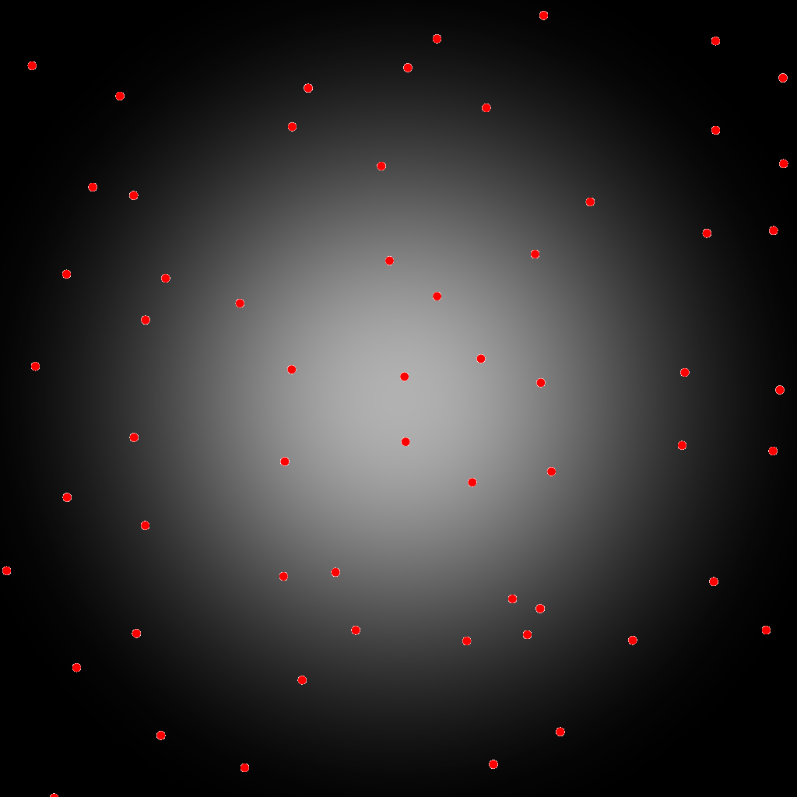
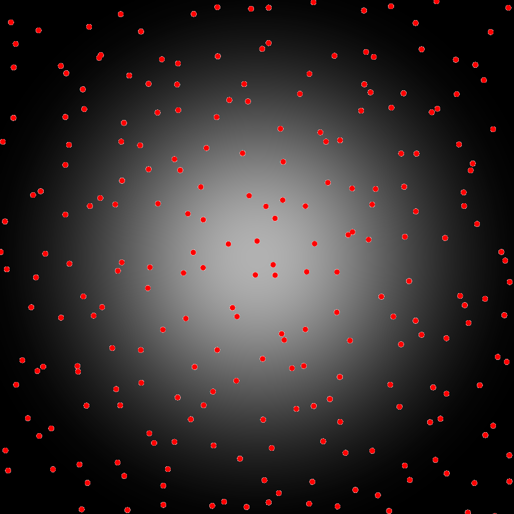
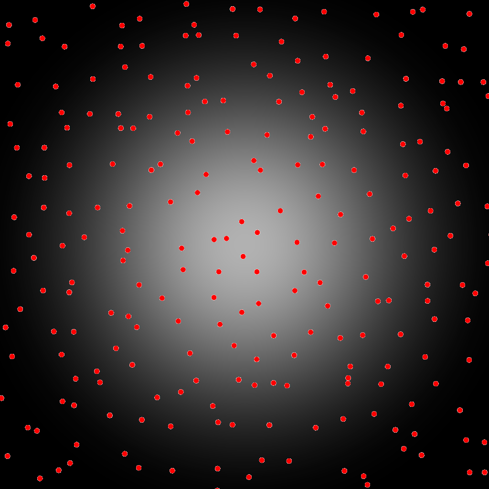
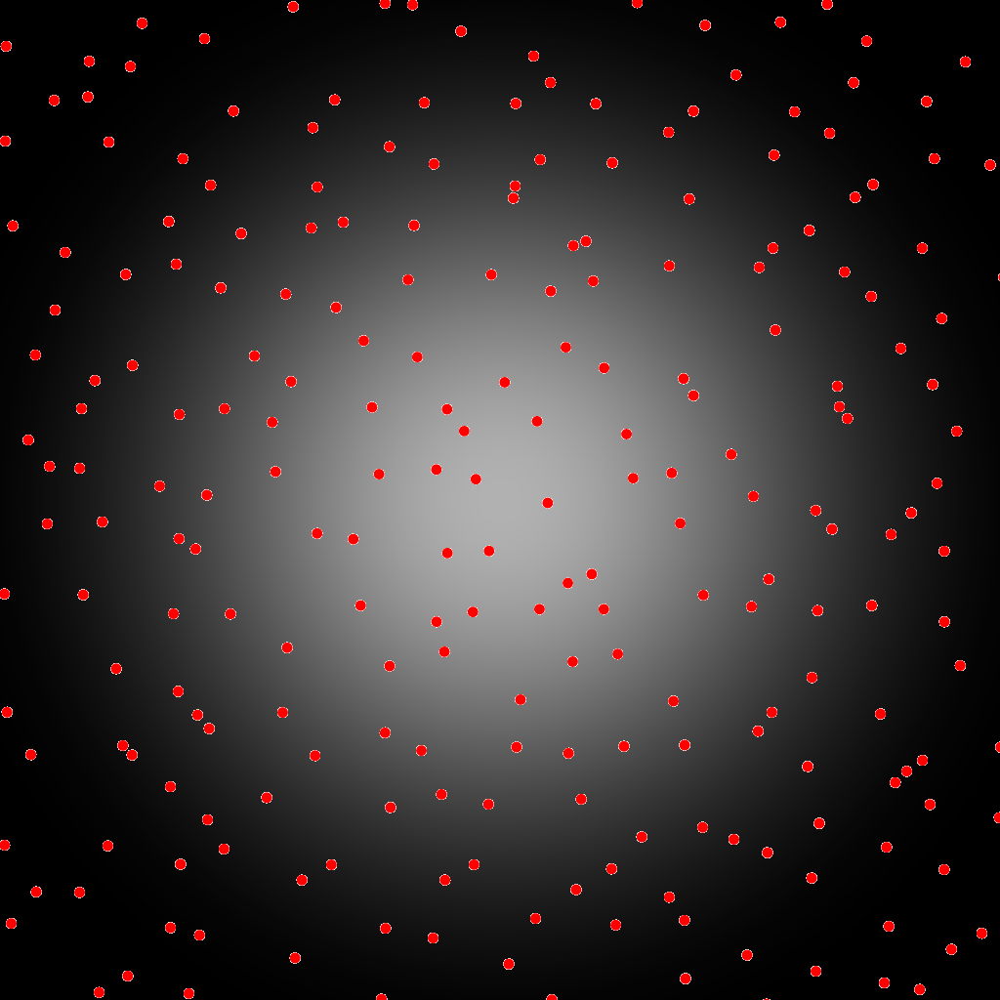
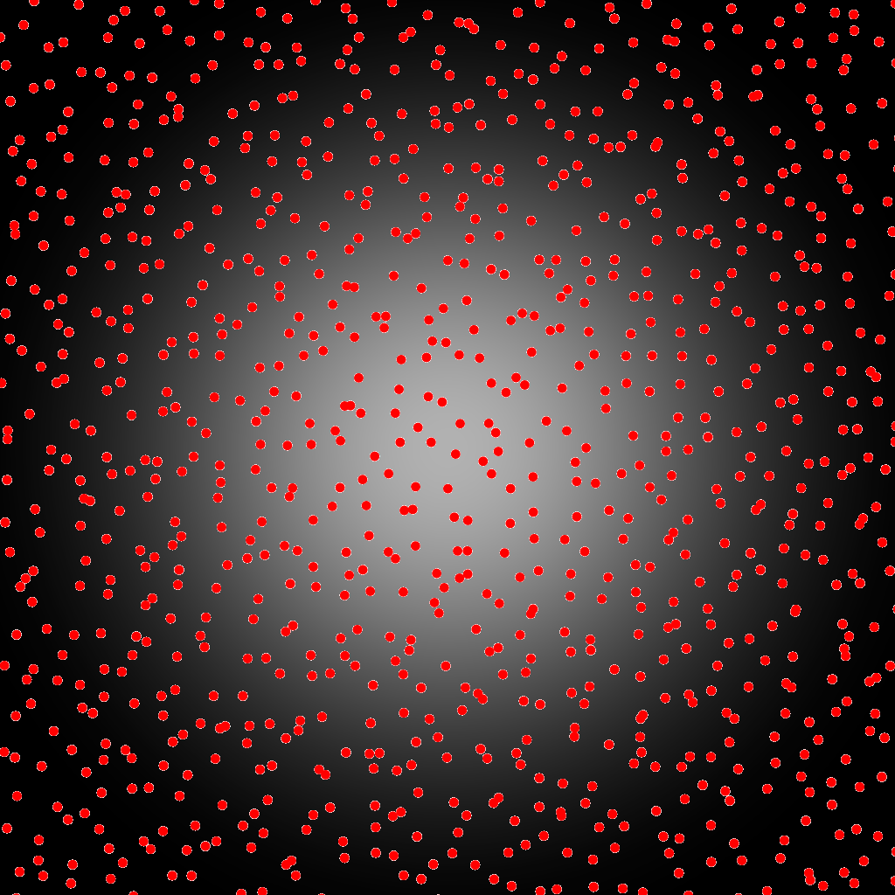

Integration IntegrationGaussian
-------------------------------

Files

src/integration/IntegrationGaussian.hpp  
src/bin/integration/IntegrationGaussian\_fromfile\_2dd.cpp.cpp

Description
===========

This test uses an input pointset to approximate the CDF of a Gaussian function using a Monte Carlo estimator. Note that due to our inability to find any analytical function to determine the area of a cropped gaussian, we devised independant tests for a centered uncropped gaussian and a 1/4 cropped gaussian (which both have exact analytical values) and a generic gaussian where the analytical value is estimated using a Monte Carlo estimator using 10e6 regular samples. This test exists only in 2D.

Execution
=========

Parameters:  

	\[HELP\]
	--stddevx \[double=0.15\]	Sets the x value for the standard deviation of the gaussian
	--meanx \[double=0.5\]	Sets the x value for the mean of the gaussian
	--stddevy \[double=0.15\]	Sets the y value for the standard deviation of the gaussian
	--meany \[double=0.5\]	Sets the y value for the mean of the gaussian
	--outputfunc 	Outputs the integrated function in func.dat (plottable with gnuplot)
	--outputimg 	Outputs the integrated function in func.png
	-h \[string\]		Displays this help message
	-i \[string\]		The input pointsets
	-o \[string\]		The output integration results
	-s \[uint\]		The number of samples to read (if integrating from a sequence)
	--silent 		Silent mode
	--brute 		Output brute values instead of computing the statistics
			

To integrate over a function using an input 2D point set, we can use the following client line command:

 ./bin/integration/IntegrationGaussian\_fromfile\_2dd -i toto.dat 

Or one can use the following C++ code:

    
    IntegrationGaussian integration_test;
    IntegrationStatistics stats;
    Pointset< D, double, Point > pts;
    //We assume pts is filled
    stats.nbpts = pts.size();
    
    //Can be done several times if we need to average over
    //several stochastic pointsets
    double analytical = 0;
    double integration = 0;
    integration_test.compute< D, double, Point >(pts, integration, analytical)
    stats.setAnalytical(analytical);
    stats.addValue(integration);
    
    stats.computeStatistics();
    std::cout << stats << std::endl;
    			

Results
=======

Stochastic sampler

./bin/integration/IntegrationGaussian\_fromfile\_2dd -i stratified\_256.dat
#Nbpts	#Mean		#Var		#Min		#Max	#Analytical	#MSE		#NbPtsets
256	0.998641	0.000114815	0.978868	1.01693	0.998284	0.000103461	10 

   ...

./bin/integration/IntegrationGaussian\_fromfile\_2dd -i stratified\_1024.dat
#Nbpts	#Mean		#Var		#Min		#Max	#Analytical	#MSE		#NbPtsets
1024	0.998347	1.52336e-05	0.990475	1.00308	0.998284	1.37142e-05	10 

   ...

./bin/integration/IntegrationGaussian\_fromfile\_2dd -i stratified\_4096.dat
#Nbpts	#Mean		#Var		#Min		#Max		#Analytical	#MSE		#NbPtsets
4096	0.997984	9.59856e-07	0.996402	0.999474	0.998284	9.53883e-07	10 

   ...

Deterministic sampler

./bin/integration/IntegrationGaussian\_fromfile\_2dd -i sobol\_1024.dat
#Nbpts	#Mean		#Var	#Min		#Max		#Analytical	#MSE		#NbPtsets
1024	0.998285	0	0.998285	0.998285	0.998284	6.1907e-13	1 

./bin/integration/IntegrationGaussian\_fromfile\_2dd -i sobol\_4096.dat
#Nbpts	#Mean		#Var	#Min		#Max		#Analytical	#MSE		#NbPtsets
4096	0.998284	0	0.998284	0.998284	0.998284	1.52042e-13	1 

Changing the gaussian parameters

./bin/integration/IntegrationGaussian\_fromfile\_2dd --meanx 0.25 --meany 0.75 --stddevx 0.1 --stddevy 0.1 -i sobol\_1024.dat
#Nbpts	#Mean		#Var	#Min		#Max		#Analytical	#MSE		#NbPtsets
1024	0.987861	0	0.987861	0.987861	0.987619	5.82659e-08	1 

./bin/integration/IntegrationGaussian\_fromfile\_2dd --meanx 0.35 --meany 0.45 --stddevx 0.05 --stddevy 0.1 -i sobol\_1024.dat
#Nbpts	#Mean		#Var	#Min		#Max		#Analytical	#MSE		#NbPtsets
1024	0.998168	0	0.998168	0.998168	0.999997	3.34345e-06	1 

