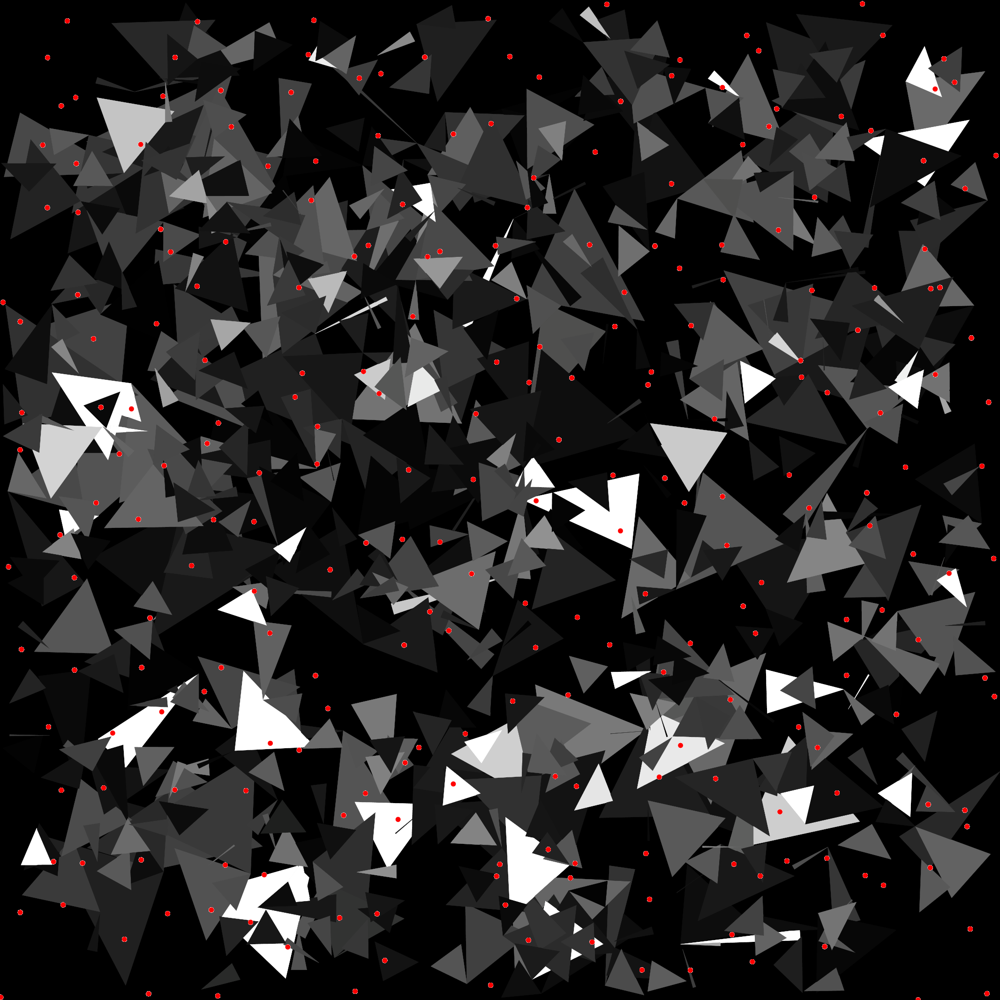
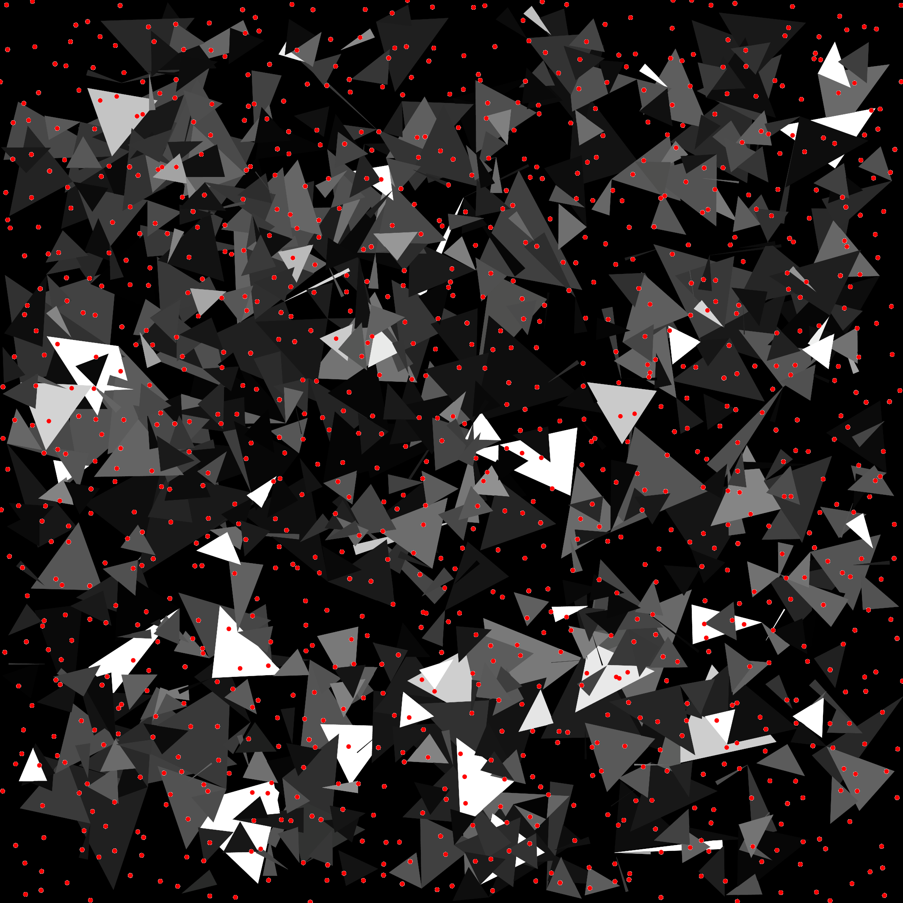
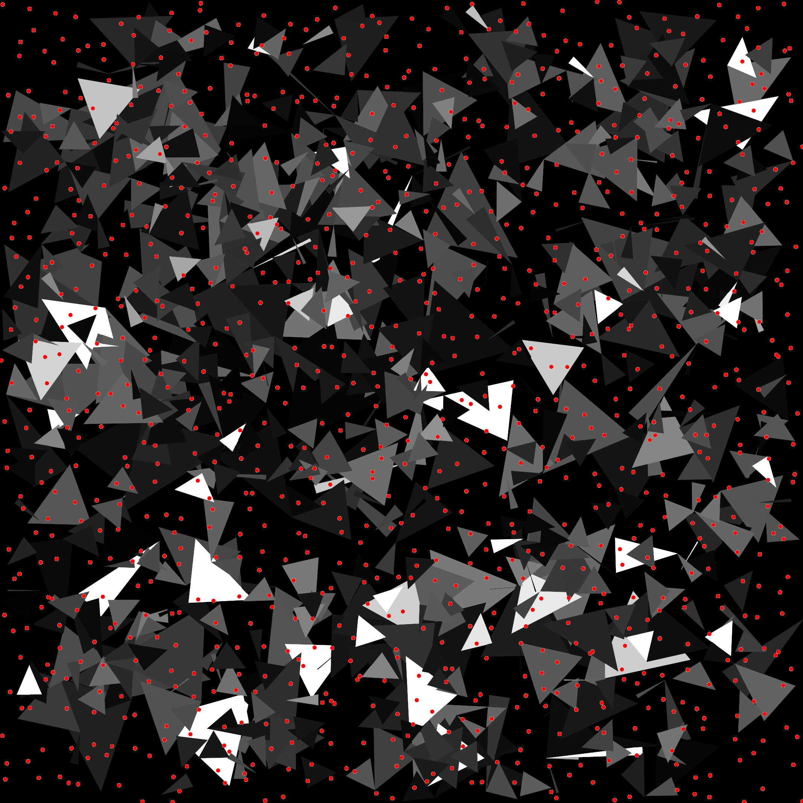
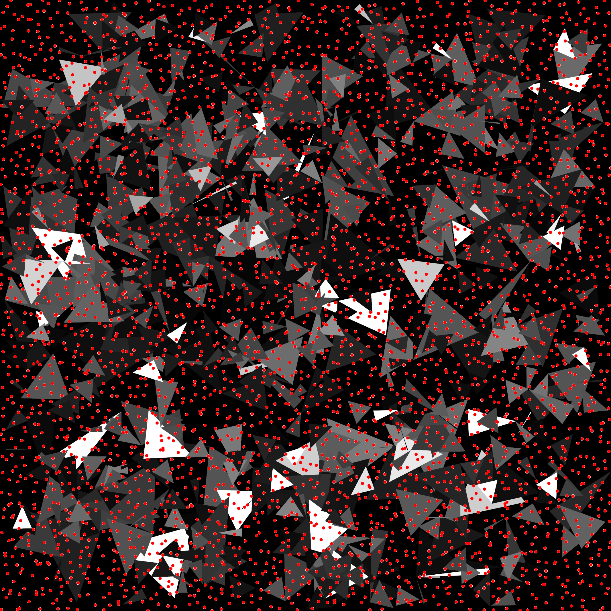

# Integration Triangle Arrangement

## Files

    src/integration/IntegrationTriangleArrangement.hpp  
    src/integration/arrangement/TriangleArrangement.hpp  
    src/integration/arrangement/TrianglesRandom.hpp  
    src/bin/integration/IntegrationTriangleArrangement_fromfile_2dd.cpp

## Description

To palliate the absence of analytical expression for natural images, we instead try to integrate analytical arrangements of boxes or triangles. Such arrangement present analytical expression for their integrand and are therefore a better reference when testing the behavior of a sampler when used to approximate an integrand using a Monte Carlo estimator. Note that this test is not yet finished. Due to numerical imprecisions (?), we can't generate too many triangles and boxes within the arrangement. Furthermore, the Fourier spectrum of the arrangement is not yet controllable. However, this second issue might be solved by distributing shapes following colored noise distributions (green noise, pink noise, blue noise). as each color of noise seems to affect a particular range of frequencies.


!!! note
     This tool requires the CGAL library. You would need also to set  `cmake .. -DUSE_CGAL=true` when generating the project.


## License

BSD, see `IntegrationTriangleArrangement.hpp`

## Execution

```
Parameters:  

	[HELP]
	-h [string]		Displays this help message
	-i [string]		The input pointsets
	-o [string]		The output integration results
	-s [uint]		The number of samples to read (if integrating from a sequence)
	--silent 		Silent mode
	--brute 		Output brute values instead of computing the statistics
	-r [string]	 	Rasterized output
```


To integrate over a function using an input 2D point set, we can use the following client line command:

     ./bin/integration/IntegrationTriangleArrangement_fromfile_2dd -i toto.dat

Or one can use the following C++ code:

``` cpp
    IntegrationTriangleArrangement integration_test;
    IntegrationStatistics stats;
    Pointset< D, double, Point > pts;
    //We assume pts is filled
    stats.nbpts = pts.size();

    //Can be done several times if we need to average over
    //several stochastic pointsets
    double analytical = 0;
    double integration = 0;
    integration_test.compute< D, double, Point >(pts, integration, analytical)
    stats.setAnalytical(analytical);
    stats.addValue(integration);

    stats.computeStatistics();
    std::cout << stats << std::endl;
```

## Results

Stochastic sampler

```
./bin/integration/IntegrationTriangleArrangement_fromfile_2dd -i stratified_256.dat
#Nbpts	#Mean		#Var		#Min		#Max		#Analytical	#MSE	#NbPtsets
256	132.652		149.531		114.164		143.926		130.15		140.841	10
```

[](data/triangle_arrangement/integration_1_256.png) [](data/triangle_arrangement/integration_2_256.png) [](data/triangle_arrangement/integration_3_256.png) ...

```
./bin/integration/IntegrationTriangleArrangement_fromfile_2dd -i stratified_1024.dat
#Nbpts	#Mean		#Var		#Min		#Max		#Analytical	#MSE	#NbPtsets
1024	130.225		20.2556		122.274		138.928		130.15		18.2358	10
```

[](data/triangle_arrangement/integration_1_1024.png) [](data/triangle_arrangement/integration_2_1024.png) [](data/triangle_arrangement/integration_3_1024.png) ...

```
./bin/integration/IntegrationTriangleArrangement_fromfile_2dd -i stratified_4096.dat
#Nbpts	#Mean		#Var		#Min		#Max		#Analytical	#MSE	#NbPtsets
4096	130.193		3.12017		128.694		134.533		130.15		2.81005	10
```

[](data/triangle_arrangement/integration_1_4096.png) [](data/triangle_arrangement/integration_2_4096.png) [](data/triangle_arrangement/integration_3_4096.png) ...

Deterministic sampler

```
./bin/integration/IntegrationTriangleArrangement_fromfile_2dd -i sobol_1024.dat
#Nbpts	#Mean		#Var	#Min		#Max		#Analytical	#MSE	#NbPtsets
1024	131.031		0	131.031		131.031		130.15		0.77707	1
```

[](data/triangle_arrangement/integration_1024.png)

```
./bin/integration/IntegrationTriangleArrangement_fromfile_2dd -i sobol_4096.dat
#Nbpts	#Mean		#Var	#Min		#Max		#Analytical	#MSE	#NbPtsets
4096	133.135		0	133.135		133.135		130.15		8.90896	1
```

[](data/triangle_arrangement/integration_4096.png)
