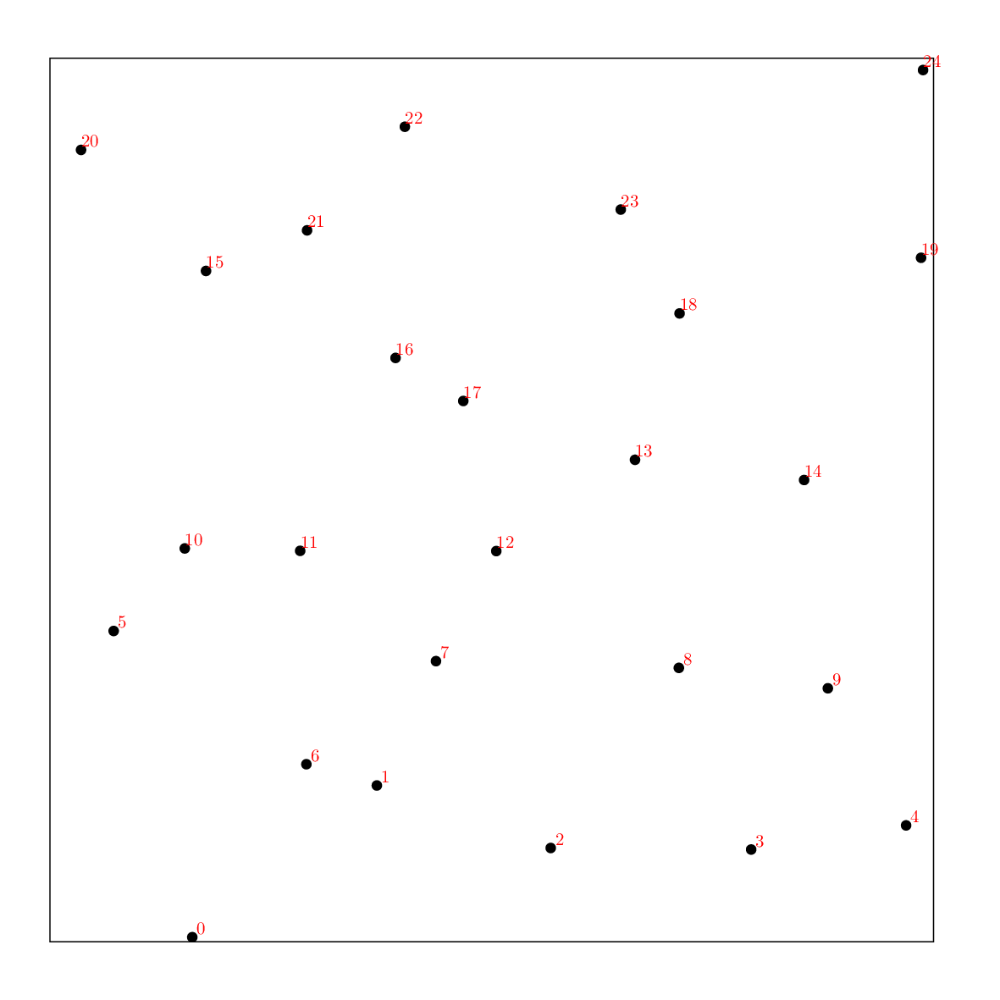

# File format .tex

##Files

```
src/io/imageIO.hpp  
src/io/imageIO\_model.hpp  
src/io/imageIO\_tikz.hpp
```

## Description


UnicornTK relies on the extension of the input file to determine its type. When the extension is .tex, the pointset is drawn as a tikz figure in a .tex file. This file can be compiled using any latex compiler you want to generate a .pdf image.

## Examples


Input pointset | Output .tex file | Image
---------------|-----------------|------
[sobol\_128.edat](data/graphics/sobol_128.edat)|[sobol\_128.tex](data/graphics/sobol_128.tex)|[](data/graphics/sobol_128_tikz.png)
[stratified\_25.dat](data/graphics/stratified_25.dat)|[stratified\_25.tex](data/graphics/stratified_25.tex)|[](data/graphics/stratified_25_tikz.png)
[toric\_bnot\_50.dat](data/graphics/toric_bnot_50.dat)|[toric\_bnot\_50.tex](data/graphics/toric_bnot_50.tex)|[](data/graphics/toric_bnot_50_tikz.png)
