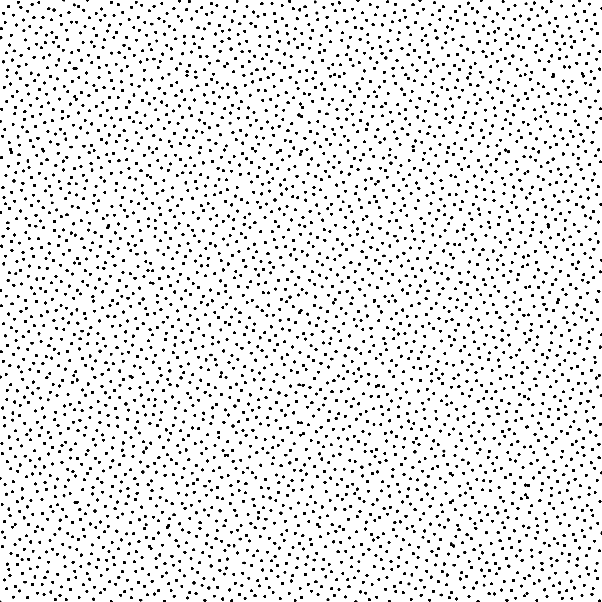
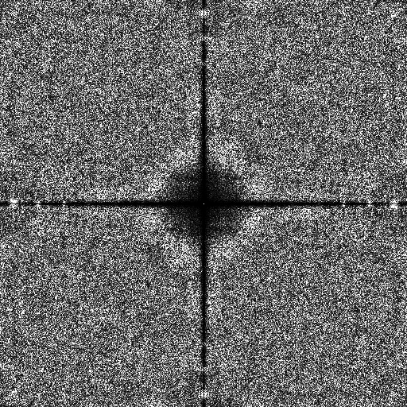

Sampler BNLDS
-------------

Files

src/samplers/SamplerBNLDS.hpp  
src/samplers/BNLDS_2dd.cpp

Description
===========

  
For a more precise description of this sampler and its performances in terms of aliasing and discrepancy, please refer to the following web bundle [https://liris.cnrs.fr/ldbn/HTML_bundle/index.html](https://liris.cnrs.fr/ldbn/HTML_bundle/index.html).

Execution
=========

Parameters:  

	[HELP]
	-o [string=output_pts.dat]	Output file
	-m [int=1]			Number of poinset realisations
	-n [ullint=1024]		Number of samples to generate
	--silent 			Silent mode
	-h 				Displays this help message
	--lut-in [string]		the file containing the lookuptable
	--sobolD0 [uint=1]		the sobol indices for dimension 0
	--sobolD1 [uint=2]		the sobol indices for dimension 1
	-K [uint=4]			the subdivision factor K
	--level [uint=-1]		the level of subdivision (overrides the -n parameter)
			

To generate a 2D point set of 1024 samples with a BNLDS distribution, we can use the following client line command:

 ./src/samplers/BNLDS_2dd -n 1024 -o toto.dat 

Or one can use the following C++ code:

    
    PointsetWriter< 2, double, Point<2, double> > writer;
    writer.open("toto.dat");
    Pointset< 2, double, Point<2, double> > pts;
    ./src/samplers/SamplerBNLDS.hpp s;
    unsigned int param_nbsamples = 1024;
    s.generateSamples< 2, double, Point<2, double> >(pts, param_nbsamples);
    writer.writePointset(pts);
    writer.close();
    			

Results
=======

Note that only the point sets containing K^{2n} samples are Blue Noise and Low Discrepancy, for K=4, 1024 is not a multiple of 4^{2n}, whereas 4096=4^6 (n=3).

 ./src/samplers/BNLDS_2dd -o BNLDS_1024.edat -n 1024 

File  
[BNLDS_1024.edat](data/BNLDS/BNLDS_1024.edat)

Pointset  

Fourier  

 ./src/samplers/BNLDS_2dd -o BNLDS_4096.edat -n 4096 

File  
[BNLDS_4096.edat](data/BNLDS/BNLDS_4096.edat)

Pointset  

Fourier  

Changing the initial Sobol sequence

 ./src/samplers/BNLDS_2dd --sobolD0 3 --sobolD1 7 
--lut-in ../data/BNLDS/factorK_4/Sobol_37/allPermutsCache_Sobol+OptPerms_3_7_00000.dat 
-o BNLDS_2_4096.edat -n 4096 

File  
[BNLDS_2_4096.edat](data/BNLDS_2/BNLDS_2_4096.edat)

Pointset  

Fourier  

Changing the K factor

 ./src/samplers/BNLDS_2dd -K 8 --sobolD0 1 --sobolD1 2 
--lut-in ../data/BNLDS/factorK_8/fastoptim_lut_sobol1_2_k8_lvlmax3_sampler_BNLDS_optimizer_PCF_RandomOpti_2dd.dat 
-o BNLDS_3_4096.edat -n 4096 

File  
[BNLDS_3_4096.edat](data/BNLDS_3/BNLDS_3_4096.edat)

Pointset  

Fourier  

