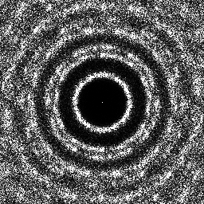
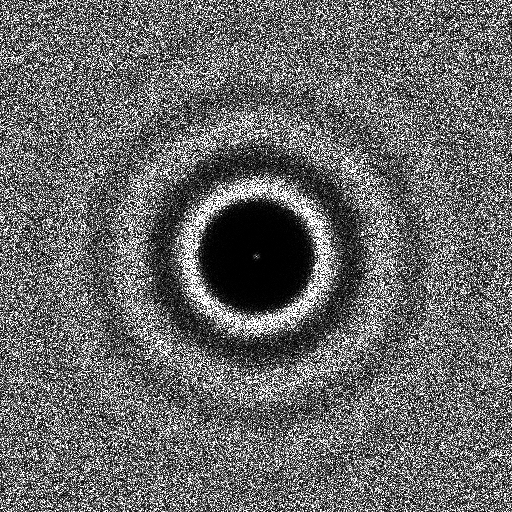

Sampler CVT [\[BSD09\]](https://dl.acm.org/citation.cfm?id=1531392)
-------------------------------------------------------------------

Files

src/samplers/SamplerCapCVT.hpp  
src/samplers/CVT\_2dd.cpp  
src/samplers/SamplerCapCVT/\*

Description
===========

Implementation of the CVT sampler from [\[BSD09\]](https://dl.acm.org/citation.cfm?id=1531392).  
For a more precise description of this sampler and its performances in terms of aliasing and discrepancy, please refer to the following web bundle [https://liris.cnrs.fr/ldbn/HTML\_bundle/index.html](https://liris.cnrs.fr/ldbn/HTML_bundle/index.html).

Execution
=========

Parameters:  

	\[HELP\]
	--boundary \[string\]		The file with the boundary of the domain
	--iter \[int\]			The number of iterations
	-o \[string=output\_pts.dat\]	Output file
	-m \[int=1\]			Number of poinset realisations
	-n \[ullint=1024\]		Number of samples to generate
	--silent 			Silent mode
	-h 				Displays this help message
			

To generate a 2D point set of 1024 samples with a CCVT distribution, we can use the following client line command:

 ./src/samplers/CVT\_2dd -n 1024 -o toto.dat 

Or one can use the following C++ code:

    
    PointsetWriter< 2, double, Point<2, double> > writer;
    writer.open("toto.dat");
    Pointset< 2, double, Point<2, double> > pts;
    SamplerCapCVT. s;
    uint nbIter=100;
    s.setIterations(nbIter);
    unsigned int param_nbsamples = 1024;
    s.generateSamples< 2, double, Point<2, double> >(pts, param_nbsamples);
    writer.writePointset(pts);
    writer.close();
    			

Results
=======

 ./src/samplers/CCVT\_2dd -o CVT\_1024.edat -n 1024 

File  
[CCVT\_1024.edat](data/CVT/CVT_1024.edat)

Pointset  

Fourier  

 ./src/samplers/CCVT\_2dd -o CVT\_4096.edat -n 4096 

File  
[CCVT\_4096.edat](data/CVT/CVT_4096.edat)

Pointset  

Fourier  

 ./src/samplers/CVT\_2dd -o CVT\_2\_4096.edat -n 4096 --iter 10 

File  
[CVT\_2\_4096.edat](data/CVT_2/CVT_2_4096.edat)

Pointset  

Fourier  
