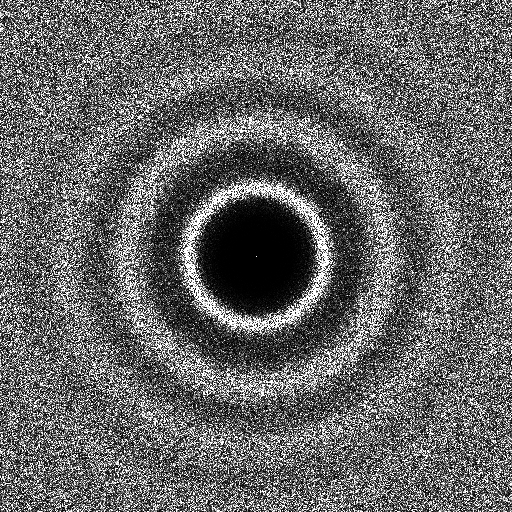

# Sampler CapCVT [[CYC12]](https://dl.acm.org/citation.cfm?id=2360839)

## Files

```
src/samplers/SamplerCapCVT.hpp  
src/samplers/CapCVT_2dd.cpp  
src/samplers/SamplerCapCVT/
```

## Description


Implementation of the CapCVT sampler from [[CYC12]](https://dl.acm.org/citation.cfm?id=2360839).  
For a more precise description of this sampler and its performances in terms of aliasing and discrepancy, please refer to the following web bundle [https://liris.cnrs.fr/ldbn/HTML_bundle/index.html](https://liris.cnrs.fr/ldbn/HTML_bundle/index.html).

!!! note
     This sampler requires an old version of the CGAL (v2) library. and set  `cmake .. -DUSE_CGALv2=true` when generating the project.

## Execution

```
Parameters:  

	[HELP]
	--boundary [string]		The file with the boundary of the domain
	--iter [int]			The number of iterations
	--lambda [float]		 The lambda value
	-o [string=output_pts.dat]	Output file
	-m [int=1]			Number of poinset realisations
	-n [ullint=1024]		Number of samples to generate
	--silent 			Silent mode
	-h 				Displays this help message
```			

To generate a 2D point set of 1024 samples with a CapCVT distribution, we can use the following client line command:

     ./src/samplers/CapCVT_2dd -n 1024 -o toto.dat

Or one can use the following C++ code:

``` cpp    
    PointsetWriter< 2, double, Point<2, double> > writer;
    writer.open("toto.dat");
    Pointset< 2, double, Point<2, double> > pts;
    SamplerCapCVT s;
    double lambda=30.0;
    s.setLambda(lambda);
    uint nbIter=100;
    s.setIterations(nbIter);
    unsigned int param_nbsamples = 1024;
    s.generateSamples< 2, double, Point<2, double> >(pts, param_nbsamples);
    writer.writePointset(pts);
    writer.close();
```     			

## Results

     ./src/samplers/CapCVT_2dd -o CapCVT_1024.edat -n 1024

File  
[CapCVT_1024.edat](data/CapCVT/CapCVT_1024.edat)

Pointset  
[](data/CapCVT/CapCVT_1024.png)

Fourier  
[](data/CapCVT/CapCVT_1024_fourier.png)

     ./src/samplers/CapCVT_2dd -o CapCVT_4096.edat -n 4096

File  
[CapCVT_4096.edat](data/CapCVT/CapCVT_4096.edat)

Pointset  
[](data/CapCVT/CapCVT_4096.png)

Fourier  
[](data/CapCVT/CapCVT_4096_fourier.png)

     ./src/samplers/CapCVT_2dd -o CapCVT_2_1024.edat -n 1024 --lambda 10

File  
[CapCVT_2_1024.edat](data/CapCVT_2/CapCVT_2_1024.edat)

Pointset  
[](data/CapCVT_2/CapCVT_2_1024.png)

Fourier  
[](data/CapCVT_2/CapCVT_2_1024_fourier.png)

     ./src/samplers/CapCVT_2dd -o CapCVT_2_1024.edat -n 1024 --iter 10

File  
[CapCVT_3_1024.edat](data/CapCVT_3/CapCVT_3_1024.edat)

Pointset  
[](data/CapCVT_3/CapCVT_3_1024.png)

Fourier  
[](data/CapCVT_3/CapCVT_3_1024_fourier.png)
