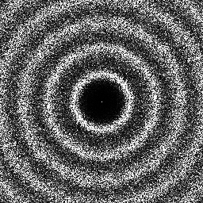
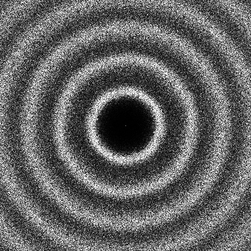

Sampler FPO [[SHD11]](https://dl.acm.org/citation.cfm?id=2018345)
-------------------------------------------------------------------

Files

src/samplers/SamplerFPO.hpp  
src/samplers/SamplerFPO/*  
src/bin/samplers/FPO_2dd.cpp  

Description
===========

Implementation from the stk library of the sampler from [[SHD11]](https://dl.acm.org/citation.cfm?id=2018345).  
For a more precise description of this sampler and its performances in terms of aliasing and discrepancy, please refer to the following web bundle [https://liris.cnrs.fr/ldbn/HTML_bundle/index.html](https://liris.cnrs.fr/ldbn/HTML_bundle/index.html).

Execution
=========

Parameters:  

	[HELP]
	-o [string=output_pts.dat]	Output file
	-m [int=1]			Number of poinset realisations
	-n [ullint=1024]		Number of samples to generate
	--silent 			Silent mode
	-h 				Displays this help message
			

To generate a 2D point set of 1024 samples with a FPO distribution, we can use the following client line command:

 ./src/samplers/FPO_2dd -n 1024 -o toto.dat 

Or one can use the following C++ code:

    
    PointsetWriter< 2, double, Point<2, double> > writer;
    writer.open("toto.dat");
    Pointset< 2, double, Point<2, double> > pts;
    SamplerFPO s;
    unsigned int param_nbsamples = 1024;
    s.generateSamples< 2, double, Point<2, double> >(pts, param_nbsamples);
    writer.writePointset(pts);
    writer.close();
    			

Results
=======

 ./src/samplers/FPO_2dd -o FPO_1024.edat -n 1024 

File  
[FPO_1024.edat](data/FPO/FPO_1024.edat)

Pointset  

Fourier  

 ./src/samplers/FPO_2dd -o FPO_4096.edat -n 4096 

File  
[FPO_4096.edat](data/FPO/FPO_4096.edat)

Pointset  

Fourier  

