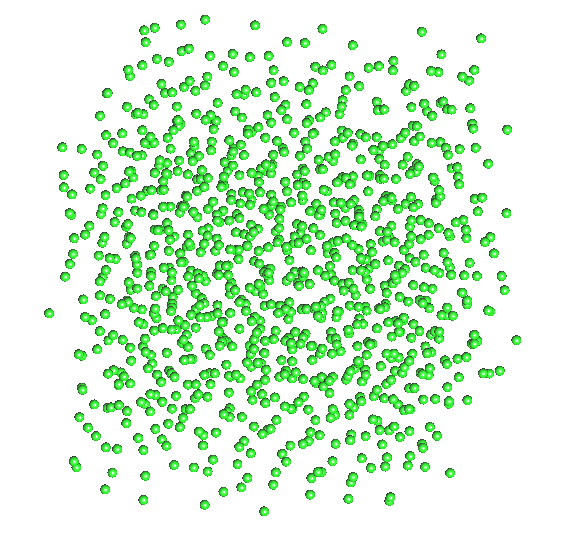

# Sampler Lloyd 3D


## Files


```
src/samplers/SamplerLloyd.hpp 
src/samplers/SamplerLloyd/ 
src/samplers/Lloyd_3dd.cpp
```

## Description


This sampler is a wrapper around the
[geogram](http://alice.loria.fr/software/geogram/doc/html/index.html)
library for an efficient implementation of periodic and non-periodic
Delaunay triangulation in 3D. The `Lloyd_3dd` sampler is a standard
implementation of Lloyd's relaxation algorithm.


## License

BSD for the UTK wrapper. Geogram is licensed under the 3-clauses BSD License (also called
"Revised BSD License", "New BSD License", or "Modified BSD License").


## Execution


Parameters:  

```
[HELP]
	-o [string=output_pts.dat]	Output file
	-m [int=1]			Number of poinset realisations
	-n [ullint=1024]		Number of samples to generate
	--silent 			Silent mode
	-h 				Displays this help message
	-s [int=100]			Number of Lloyd's steps
	-t [bool=false]			Activate Toroidal domain
```

To generate 4 realizations of a 3D toroidal point set of 1024 samples
with 500 Lloyd's steps, we can use the following client line command (from the buold folder):

     ./bin/Lloyd_3dd -n 1024 -o toto.dat -t -m 4 -s 500

Results
=======


[](data/Lloyd3d/lloyd3d.png)
