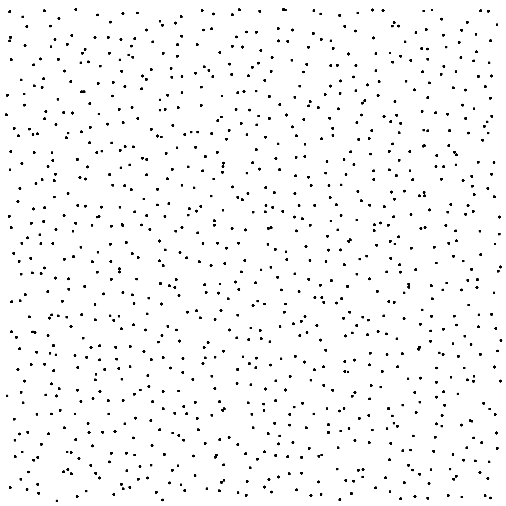
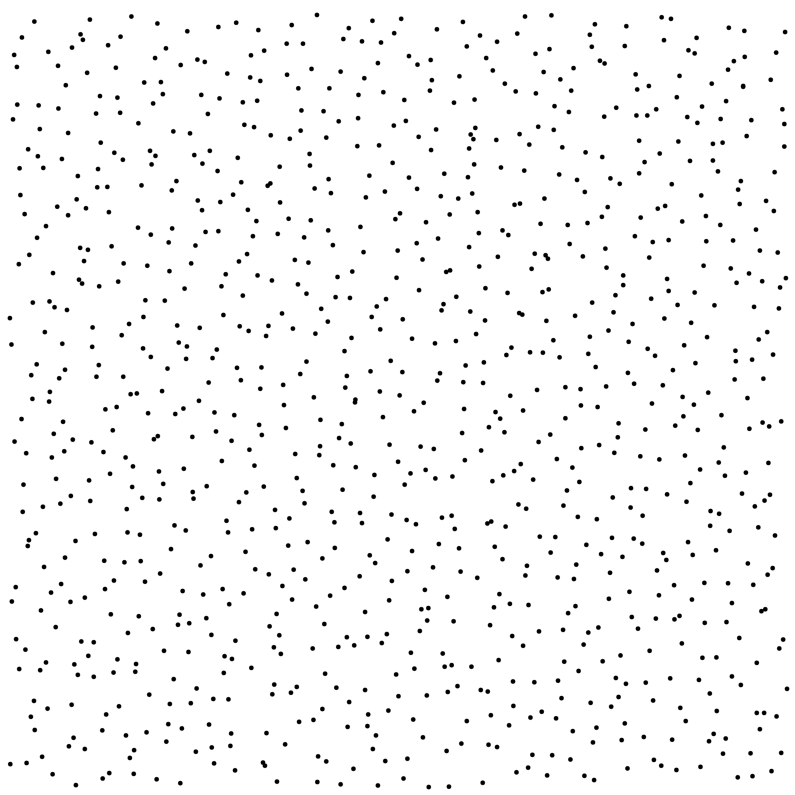
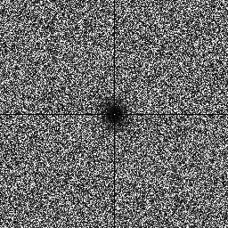

UTK     hljs.initHighlightingOnLoad();

Sampler PMJ [[PMJ]](https://graphics.pixar.com/library/ProgressiveMultiJitteredSampling/paper.pdf)
----------------------------------------------------------------------------------------------------

## Files

src/samplers/src_pmj

## Description

The Progressive Multi-Jittered sampler. This sampler is divided in 3 techniques, each giving better results than the previous one :  
  
Progressive Jittered (PJ) : Divides the unit square into 4 equal squares. Randomly throws a point into each subsquare. Then divide those subsquares into subsubsquares. Randomly throws points in them, and so on.  
  
Progressive Multi-Jittered (PMJ) : Adds to PJ one property : Using PJ, each sample falls into its own square subdivision. Using PMJ, each sample falls into its own square subdivision AND its own strata. When throwing points, uses a best candidate algorithm.  
  
Progressive Multi-Jittered(0,2) (PMJ02) : Generalises the previous techniques. If we subdivide the unit square into equals rectangles, each sample falls into its own rectangle.  
  
View article : [[PMJ]](https://graphics.pixar.com/library/ProgressiveMultiJitteredSampling/paper.pdf)

## Execution

Parameters:  

	[HELP]
	-o [string=output_pts.dat]	Output file
	-n [ullint=1024]		Number of samples to generate
	-s [int=0]			Seed
	-c [int=10]			For PMJ Sampler, number of candidates for 
					best candidates selection.
			

To generate a 2D point set of 1024 samples with a PMJ distribution using 20 candidates, we can use the following client line command:

     ./bin/samplers/ProgressiveMultiJittered_2dd -n 1024 -o toto.dat -s 0 -c 20 

Results
=======

File  
[PJ____ 1024.dat](data/PMJ/SampleSequences/PJ_1024.dat)

Pointset  

Fourier  

File  
[PMJ___1024.dat](data/PMJ/SampleSequences/PMJ_1024.dat)

Pointset  

Fourier  

File  
[PMJ02_1024.dat](data/PMJ/SampleSequences/PMJ02_1024.dat)

Pointset  

Fourier  

File  
[PMJ02_4096.dat](data/PMJ/SampleSequences/PMJ02_4096.dat)

Pointset  

Fourier  

