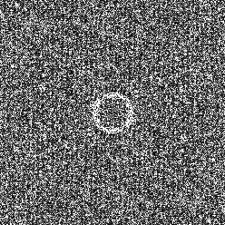

# Sampler AA Patterns [[Ahm16]](http://abdallagafar.com/abdalla/wp-content/uploads/2017/03/Sampling-with-AA-Patterns.pdf)

## Files

```
src/samplers/SamplerAAPattern.hpp  
src/bin/samplers/AAPatterns_2dd.cpp.cpp
```

## Description


The AA Pattern sampler from [[Ahm16]](http://abdallagafar.com/abdalla/wp-content/uploads/2017/03/Sampling-with-AA-Patterns.pdf).  
For a more precise description of this sampler and its performances in terms of aliasing and discrepancy, please refer to the following web bundle [https://liris.cnrs.fr/ldbn/HTML_bundle/index.html](https://liris.cnrs.fr/ldbn/HTML_bundle/index.html).

## License

```
/* Generate a distribution based on an AA pattern and a loadable displacement map
 * Values which depend on pattern parameters are read from a header file so
 *  that different parameters can be used with this code.
 * We could also load these dynamically, but hard-coding them gives substantial speedup
 * Created by Abdalla Ahmed
 * 2014-11-11
 * Last revision 2015-09-10
 */
```

## Execution

```
Parameters:  

	[HELP]
	-o [string=output_pts.dat]	Output file
	-m [int=1]			Number of poinset realisations
	-n [ullint=1024]		Number of samples to generate
	--silent 			Silent mode
	-h 				Displays this help message
	-d File containing the displacement vectors
```

To generate a 2D point set of 1024 samples with a aapatterns distribution, we can use the following client line command:

     ./bin/samplers/AAPatterns_2dd -d ../../data/aapatterns/blue.dat -n 1024 -o toto.dat

Or one can use the following C++ code:

 ```cpp   
    PointsetWriter< 2, double, Point<2, double> > writer;
    writer.open("toto.dat");
    Pointset< 2, double, Point<2, double> > pts;
    SamplerAAPattern s;
    unsigned int param_nbsamples = 1024;
    s.generateSamples< 2, double, Point<2, double> >(pts, param_nbsamples);
    writer.writePointset(pts);
    writer.close();
 ```   			

Results
=======

     ./bin/samplers/AAPatterns_2dd -d ../../data/aapatterns/blue.dat -o aapatterns_1024.edat -n 1024

File  
[aapatterns_1024.edat](data/aapatterns/aapatterns_1024.edat)

Pointset  
[](data/aapatterns/aapatterns_1024.png)

Fourier  
[](data/aapatterns/aapatterns_1024_fourier.png)

     ./bin/samplers/AAPatterns_2dd -d ../../data/aapatterns/blue.dat -o aapatterns_4096.edat -n 4096

File  
[aapatterns_4096.edat](data/aapatterns/aapatterns_4096.edat)

Pointset  
[](data/aapatterns/aapatterns_4096.png)

Fourier  
[](data/aapatterns/aapatterns_4096_fourier.png)

This sampler can also match various distributions

     ./bin/samplers/AAPatterns_2dd -d ../../data/aapatterns/green.dat -o aapatterns_green_1024.edat -n 1024

File  
[aapatterns_green_1024.edat](data/aapatterns_green/aapatterns_green_1024.edat)

Pointset  
[](data/aapatterns_green/aapatterns_green_1024.png)

Fourier  
[](data/aapatterns_green/aapatterns_green_1024_fourier.png)

     ./bin/samplers/AAPatterns_2dd -d ../../data/aapatterns/pink.dat -o aapatterns_pink_1024.edat -n 1024

File  
[aapatterns_pink_1024.edat](data/aapatterns_pink/aapatterns_pink_1024.edat)

Pointset  
[](data/aapatterns_pink/aapatterns_pink_1024.png)

Fourier  
[](data/aapatterns_pink/aapatterns_pink_1024_fourier.png)

     ./bin/samplers/AAPatterns_2dd -d ../../data/aapatterns/step.dat -o aapatterns_step_1024.edat -n 1024

File  
[aapatterns_step_1024.edat](data/aapatterns_step/aapatterns_step_1024.edat)

Pointset  
[](data/aapatterns_step/aapatterns_step_1024.png)

Fourier  
[](data/aapatterns_step/aapatterns_step_1024_fourier.png)
