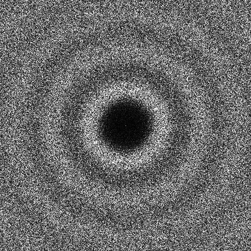
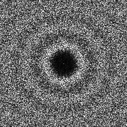
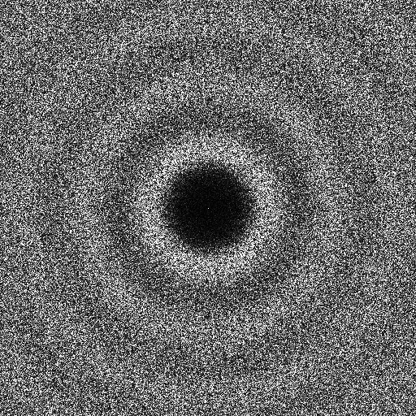

# Sampler Dart Throwing [[MF92]](http://www.dgp.toronto.edu/~elf/.misc/poissondisk.pdf)


## Files

```
src/samplers/SamplerDartThrowing.hpp  
src/bin/samplers/DartThrowing_2dd.cpp
```

## Description


A naive (relaxed) dart throwing algorithm.  
For a more precise description of this sampler and its performances in terms of aliasing and discrepancy, please refer to the following web bundle [https://liris.cnrs.fr/ldbn/HTML_bundle/index.html](https://liris.cnrs.fr/ldbn/HTML_bundle/index.html).

## Execution


Parameters:  

	[HELP]
	-o [string=output_pts.dat]	Output file
	-m [int=1]			Number of poinset realisations
	-n [ullint=1024]		Number of samples to generate
	--silent 			Silent mode
	-h 				Displays this help message
	--relaxed 				Use relaxed dart throwing
			

To generate a 2D point set of 1024 samples with a dart_throwing distribution, we can use the following client line command:

     ./bin/samplers/DartThrowing_2dd -n 1024 -o toto.dat 

Or one can use the following C++ code:

    
    PointsetWriter< 2, double, Point<2, double> > writer;
    writer.open("toto.dat");
    Pointset< 2, double, Point<2, double> > pts;
    SamplerDartThrowing s;
    unsigned int param_nbsamples = 1024;
    s.generateSamples< 2, double, Point<2, double> >(pts, param_nbsamples);
    writer.writePointset(pts);
    writer.close();
    			

Results
=======

     ./bin/samplers/DartThrowing_2dd -o dart_throwing_1024.edat -n 1024 

File  
[dart_throwing_1024.edat](data/dart_throwing/dart_throwing_1024.edat)

Pointset  
[](data/dart_throwing/dart_throwing_1024.png)

Fourier  
[](data/dart_throwing/dart_throwing_1024_fourier.png)

     ./bin/samplers/DartThrowing_2dd -o dart_throwing_4096.edat -n 4096 

File  
[dart_throwing_4096.edat](data/dart_throwing/dart_throwing_4096.edat)

Pointset  
[](data/dart_throwing/dart_throwing_4096.png)

Fourier  
[](data/dart_throwing/dart_throwing_4096_fourier.png)

     ./bin/samplers/DartThrowing_2dd --relaxed -o dart_throwing_relaxed_1024.edat -n 1024 

File  
[dart_throwing_relaxed_1024.edat](data/dart_throwing_relaxed/dart_throwing_relaxed_1024.edat)

Pointset  
[](data/dart_throwing_relaxed/dart_throwing_relaxed_1024.png)

Fourier  
[](data/dart_throwing_relaxed/dart_throwing_relaxed_1024_fourier.png)

     ./bin/samplers/DartThrowing_2dd --relaxed -o dart_throwing_relaxed_4096.edat -n 4096 

File  
[dart_throwing_relaxed_4096.edat](data/dart_throwing_relaxed/dart_throwing_relaxed_4096.edat)

Pointset  
[](data/dart_throwing_relaxed/dart_throwing_relaxed_4096.png)

Fourier  
[](data/dart_throwing_relaxed/dart_throwing_relaxed_4096_fourier.png)
