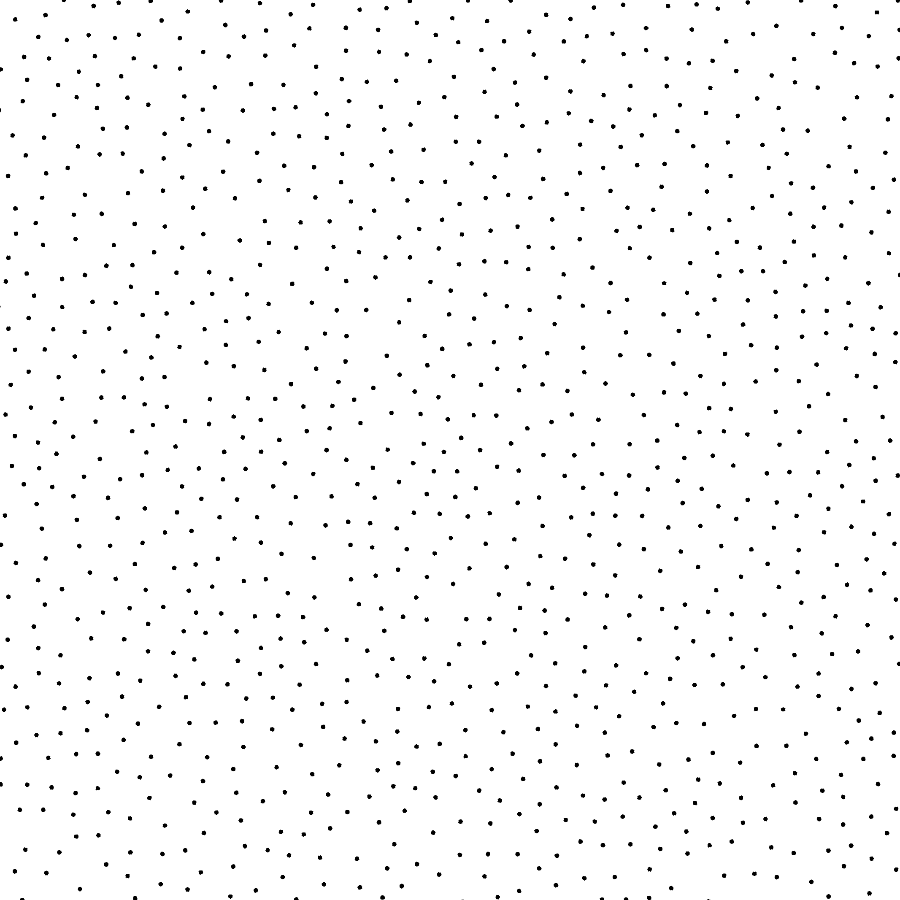
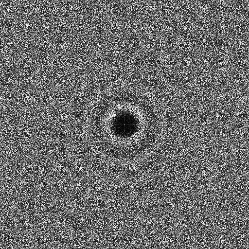
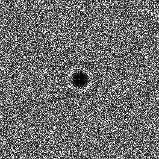
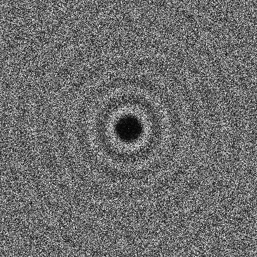
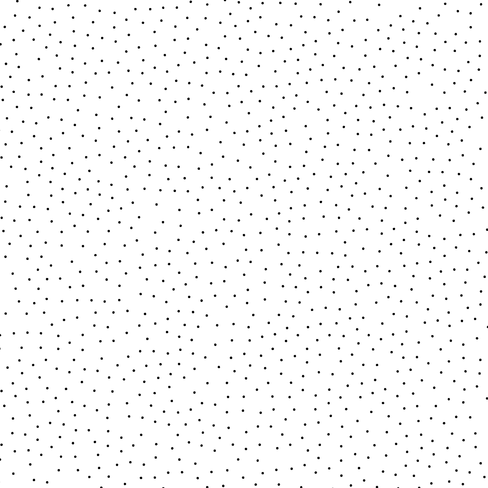
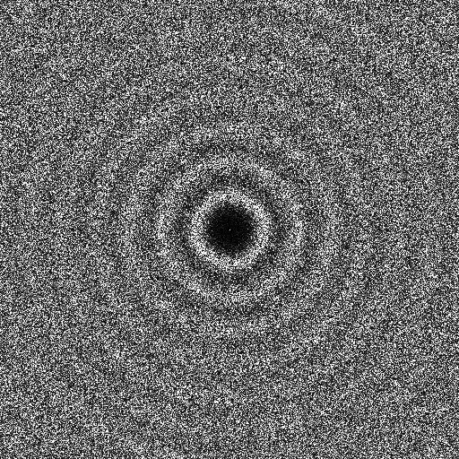

Sampler Fast Poisson [\[Bri07\]](https://www.cs.ubc.ca/~rbridson/docs/bridson-siggraph07-poissondisk.pdf)
---------------------------------------------------------------------------------------------------------

Files

src/samplers/SamplerFastPoisson.hpp  
src/bin/samplers/FastPoisson\_2dd.cpp.cpp

Description
===========

The Fast Poisson sampler from [\[DH06\]](https://dl.acm.org/citation.cfm?doid=1141911.1141915).  
For a more precise description of this sampler and its performances in terms of aliasing and discrepancy, please refer to the following web bundle [https://liris.cnrs.fr/ldbn/HTML\_bundle/index.html](https://liris.cnrs.fr/ldbn/HTML_bundle/index.html).

Execution
=========

Parameters:  

	\[HELP\]
	-o \[string=output\_pts.dat\]	Output file
	-m \[int=1\]			Number of poinset realisations
	-n \[ullint=1024\]		Number of samples to generate
	--silent 			Silent mode
	-h 				Displays this help message
	--method \[string=DartThrowing\] 	The method to use to generate the samples 
							(DartThrowing | Pure | LinearPure)
	--minmaxthrows \[int=100\] 	set minimum number of maximum throws for DartThrowing sampler
	--mult \[int=1\] 			set multiplier for DartThrowing sampler
	--tiled 			If set, use tiled domain
			

To generate a 2D point set of 1024 samples with a fastpoisson distribution, we can use the following client line command:

 ./bin/samplers/FastPoisson\_2dd -n 1024 -o toto.dat 

Or one can use the following C++ code:

    
    PointsetWriter< 2, double, Point<2, double> > writer;
    writer.open("toto.dat");
    Pointset< 2, double, Point<2, double> > pts;
    SamplerFastPoisson s;
    unsigned int param_nbsamples = 1024;
    s.generateSamples< 2, double, Point<2, double> >(pts, param_nbsamples);
    writer.writePointset(pts);
    writer.close();
    			

Results
=======

Dart Throwing Method

 ./bin/samplers/FastPoisson\_2dd -o fastpoisson\_1024.edat -n 1024 

File  
[fastpoisson\_1024.edat](data/fastpoisson/fastpoisson_1024.edat)

Pointset  

Fourier  

 ./bin/samplers/FastPoisson\_2dd -o fastpoisson\_4096.edat -n 4096 

File  
[fastpoisson\_4096.edat](data/fastpoisson/fastpoisson_4096.edat)

Pointset  

Fourier  

 ./bin/samplers/FastPoisson\_2dd --minmaxthrows 50 -o fastpoisson\_50\_1024.edat -n 1024 

File  
[fastpoisson\_50\_1024.edat](data/fastpoisson_50/fastpoisson_50_1024.edat)

Pointset  

Fourier  

 ./bin/samplers/FastPoisson\_2dd --minmaxthrows 200 -o fastpoisson\_200\_1024.edat -n 1024 

File  
[fastpoisson\_200\_1024.edat](data/fastpoisson_200/fastpoisson_200_1024.edat)

Pointset  

Fourier  

 ./bin/samplers/FastPoisson\_2dd --mult 2 -o fastpoisson\_mult2\_1024.edat -n 1024 

File  
[fastpoisson\_mult2\_1024.edat](data/fastpoisson_mult2/fastpoisson_mult2_1024.edat)

Pointset  

Fourier  

Pure Method

 ./bin/samplers/FastPoisson\_2dd --method Pure -o fastpoisson\_Pure\_1024.edat -n 1024 

File  
[fastpoisson\_Pure\_1024.edat](data/fastpoisson_Pure/fastpoisson_Pure_1024.edat)

Pointset  

Fourier  

 ./bin/samplers/FastPoisson\_2dd --method Pure -o fastpoisson\_Pure\_4096.edat -n 4096 

File  
[fastpoisson\_Pure\_4096.edat](data/fastpoisson_Pure/fastpoisson_Pure_4096.edat)

Pointset  

Fourier  

Linear Pure Method

 ./bin/samplers/FastPoisson\_2dd --method LinearPure -o fastpoisson\_LinearPure\_1024.edat -n 1024 

File  
[fastpoisson\_LinearPure\_1024.edat](data/fastpoisson_LinearPure/fastpoisson_LinearPure_1024.edat)

Pointset  

Fourier  

 ./bin/samplers/FastPoisson\_2dd --method LinearPure -o fastpoisson\_LinearPure\_4096.edat -n 4096 

File  
[fastpoisson\_LinearPure\_4096.edat](data/fastpoisson_LinearPure/fastpoisson_LinearPure_4096.edat)

Pointset  

Fourier  
