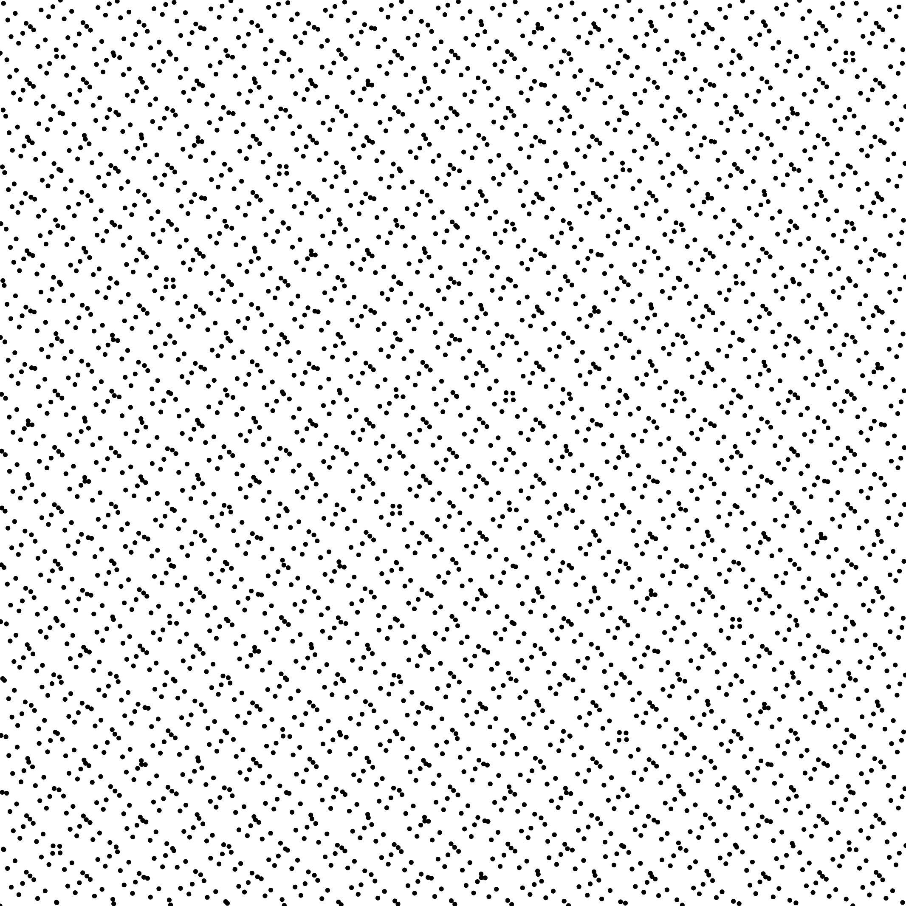

# Sampler Faure [[Fau82]](https://eudml.org/doc/205851)

## Files

```
src/samplers/SamplerFaure.hpp  
src/bin/samplers/Faure_2d*.cpp.cpp
```

## Description

The Faure sequence (2D only). For a more precise description of this sampler and its performances in terms of aliasing and discrepancy, please refer to the following web bundle [https://liris.cnrs.fr/ldbn/HTML_bundle/index.html](https://liris.cnrs.fr/ldbn/HTML_bundle/index.html).


## License

[GNU LGPL](https://people.sc.fsu.edu/~jburkardt/txt/gnu_lgpl.txt), code from [https://people.sc.fsu.edu/~jburkardt/cpp_src/faure/faure.html](https://people.sc.fsu.edu/~jburkardt/cpp_src/faure/faure.html)

## Execution

```
Parameters:  

	[HELP]
	-o [string=output_pts.dat]	Output file
	-m [int=1]			Number of poinset realisations
	-n [ullint=1024]		Number of samples to generate
	--silent 			Silent mode
	-h 				Displays this help message

```

To generate a 2D point set of 1024 samples with a faure distribution, we can use the following client line command:

        ./bin/samplers/Faure_2dd -n 1024 -o toto.dat

Or one can use the following C++ code:

```  cpp
    PointsetWriter< 2, double, Point<2, double> > writer;
    writer.open("toto.dat");
    Pointset< 2, double, Point<2, double> > pts;
    SamplerFaure s;
    unsigned int param_nbsamples = 1024;
    s.generateSamples< 2, double, Point<2, double> >(pts, param_nbsamples);
    writer.writePointset(pts);
    writer.close();
```    			

## Results

        ./bin/samplers/Faure_2dd -o faure_1024.edat -n 1024

### File  
[faure_1024.edat](data/faure/faure_1024.edat)

### Pointset  
[](data/faure/faure_1024.png)

### Fourier  
[](data/faure/faure_1024_fourier.png)

        ./bin/samplers/Faure_2dd -o faure_4096.edat -n 4096

### File  
[faure_4096.edat](data/faure/faure_4096.edat)

### Pointset  
[](data/faure/faure_4096.png)

### Fourier  
[](data/faure/faure_4096_fourier.png)
