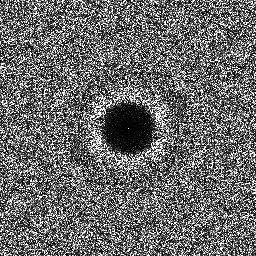

Sampler Forced Random [[CTS*17]](https://link.springer.com/article/10.1007/s00371-017-1392-7)
------------------------------------------------------------------------------------------------

## Files

src/samplers/SamplerForcedRandom.hpp  
src/bin/samplers/ForcedRandom_2dd.cpp.cpp

## Description

A sampler based on dithering matrices from [[CTS*17]](https://link.springer.com/article/10.1007/s00371-017-1392-7).

## Execution

Parameters:  

	[HELP]
	-o [string=output_pts.dat]	Output file
	-m [int=1]			Number of poinset realisations
	-n [ullint=1024]		Number of samples to generate
	--silent 			Silent mode
	-h 				Displays this help message
	--matrix [int=512] 		the matrix size [512 | 1024 | 2048]
	--sparsity [int=8] 		the matrix sparsity
			

To generate a 2D point set of 1024 samples with a forced_random distribution, we can use the following client line command:

     ./bin/samplers/ForcedRandom_2dd -n 1024 -o toto.dat 

Or one can use the following C++ code:

    
    PointsetWriter< 2, double, Point<2, double> > writer;
    writer.open("toto.dat");
    Pointset< 2, double, Point<2, double> > pts;
    SamplerForcedRandom s;
    unsigned int param_nbsamples = 1024;
    s.generateSamples< 2, double, Point<2, double> >(pts, param_nbsamples);
    writer.writePointset(pts);
    writer.close();
    			

Results
=======

     ./bin/samplers/ForcedRandom_2dd -o forced_random_1024.edat -n 1024 

File  
[forced_random_1024.edat](data/forced_random/forced_random_1024.edat)

Pointset  

Fourier  

     ./bin/samplers/ForcedRandom_2dd -o forced_random_4096.edat -n 4096 

File  
[forced_random_4096.edat](data/forced_random/forced_random_4096.edat)

Pointset  

Fourier  

