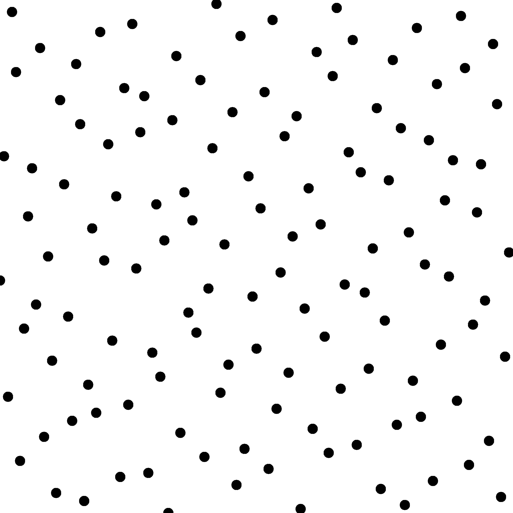
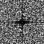

Sampler Genetic Owen
--------------------

Files

src/samplers/SamplerGeneticOwen.hpp  
src/bin/samplers/GeneticOwen\_2dd.cpp.cpp

Description
===========

Owen's scrambling uses a permutation tree in each dimension. This tree is usually randomly filled. For a set containing n samples, it contains N flags, with N=n-1. This leads to 2^N possible trees in each dimension, which is too computationnally expensive for an exhaustive search. This sampler thus uses genetic algorithms to try and find the best possible tree generating Blue Noise sets. However, the algorithm is too naive to generate good Blue Noise sets for more than 128 samples.

Execution
=========

Parameters:  

	\[HELP\]
	-o \[string=output\_pts.dat\]	Output file
	-m \[int=1\]			Number of poinset realisations
	-n \[ullint=1024\]		Number of samples to generate
	--silent 			Silent mode
	-h 				Displays this help message
	--iter \[int=1000\]		the number of iterations
			

To generate a 2D point set of 1024 samples with a genetic\_owen distribution, we can use the following client line command:

 ./bin/samplers/GeneticOwen\_2dd --iter 200 -n 1024 -o toto.dat 

Or one can use the following C++ code:

    
    PointsetWriter< 2, double, Point<2, double> > writer;
    writer.open("toto.dat");
    Pointset< 2, double, Point<2, double> > pts;
    SamplerGeneticOwen s;
    unsigned int param_nbsamples = 1024;
    s.generateSamples< 2, double, Point<2, double> >(pts, param_nbsamples);
    writer.writePointset(pts);
    writer.close();
    			

Results
=======

 ./bin/samplers/GeneticOwen\_2dd --iter 200 -o genetic\_owen\_64.edat -n 64 

File  
[genetic\_owen\_64.edat](data/genetic_owen/genetic_owen_64.edat)

Pointset  

Fourier  

 ./bin/samplers/GeneticOwen\_2dd --iter 200 -o genetic\_owen\_128.edat -n 128 

File  
[genetic\_owen\_128.edat](data/genetic_owen/genetic_owen_128.edat)

Pointset  

Fourier  
