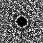
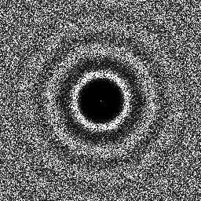
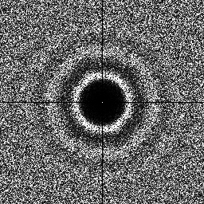

# Sampler Gradient Descent

## Files

    src/samplers/SamplerGradientDescent.hpp  
    src/bin/samplers/GradientDescent_2dd.cpp.cpp

## Description

This sampler optimizes a given input sampler to minimize its Generalized L2 discrepancy, using gradient descent. This optimizing is very slow and therefore can hardly be performed on more than 4k samples.

## Execution

Parameters:  

	[HELP]
	-o [string=output_pts.dat]	Output file
	-m [int=1]			Number of poinset realisations
	-n [ullint=1024]		Number of samples to generate
	--silent 			Silent mode
	-h 				Displays this help message
	-i [string]			The pointset to optimize
			

To optimize the discrepancy of a 2D point set using gradient descent, we can use the following client line command:

     ./bin/samplers/GradientDescent_2dd -i bnot128.dat -o toto.dat 

Or one can use the following C++ code:

    
    PointsetWriter< 2, double, Point<2, double> > writer;
    writer.open("toto.dat");
    Pointset< 2, double, Point<2, double> > pts;
    SamplerGradientDescent s;
    s.setInputPointset("bnot128.dat");
    s.generateSamples< 2, double, Point<2, double> >(pts);
    writer.writePointset(pts);
    writer.close();
    			

Results
=======

     ./bin/samplers/GradientDescent_2dd -i bnot128.dat -o optimbnot_128.edat 

Initial File  
[bnot128.dat](data/gradient_descent/bnot128.dat)

Initial Pointset  

Initial Fourier  

Optimized File  
[optimbnot_128.edat](data/gradient_descent/optimbnot_128.edat)

Optimized Pointset  

Optimized Fourier  

     ./bin/samplers/GradientDescent_2dd -i bnot1024.dat -o optimbnot_1024.edat 

Initial File  
[bnot1024.dat](data/gradient_descent/bnot1024.dat)

Initial Pointset  

Initial Fourier  

Optimized File  
[optimbnot_1024.edat](data/gradient_descent/optimbnot_1024.edat)

Optimized Pointset  

Optimized Fourier  

Discrepancy Graph

