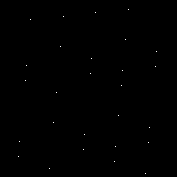
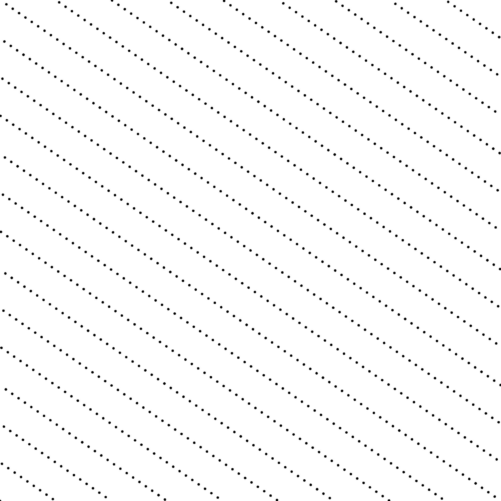
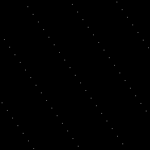
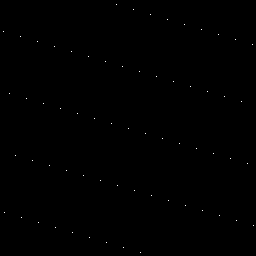

Sampler Korobov [[Kor59]](https://www.sciencedirect.com/science/article/pii/S0885064X14001204)
------------------------------------------------------------------------------------------------

Files

src/samplers/SamplerKorobov.hpp  
src/bin/samplers/Korobov_2dd.cpp.cpp

Description
===========

Korobov lattices. The generator value should be prime relatively to the number of samples, otherwise the point set will not be projection regular.  
For a more precise description of this sampler and its performances in terms of aliasing and discrepancy, please refer to the following web bundle [https://liris.cnrs.fr/ldbn/HTML_bundle/index.html](https://liris.cnrs.fr/ldbn/HTML_bundle/index.html).

Execution
=========

Parameters:  

	[HELP]
	-o [string=output_pts.dat]	Output file
	-m [int=1]			Number of poinset realisations
	-n [ullint=1024]		Number of samples to generate
	--silent 			Silent mode
	-h 				Displays this help message
	-a [uint=3]			The generator value
			

To generate a 2D point set of 1024 samples with a korobov distribution, we can use the following client line command:

     ./bin/samplers/Korobov_2dd -n 1024 -o toto.dat 

Or one can use the following C++ code:

    
    PointsetWriter< 2, double, Point<2, double> > writer;
    writer.open("toto.dat");
    Pointset< 2, double, Point<2, double> > pts;
    SamplerKorobov s;
    unsigned int param_nbsamples = 1024;
    s.generateSamples< 2, double, Point<2, double> >(pts, param_nbsamples);
    writer.writePointset(pts);
    writer.close();
    			

Results
=======

     ./bin/samplers/Korobov_2dd -o korobov_1024.edat -n 1024 

File  
[korobov_1024.edat](data/korobov/korobov_1024.edat)

Pointset  

Fourier  

     ./bin/samplers/Korobov_2dd -o korobov_4096.edat -n 4096 

File  
[korobov_4096.edat](data/korobov/korobov_4096.edat)

Pointset  

Fourier  

     ./bin/samplers/Korobov_2dd -a 89 -o korobov_89_1024.edat -n 1024 

File  
[korobov_89_1024.edat](data/korobov_89/korobov_89_1024.edat)

Pointset  

Fourier  

     ./bin/samplers/Korobov_2dd -a 419 -o korobov_419_1024.edat -n 1024 

File  
[korobov_419_1024.edat](data/korobov_419/korobov_419_1024.edat)

Pointset  

Fourier  

     ./bin/samplers/Korobov_2dd -a 787 -o korobov_787_1024.edat -n 1024 

File  
[korobov_787_1024.edat](data/korobov_787/korobov_787_1024.edat)

Pointset  

Fourier  

     ./bin/samplers/Korobov_2dd -a 2659 -o korobov_2659_1024.edat -n 1024 

File  
[korobov_2659_1024.edat](data/korobov_2659/korobov_2659_1024.edat)

Pointset  

Fourier  

