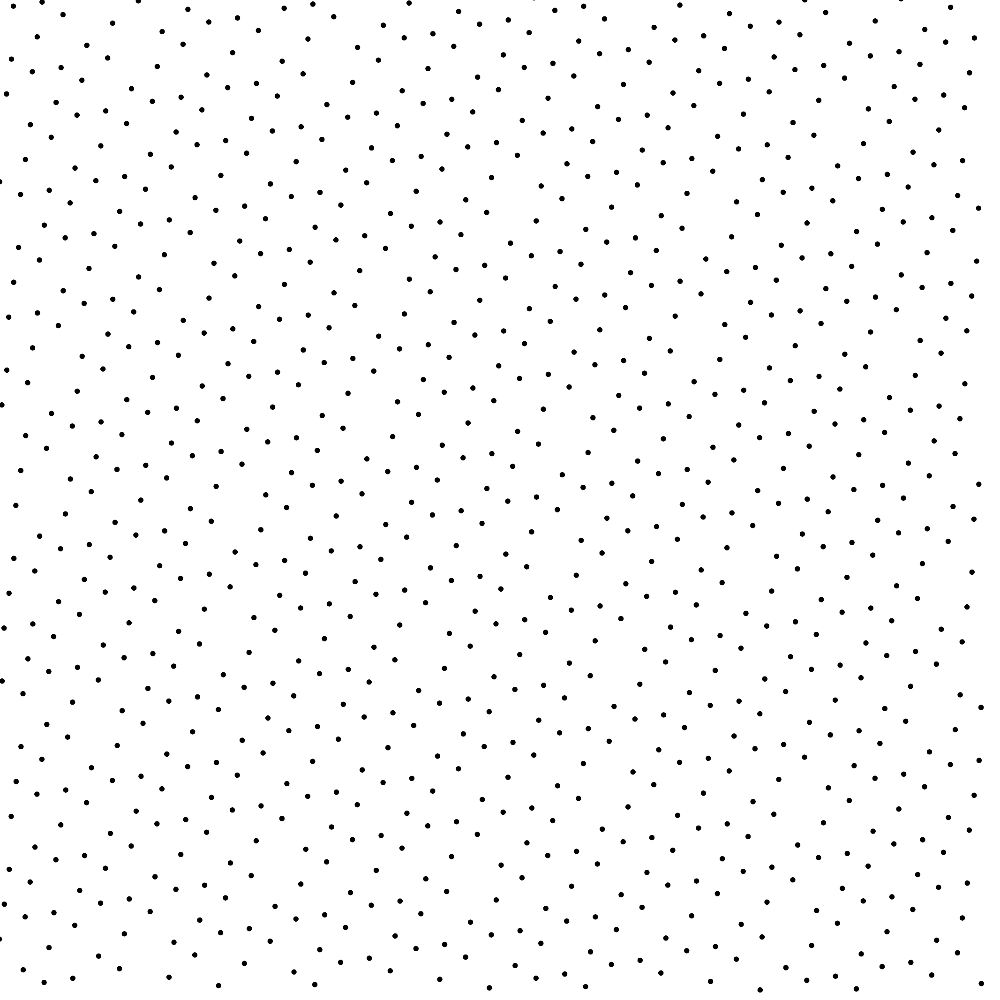
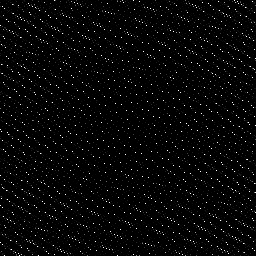
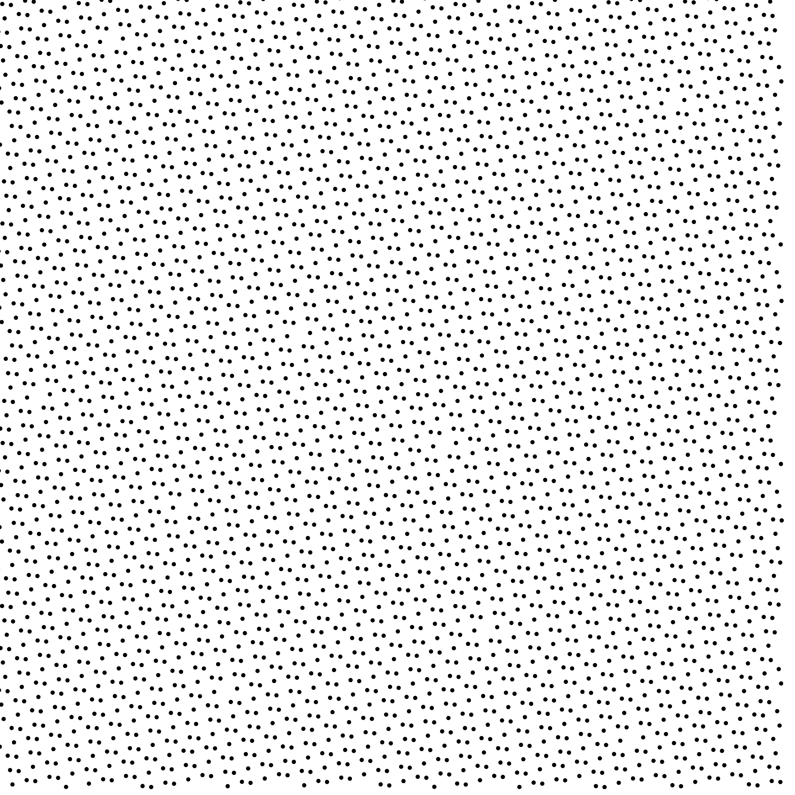
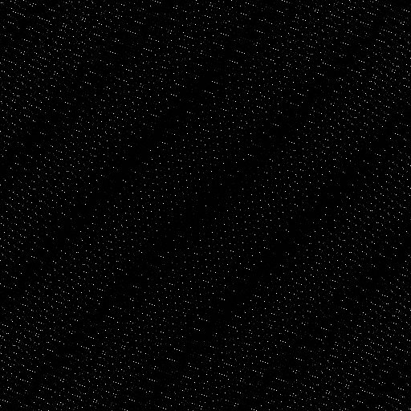

# Sampler Kronecker K21-2


## Files

```
src/samplers/SamplerKronecker.hpp  
src/samplers/SamplerKronecker/Kronecker.hpp
src/samplers/SamplerKronecker/Kronecker.cpp

```

## Description

A Kronecker sequence is defined by an additive recurrence for each dimension:

S[i] = { S[i-1] + a }

Where _a_ is an irrational value and {_x_} denotes the fractional part of _x_.
In this case, we use the K21-2 irrationals of: (To appear) Optimizing Kronecker Sequences for Multidimensional Sampling, Journal of Computer Graphics Techniques.


## License

BSD license, see the `SamplerKronecker.hpp` file.

## Execution

```
Parameters:  

	[HELP]
	-o [string=output_pts.dat]	Output file
	-m [int=1]					Number of poinset realisations
	-n [ullint=1024]		Number of samples to generate
	--silent 						Silent mode
	-h 								Displays this help message
```			

To generate a 2D point set of 1024 samples with a Kronecker sequence, we can use the following client line command:

           ./bin/samplers/KroneckerK21-2_2dd  -n 1024 -o toto.dat

Or one can use the following C++ code:

```c++    
    PointsetWriter< 2, double, Point<2, double> > writer;
    writer.open("toto.dat");
    Pointset< 2, double, Point<2, double> > pts;
    SamplerKronecker s(Kronecker::K21_2);
    unsigned int param_nbsamples = 1024;
    unsigned int bases[2] = {2, 3};
    s.setBaseList(&bases[0], 2);
    s.generateSamples< 2, double, Point<2, double> >(pts, param_nbsamples);
    writer.writePointset(pts);
    writer.close();
```			

## Results


    ./bin/samplers/KroneckerK21-2_2dd -o k21-2_1024.dat -n 1024


File  
[k21-2_1024.dat](data/kronecker_k21_2/k21-2_1024.dat)

Pointset  
[](data/kronecker_k21_2/k21-2_1024.png)

Fourier  
[](data/kronecker_k21_2/k21-2_1024_psd.png)

     ./bin/samplers/KroneckerK21-2_2dd -o k21-2_4096.dat -n 4096

File  
[k21-2_4096.dat](data/kronecker_k21_2/k21-2_4096.dat)

Pointset  
[](data/kronecker_k21_2/k21-2_4096.png)

Fourier  
[](data/kronecker_k21_2/k21-2_4096_psd.png)
