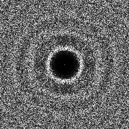
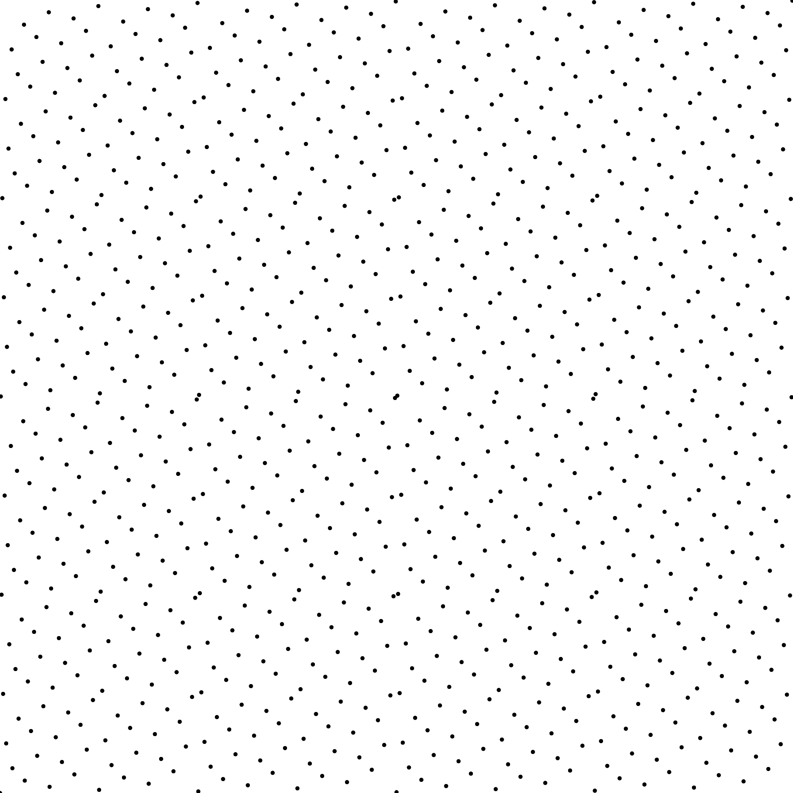
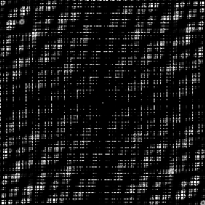
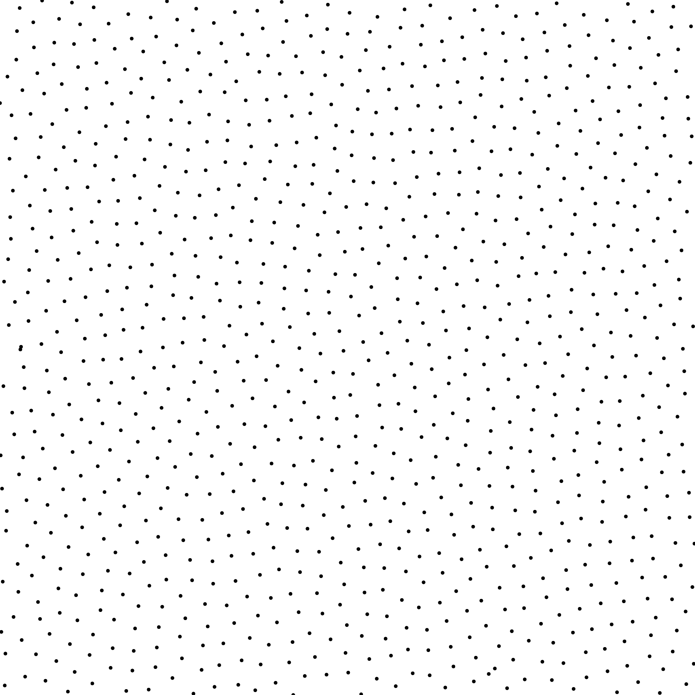
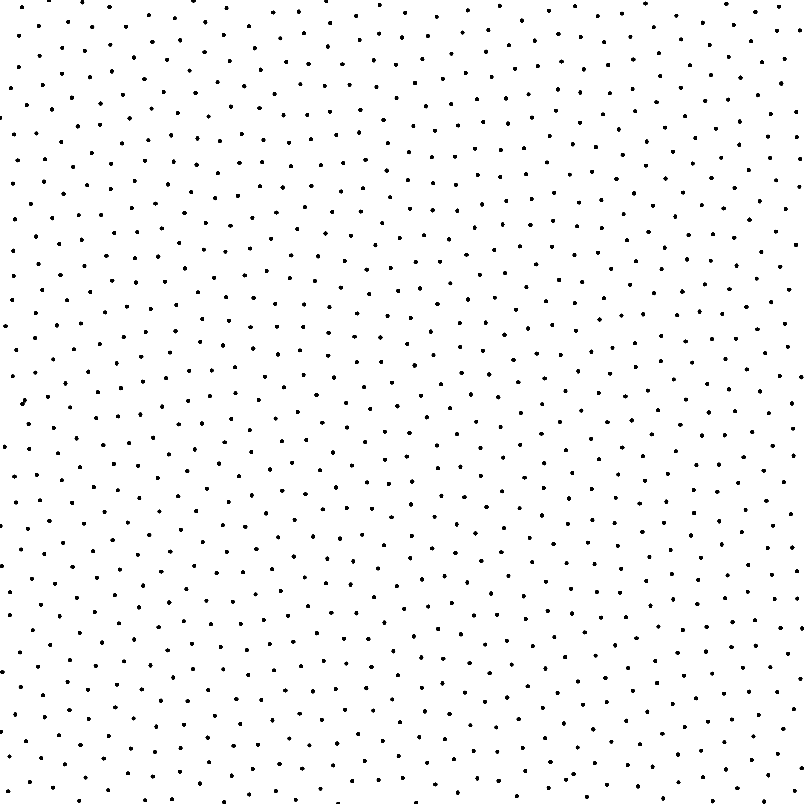
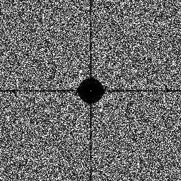

Sampler LDBN [[APC*16]](https://liris.cnrs.fr/ldbn/)
-------------------------------------------------------

Files

src/samplers/SamplerLDBN.hpp  
src/bin/samplers/LDBN_2dd.cpp.cpp

Description
===========

The LDBN sampler from [[APC*16]](https://liris.cnrs.fr/ldbn). This sampler is only 2D.  
For a more precise description of this sampler and its performances in terms of aliasing and discrepancy, please refer to the following web bundle [https://liris.cnrs.fr/ldbn/HTML_bundle/index.html](https://liris.cnrs.fr/ldbn/HTML_bundle/index.html).

Execution
=========

Parameters:  

	[HELP]
	-o [string=output_pts.dat]	Output file
	-m [int=1]			Number of poinset realisations
	-n [ullint=1024]		Number of samples to generate
	--silent 			Silent mode
	-h 				Displays this help message
	-d [string]			File containing the permutations
	-t [uint=128]			The size of the permutation tile
	-c [uint=16]			The size of the permutation chunk
			

To generate a 2D point set of 1024 samples with a ldbn distribution, we can use the following client line command:

     ./bin/samplers/LDBN_2dd -n 1024 -o toto.dat 

Or one can use the following C++ code:

    
    PointsetWriter< 2, double, Point<2, double> > writer;
    writer.open("toto.dat");
    Pointset< 2, double, Point<2, double> > pts;
    SamplerLDBN s;
    unsigned int param_nbsamples = 1024;
    s.generateSamples< 2, double, Point<2, double> >(pts, param_nbsamples);
    writer.writePointset(pts);
    writer.close();
    			

Results
=======

     ./bin/samplers/LDBN_2dd -o ldbn_1024.edat -n 1024 

File  
[ldbn_1024.edat](data/ldbn/ldbn_1024.edat)

Pointset  

Fourier  

     ./bin/samplers/LDBN_2dd -o ldbn_4096.edat -n 4096 

File  
[ldbn_4096.edat](data/ldbn/ldbn_4096.edat)

Pointset  

Fourier  

Changing the chunk size affects the Blue Noise property of the final set

     ./bin/samplers/LDBN_2dd -t 128 -c 1 -o ldbn_128_1_1024.edat -n 1024 

File  
[ldbn_128_1_1024.edat](data/ldbn_128_1/ldbn_128_1_1024.edat)

Pointset  

Fourier  

     ./bin/samplers/LDBN_2dd -t 128 -c 4 -o ldbn_128_4_1024.edat -n 1024 

File  
[ldbn_128_4_1024.edat](data/ldbn_128_4/ldbn_128_4_1024.edat)

Pointset  

Fourier  

     ./bin/samplers/LDBN_2dd -t 128 -c 8 -o ldbn_128_8_1024.edat -n 1024 

File  
[ldbn_128_8_1024.edat](data/ldbn_128_8/ldbn_128_8_1024.edat)

Pointset  

Fourier  

     ./bin/samplers/LDBN_2dd -t 128 -c 32 -o ldbn_128_32_1024.edat -n 1024 

File  
[ldbn_128_32_1024.edat](data/ldbn_128_32/ldbn_128_32_1024.edat)

Pointset  

Fourier  

     ./bin/samplers/LDBN_2dd -t 128 -c 64 -o ldbn_128_64_1024.edat -n 1024 

File  
[ldbn_128_64_1024.edat](data/ldbn_128_64/ldbn_128_64_1024.edat)

Pointset  

Fourier  

One can also change the final spectrum to generate a step disctribution instead.

     ./bin/samplers/LDBN_2dd -t 128 -c 16 -o ldbn_step_1024.edat -n 1024 
			-d ../../data/LDBN/tables_Step/tilesize_128/chunksize_m016.dat 

File  
[ldbn_step_1024.edat](data/ldbn_step/ldbn_step_1024.edat)

Pointset  

Fourier  

