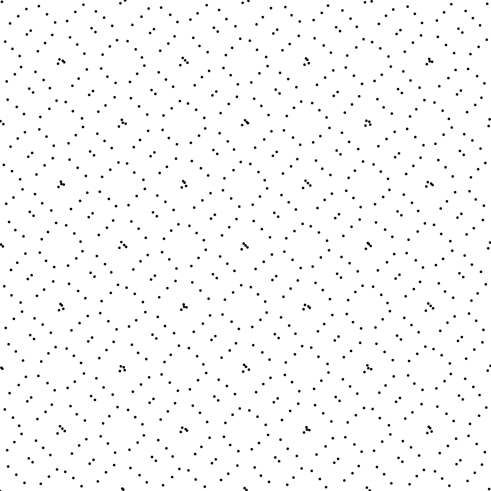
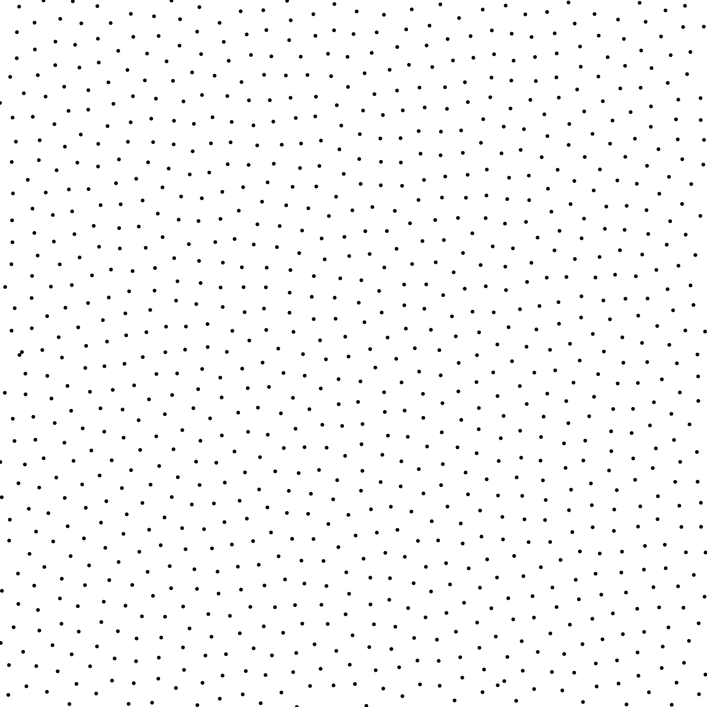

Low Discrepancy Samplers

* * *

Faure  
  

Halton  
  

Hammersley  
  

LDBN  
  

Projection scrambling  
  

Niederreiter  
  

Owen  
  

Sobol (code from [\[JK03\]](http://web.maths.unsw.edu.au/~fkuo/sobol/))  
  

Sobol (Original)  
 