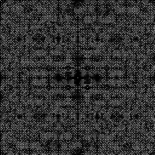
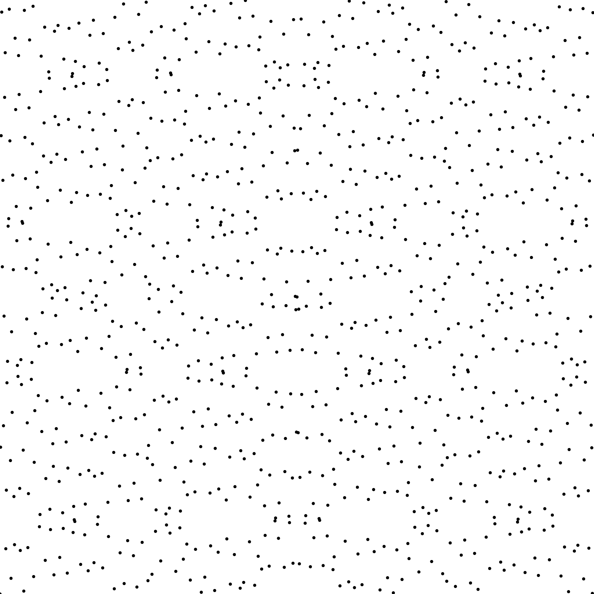
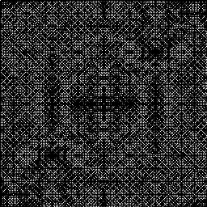

# Sampler Sobol Indiced [[Sob67]](https://www.sciencedirect.com/science/article/pii/0041555367901449)


##Files

```
src/samplers/SamplerSobolIndices.hpp  
src/bin/samplers/SobolIndices_*d*.cpp.cpp
```

##Description


The Sobol sequence. Samples are generated from a binary product between the binary representation of their index and a matrix, generated from primitive polynomials. The primitive polynomials are indiced based on [OEIS](https://oeis.org/A058943)  
For a more precise description of this sampler and its performances in terms of aliasing and discrepancy, please refer to the following web bundle [https://liris.cnrs.fr/ldbn/HTML_bundle/index.html](https://liris.cnrs.fr/ldbn/HTML_bundle/index.html).

## Execution


```
Parameters:  

	[HELP]
	-o [string=output_pts.dat]	Output file
	-m [int=1]			Number of poinset realisations
	-n [ullint=1024]		Number of samples to generate
	--silent 			Silent mode
	-h 				Displays this help message
	-x [uint=1]			Sobol Index on X dimension
	-y [uint=2]			Sobol Index on Y dimension
```			

To generate a 2D point set of 1024 samples with a sobolindiced distribution, we can use the following client line command:

     ./bin/samplers/SobolIndices_2dd -n 1024 -o toto.dat 

Or one can use the following C++ code:

```cpp    
    PointsetWriter< 2, double, Point<2, double> > writer;
    writer.open("toto.dat");
    Pointset< 2, double, Point<2, double> > pts;
    SamplerSobolIndices s;
    unsigned int param_nbsamples = 1024;
    int sobolIdX = 1;
    int sobolIdY = 2;
    int indices[2] = {sobolIdX, sobolIdY};
    s.setIndices(indices, 2);
    s.generateSamples< 2, double, Point<2, double> >(pts, param_nbsamples);
    writer.writePointset(pts);
    writer.close();
```    			

## Results


     ./bin/samplers/SobolIndices_2dd -o sobolindiced_1024.edat -n 1024 

File  
[sobolindiced_1024.edat](data/sobolindiced/sobolindiced_1024.edat)

Pointset  
[](data/sobolindiced/sobolindiced_1024.png)

Fourier  
[](data/sobolindiced/sobolindiced_1024_fourier.png)

     ./bin/samplers/SobolIndices_2dd -o sobolindiced_4096.edat -n 4096 

File  
[sobolindiced_4096.edat](data/sobolindiced/sobolindiced_4096.edat)

Pointset  
[](data/sobolindiced/sobolindiced_4096.png)

Fourier  
[](data/sobolindiced/sobolindiced_4096_fourier.png)

     ./bin/samplers/SobolIndices_2dd -x 3 -y 4 -o sobolindiced_34_1024.edat -n 1024 

File  
[sobolindiced_34_1024.edat](data/sobolindiced_34/sobolindiced_34_1024.edat)

Pointset  
[](data/sobolindiced_34/sobolindiced_34_1024.png)

Fourier  
[](data/sobolindiced_34/sobolindiced_34_1024_fourier.png)

     ./bin/samplers/SobolIndices_2dd -x 5 -y 6 -o sobolindiced_56_1024.edat -n 1024 

File  
[sobolindiced_56_1024.edat](data/sobolindiced_56/sobolindiced_56_1024.edat)

Pointset  
[](data/sobolindiced_56/sobolindiced_56_1024.png)

Fourier  
[](data/sobolindiced_56/sobolindiced_56_1024_fourier.png)