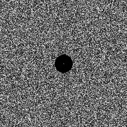
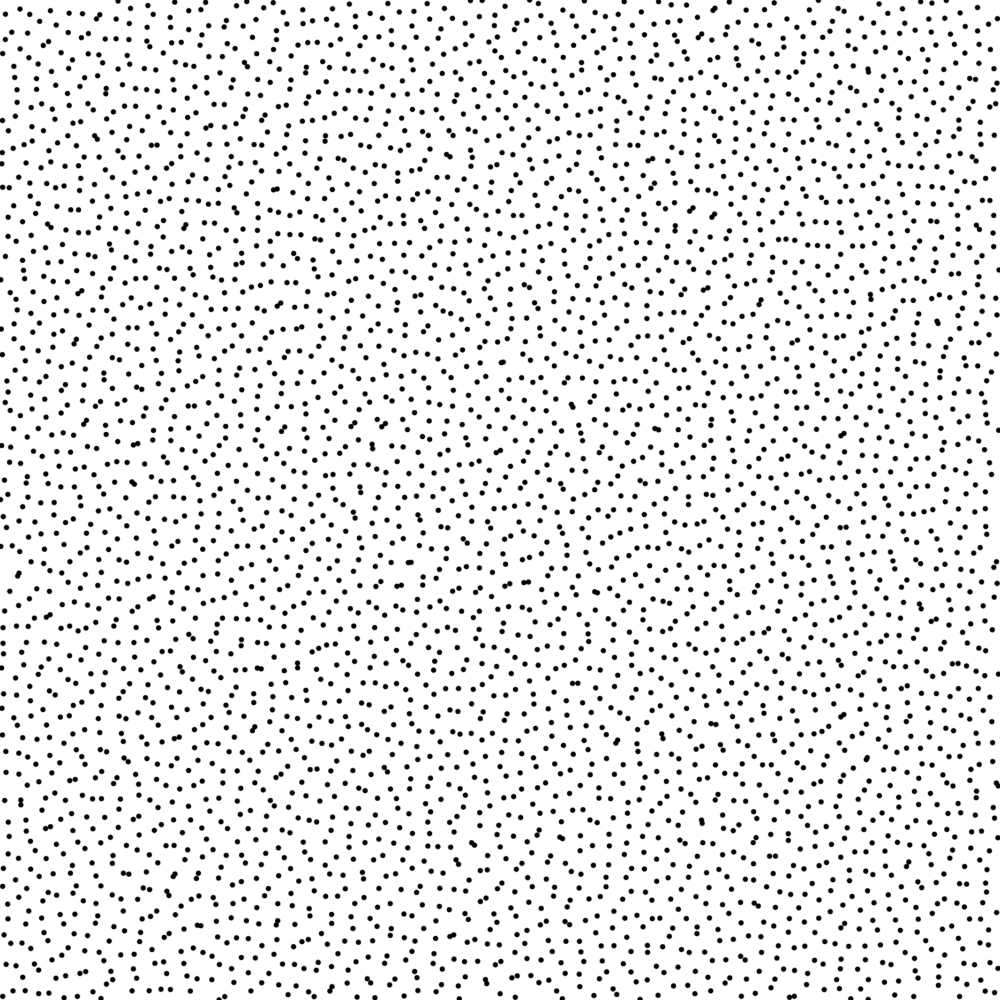

Sampler Step [[HSD13]](http://kops.uni-konstanz.de/bitstream/handle/123456789/24358/Heck_243584.pdf%3Bjsessionid%3D6A7E6EFBFF35CDC5C5F8EBB5928C44F8?sequence%3D2)
-------------------------------------------------------------------------------------------------------------------------------------------------------------------

Files

src/samplers/SamplerStep.hpp  
src/bin/samplers/Step_2dd.cpp.cpp

Description
===========

The sampler from [[HSD13]](http://kops.uni-konstanz.de/bitstream/handle/123456789/24358/Heck_243584.pdf%3Bjsessionid%3D6A7E6EFBFF35CDC5C5F8EBB5928C44F8?sequence%3D2) with a step profile.  
For a more precise description of this sampler and its performances in terms of aliasing and discrepancy, please refer to the following web bundle [https://liris.cnrs.fr/ldbn/HTML_bundle/index.html](https://liris.cnrs.fr/ldbn/HTML_bundle/index.html).

Execution
=========

Parameters:  

	[HELP]
	-o [string=output_pts.dat]	Output file
	-m [int=1]			Number of poinset realisations
	-n [ullint=1024]		Number of samples to generate
	--silent 			Silent mode
	-h 				Displays this help message
			

To generate a 2D point set of 1024 samples with a step distribution, we can use the following client line command:

     ./bin/samplers/Step_2dd -n 1024 -o toto.dat 

Or one can use the following C++ code:

    
    PointsetWriter< 2, double, Point<2, double> > writer;
    writer.open("toto.dat");
    Pointset< 2, double, Point<2, double> > pts;
    SamplerStep s;
    unsigned int param_nbsamples = 1024;
    s.generateSamples< 2, double, Point<2, double> >(pts, param_nbsamples);
    writer.writePointset(pts);
    writer.close();
    			

Results
=======

     ./bin/samplers/Step_2dd -o step_1024.edat -n 1024 

File  
[step_1024.edat](data/step/step_1024.edat)

Pointset  

Fourier  

     ./bin/samplers/Step_2dd -o step_4096.edat -n 4096 

File  
[step_4096.edat](data/step/step_4096.edat)

Pointset  

Fourier  

