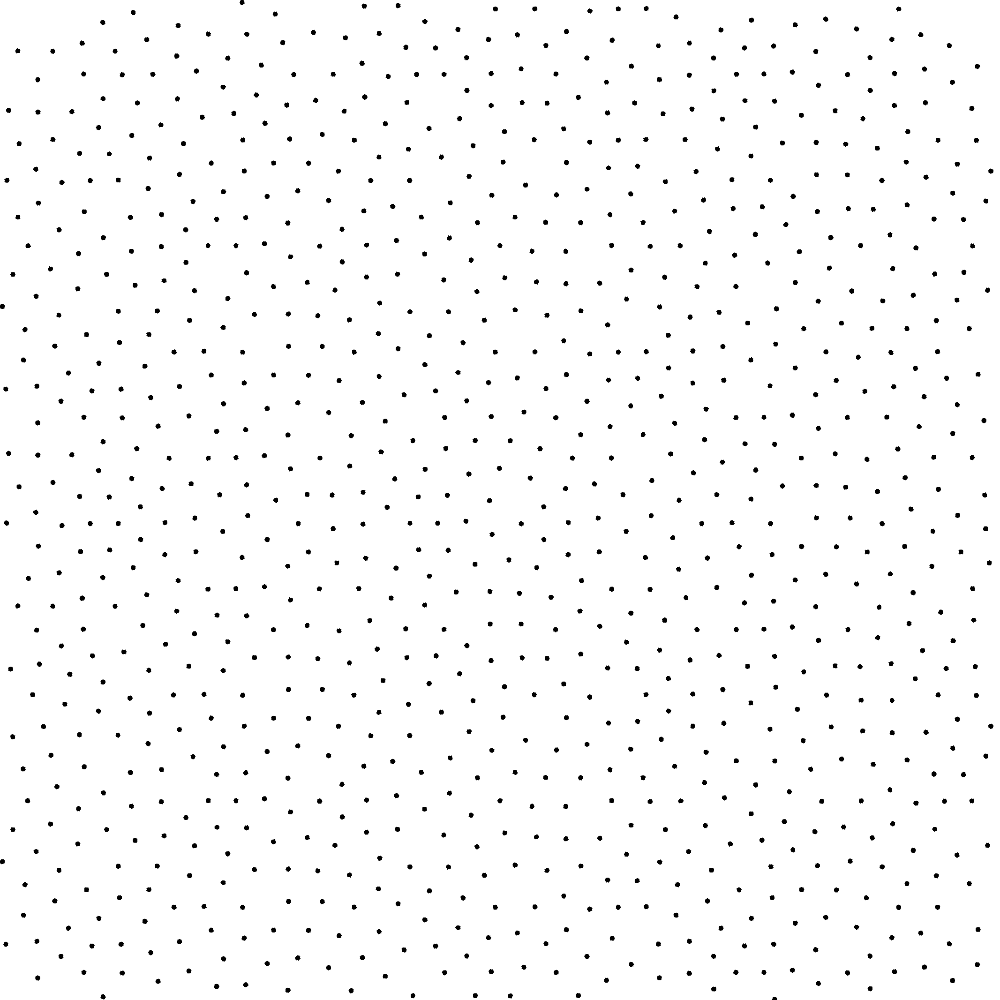
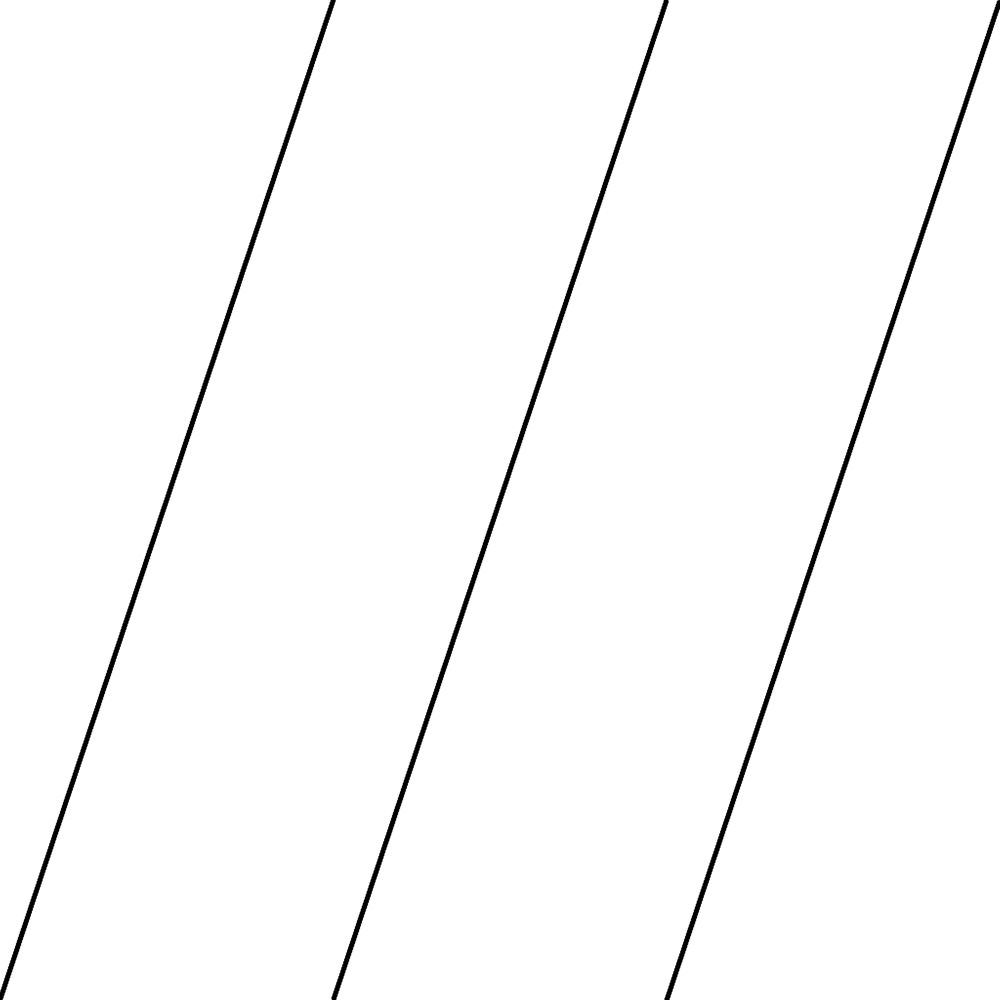
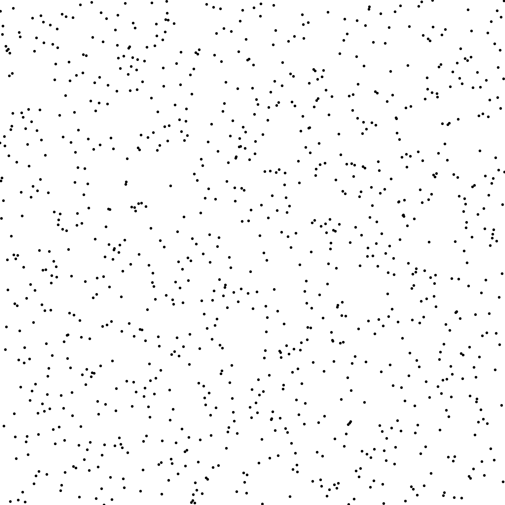
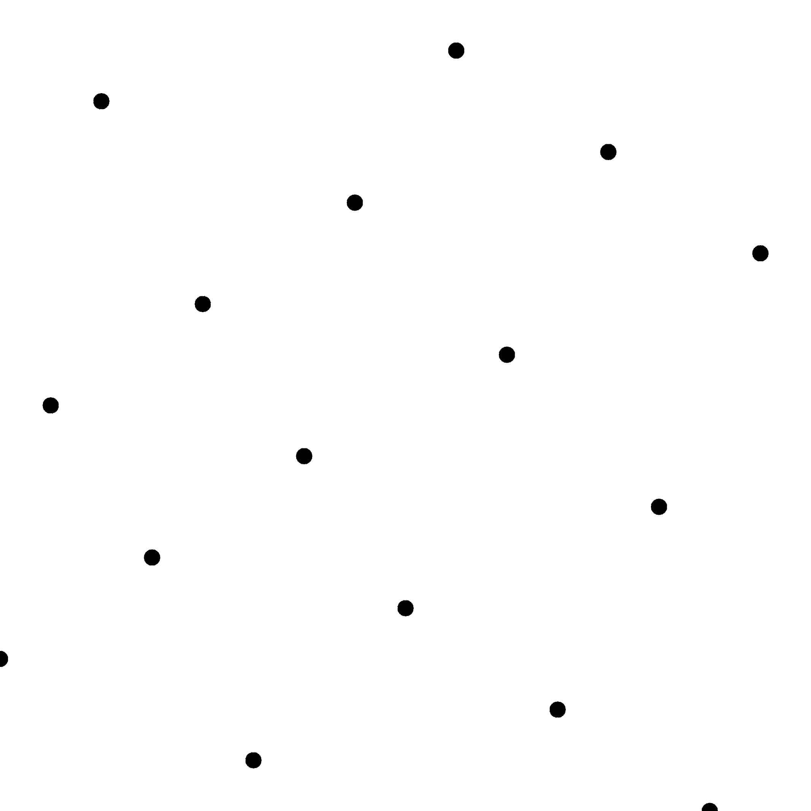

#  Samplers

All samplers are illustrated in 2D but most of them are available in higher dimensions. Please have a look to the code for more details.

## Low Discrepancy Samplers

Sampler | License  |Illustration
--------|------|---
[Faure](../sampler_faure) | LGPL |
[Halton](../sampler_halton)| BSD | 
[Hammersley](../sampler_hammersley) | BSD |
[Niederreiter](../sampler_niederreiter.md) | LGPL | 
[Sobol](../sampler_sobolkuo.md) (code from [\[JK03\]](http://web.maths.unsw.edu.au/~fkuo/sobol/)) | BSD |
[Sobol](../sampler_sobolindiced) (Original) | BSD | 
[Owen](../sampler_owen) (Sobol) | BSD |
[Rank 1](../sampler_rank1) | ??  |
[LDBN](../sampler_ldbn) | BSD |  
[BNLD Sequences](../sampler_BNLDS) | BSD |  
[Progressive MultiJittered Sampling](../sampler_PMJ) | BSD |  

##  Blue Noise Samplers

Sampler | License  |Illustration
--------|------|---
[AA Patterns](../sampler_aapatterns)| See doc |
[ART](../sampler_art) | See doc | 
[CVT](../sampler_CVT)  | See doc| 
[CapCVT](../sampler_CapCVT)| See doc | 
[Forced Random](../sampler_forced_random) | open | 
[FPO](../sampler_FPO)| See doc |
[LDBN](../sampler_ldbn) |BSD |
[Penrose](../sampler_penrose) | See doc|
[BNOT](../sampler_BNOT)| BSD and GPL |
[Lloyd 3D](../sampler_Lloyd)| See doc | 

## Poisson Disk Samplers

Sampler | License  |Illustration
--------|------|---
[Dart Throwing](../sampler_dart_throwing) | BSD | 
[Fast Poisson Disk](../sampler_fastpoisson)| Public domain | 

## Other Samplers

Sampler | License  |Illustration
--------|------|---
[CMJ](../sampler_cmj) | BSD | 
[Hexagonal Grid](../sampler_hexagonal_grid)| BSD| 
[Korobov](../sampler_korobov) | BSD|
[NRooks](../sampler_nrooks) | BSD |
[Regular Grid](../sampler_regular_grid) | BSD|
[Single Peak](../sampler_singlepeak) | See doc |
[Step](../sampler_step)| See doc | 
[Stratified](../sampler_stratified) | BSD|
[Whitenoise](../sampler_whitenoise) | BSD|

## Experimental Samplers

Sampler | License  |Illustration
--------|------|---
[Exhaustive Owen](../sampler_exhaustive_owen)| BSD| 
[Genetic Owen](../sampler_genetic_owen)| BSD| 
[Gradient descent](../sampler_gradient_descent)| BSD| 
