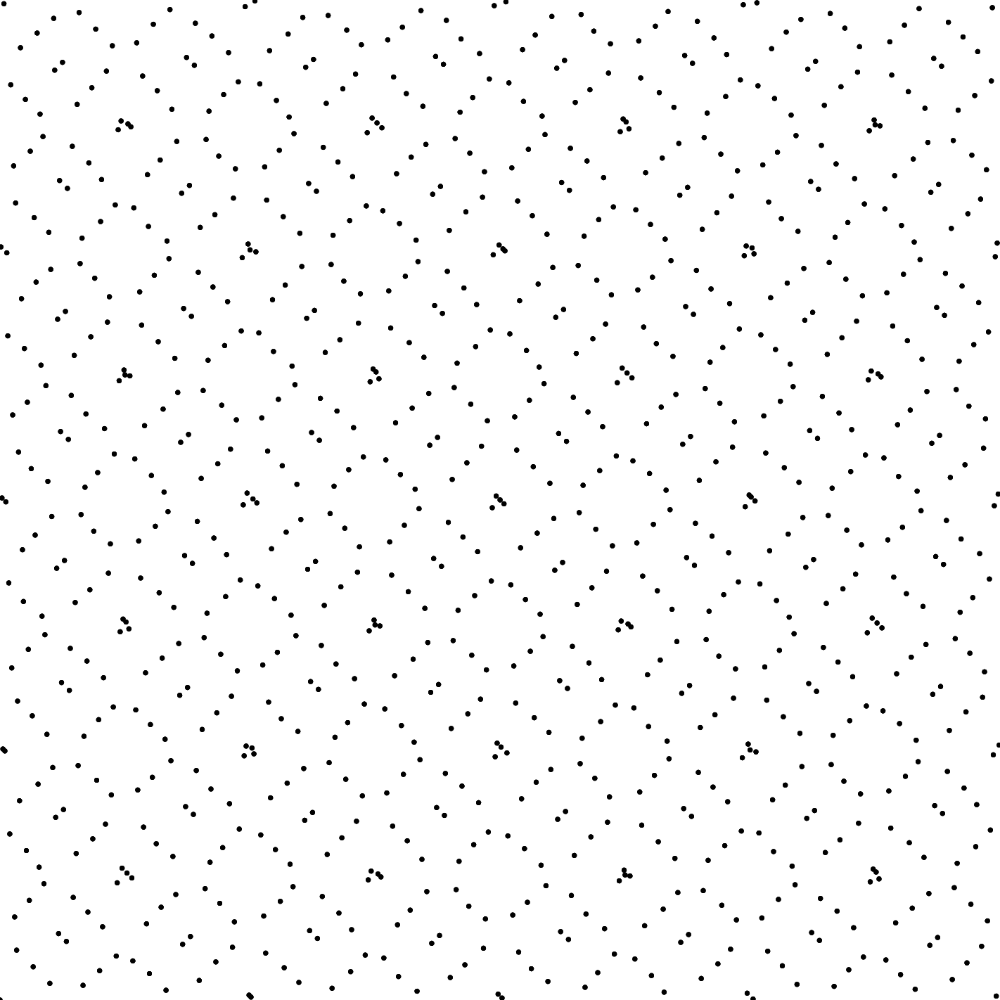

# Scrambling Cranley Patterson

## Files

    src/scrambling/ScramblingCranleyPatterson.hpp  
    src/scrambling/CranleyPatterson_*d*.cpp

## Description

Randomize a point set. Picks D random values which are each added to the D^th coordinate of each sample of the input point set. If the point gets outside the domain, it is torically duplicated.

## Execution

```
Parameters:  

	[HELP]
	-i [string]	Input file
	-o [string=output_pts.dat]	Output file
	--silent 			Silent mode
	-h 				Displays this help message
```


To generate a 2D point set of 1024 samples with a whitenoise distribution, we can use the following client line command:

    ./src/scrambling/CranleyPatterson_2dd -i pointset.edat -o scrambledset.edat

Or one can use the following C++ code:

    ScramblingCranleyPatterson scrambler;
    Pointset< D, T, P > pts;
    Pointset< D, T, P > pts_scrambled;
    //we assume pts is filled
    scrambler.scramble< D, T, P >(pts, pts_scrambled);
    PointsetWriter< D, T, P > writer;
    writer.open("scrambledset.edat");
    writer.writePointset(pts_scrambled);
    writer.close();


## Results

     ./src/scrambling/CranleyPatterson_2di -i sobol_m3_1024.edat -o scrambled.edat

Input  
[sobol_m3_1024.edat](data/cranleypatterson/sobol_1024.edat)  
[](data/cranleypatterson/sobol_1024.png)

Output  
[scrambled_m3.edat](data/cranleypatterson/scrambled_m3.edat)  
[](data/cranleypatterson/scrambled1.png)


[](data/cranleypatterson/scrambled2.png)


 [](data/cranleypatterson/scrambled3.png)
