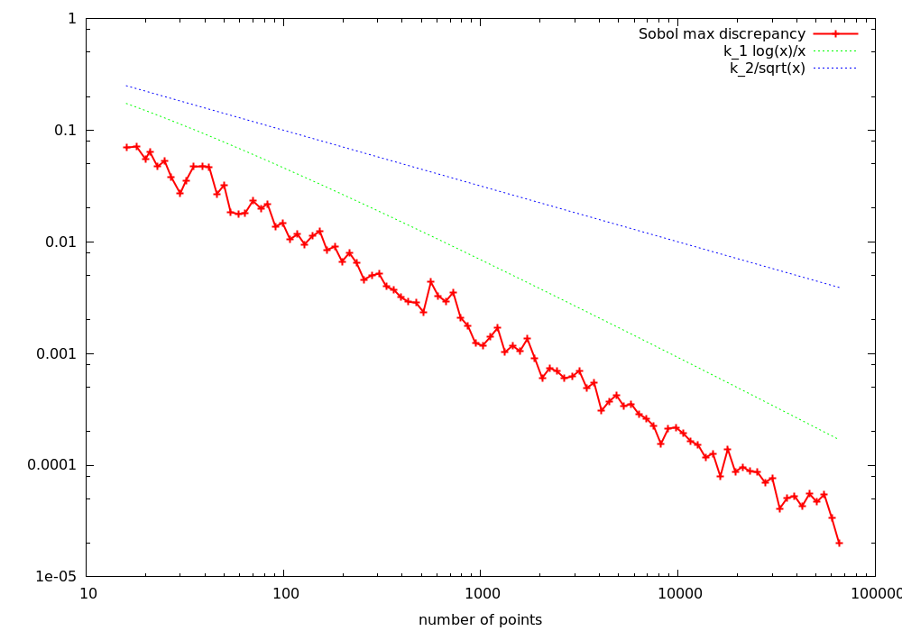

# Discrepancy graph

## Files

    src/scripts/generate_discrepancy_graph_onfly.sh

## Description

This test executes a given sampler and discrepancy test to generate a graph of discrepancy. This tests outputs the discrepancy data, but it can also output a png graph using gnuplot. Note that the generated graph also plots the theoretical 2D star discrepancy for low discrepancy samplers and a pure random sampler. If plotting discrepancy for higher dimensional samplers or using a discrepancy different than the l_inf star discrepancy, those references won't be pertinent.

## Execution

```
Parameters:  

[Help]
-s | --sampler the sampler executable
WILL BE RUN AS ./sampler_exe -o [ouput file] -n [nb_points]
-d | --discrepancer the executable computing the discrepancy
WILL BE RUN AS ./discrepancy_exe -i [input pointset] -o [ouput file]
--min the min value of the resulting graph
--max the max value of the resulting graph
--step the step between tho points of the graph (regular stepping)
--log 			 if set, the min value will be 2^min, the max 2^max and the step 2^step
--silent 		 set the script to silent mode
--gnuplot		 if set, gnuplot will be called to generate a simple plot of the final graph
--sort 			 if set, the resulting graph will be sorted automatically
--sname 		 sets the sampler name. If not given, this name will be deduced from the sampler executable
```

## Results

     ../src/scripts/generate_discrepancy_graph_onfly.sh -s "./src/samplers/Whitenoise_2dd" -d "./src/discrepancy/StarDiscrepancy_fromfile_2dd" --min 4 --max 8 --step 0.5 --log --sort --gnuplot

File  
[Whitenoise_2dd_discrepancy_graph_StarDiscrepancy_fromfile_2dd_3671.dat](data/discrepancy_graph/Whitenoise_2dd_discrepancy_graph_StarDiscrepancy_fromfile_2dd_3671.dat)

Graph  
[](data/discrepancy_graph/Whitenoise_2dd_discrepancy_graph_StarDiscrepancy_fromfile_2dd_3671.png)

```
 ../src/scripts/generate_discrepancy_graph_onfly.sh
-s "./src/samplers/Sobol_2dd -d ../data/sobol/new-joe-kuo-6.21201"
-d "./src/discrepancy/GeneralizedL2Discrepancy_fromfile_2dd"
--min 4 --max 16 --step 0.125 --log --sort --gnuplot --sname Sobol
```

File  
[Sobol_discrepancy_graph_GeneralizedL2Discrepancy_fromfile_2dd_16456.dat](data/discrepancy_graph/Sobol_discrepancy_graph_GeneralizedL2Discrepancy_fromfile_2dd_16456.dat)

Graph  
[](data/discrepancy_graph/Sobol_discrepancy_graph_GeneralizedL2Discrepancy_fromfile_2dd_16456.png)

```
 ../src/scripts/generate_discrepancy_graph_onfly.sh -s "./src/samplers/Stratified_4dd"
-d "./src/discrepancy/GeneralizedL2Discrepancy_fromfile_4dd"
--min 6 --max 18 --step 1 --log --sort --gnuplot
```

File  
[Stratified_4dd_discrepancy_graph_GeneralizedL2Discrepancy_fromfile_4dd_24898.dat](data/discrepancy_graph/Stratified_4dd_discrepancy_graph_GeneralizedL2Discrepancy_fromfile_4dd_24898.dat)

Graph  
[](data/discrepancy_graph/Stratified_4dd_discrepancy_graph_GeneralizedL2Discrepancy_fromfile_4dd_24898.png)
