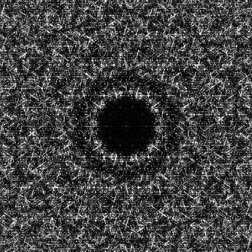
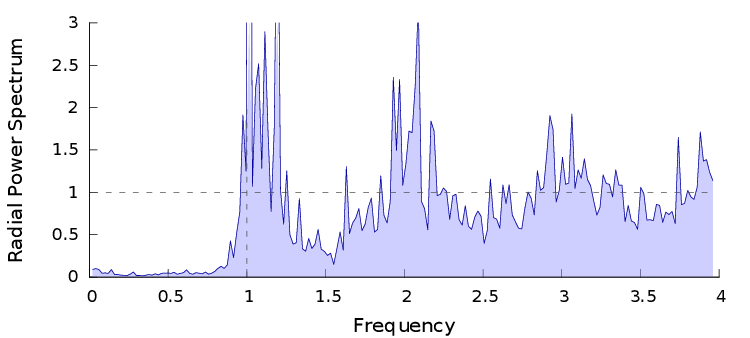
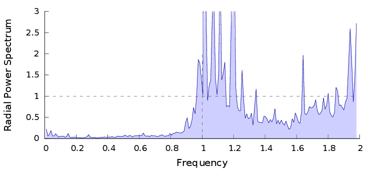
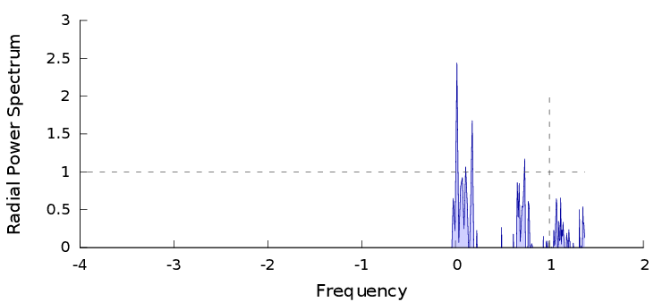

# Fourier Analysis

## Files

    src/spectral/Fourier2D.hpp  
    src/spectral/Fourier_2dd.cpp

## Description

Computes the Fourier power spectrum of the input point set (Discrete Fourier Transform). Can return a .png of the Fourier power spectrum, a .dat of the Fourier power spectrum, a .dat opf the Fourier spectrum, and/or a .dat of the radial average of this spectrum. The radial average can then be plotted using the [following script](wip.html). This executable relies on the FFTW library.

!!! note
     This tool requires FFTW library. You would also need to set  `cmake .. -DUSE_FFTW=true` when generating the project.


## License

BSD, see `Fourier2D.hpp`

## Execution

```
Parameters:  

	[HELP]
	-h 				Display this help message
	-i [string]			The input pointset
	--domain [double=4]		The fourier domain ( D*sqrt(N) )
	--Fdat [string]			The file to write the fourier spectrum
	--Pdat [string]			The file to write the power spectrum
	--Rdat [string]			The file to write the radial spectrum
	--radial-nbbins [uint=200]	The number of bins in the radial hitogram.
	-P [string]			The image to draw the power spectrum
	--limit-size 			If set, the discretization will be limited onto 4096^2.
					This allows to compute the Fourier spectrum of big pointsets but
					changes the domain
	--log-bins 			If set, the radial bins size will increase logarithmically
```


To generate the fourier spectrum of a given point set, we can use the following client line command:

     ./src/spectral/Fourier_2dd -i penrose4096.dat -P fourier.png

Or one can use the following C++ code:

``` cpp
    bool param_limit_size = false;
    double domain = 4.0;
    uint param_radial_nbbins=200;

    Fourier2D fourier;
    fourier.setDomain(domain);
    fourier.setNbBinsRadial(param_radial_nbbins);
    Pointset< D, double, Point > pts;
    fourier.compute< 2, double, Point<2, double> >(pts, param_limit_size);

    HistogramWriter<2, double, double> writer;
    writer.open("spectrum.dat");
    writer.writeHistogram(fourier.spectrum_data);
    writer.close();

    writer.open("power.dat");
    writer.writeHistogram(fourier.power_spectrum_data);
    writer.close();

    writer.open("radial.dat");
    writer.writeHistogram(fourier.radial_data);
    writer.close();
```

## Results

     ./src/spectral/Fourier_2dd -i penrose4096.dat -P fourier.png --Rdat radial.dat

File  
[penrose4096.dat](data/fourier/penrose4096.dat)

Fourier  
[](data/fourier/fourier.png)

Radial  
[](data/fourier/radial.png)  
[radial.dat](data/fourier/radial.dat)

     ./src/spectral/Fourier_2dd -i penrose4096.dat -P fourier_domain2.png --Rdat radial_domain2.dat --domain 2

File  
[penrose4096.dat](data/fourier/penrose4096.dat)

Fourier  
[](data/fourier/fourier_domain2.png)

Radial  
[](data/fourier/radial_domain2.png)  
[radial_domain2.dat](data/fourier/radial_domain2.dat)

     ./src/spectral/Fourier_2dd -i penrose4096.dat -P fourier_log.png --Rdat radial_log.dat --log-bins

File  
[penrose4096.dat](data/fourier/penrose4096.dat)

Fourier  
[](data/fourier/fourier_log.png)

Radial  
[](data/fourier/radial_log.png)  
[radial_log.dat](data/fourier/radial_log.dat)
