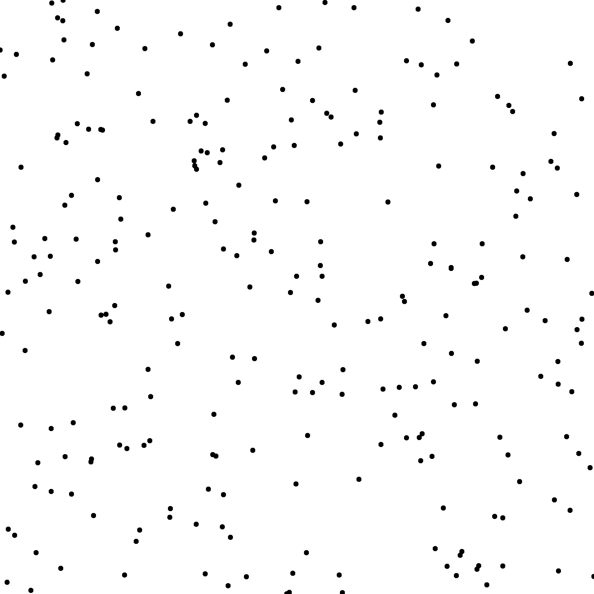

# Minimal Distance

## Files

    src/bin/statistics/computeMinDist_2dd.cpp  
    src/statistics/MinimalDistance.hpp

## Description

The minimal distance between samples is computed by taking all distances between pairs of samples and keeping the minimum. Maximizing this distance can be a way to improve the quality of a point set.

## License

BSD, see source codes.

## Execution

```
Parameters:  

	[HELP]
	--silent 		Silent mode
	-h Displays this help message
	-i the input pointset
	--non-toric does not compute toric distances
```

Note that by default the program computes the toric minimal distance between 2D samples. The minimal distance is a measure that is only valid when performed over several realisations of a sampler. Hence, the executable returns a variance, minimal, maximal and average of all minimal distances of all point sets is the input file.

To compute the minimal distance from a file containing one or several 2D point sets, we can use the following client line command:

     ./bin/statistics/computeMinDist_2dd -i toto.dat

Or to compute the min distance of a single point set, one can use the following C++ code:

``` cpp  
    MinimalDistance md_engine;
    Pointset< 2, double, Point<2, double> > pts;
    bool toric = true;
    //we assume pts is filled

    double mindist;
    md_engine.compute<2, double, Point<2, double> >(pts, toric, mindist);
```


## Results



From 10 realisations of the random sampler  
[whitenoise_m10_256.dat](data/mindist/whitenoise_m10_256.dat)

```
 ./bin/statistics/computeMinDist_2dd -i whitenoise_m10_256.dat
#Samples	#Avg MinDist	#Var MinDist	#Max MinDist	#Min MinDist
256	0.00348864	1.39075e-06	0.00514913	0.00122
```

```
 ./bin/statistics/computeMinDist_2dd -i whitenoise_m10_256.dat --non-toric
#Samples	#Avg MinDist	#Var MinDist	#Max MinDist	#Min MinDist
256	0.00351797	1.5076e-06	0.00544248	0.00122
```


From a single realisations of the Sobol sequence, with integer samples  
[sobol_256.edat](data/mindist/sobol_256.edat)

Note that in this case, we have to use a .edat file to store our samples, otherwise the size of the domain is unknown and therefore we cannot provide toric distances.

```
 ./bin/statistics/computeMinDist_2dd -i sobol_256.edat
#Samples	#Avg MinDist	#Var MinDist	#Max MinDist	#Min MinDist
256	1.41421	0	1.41421	1.41421
```
