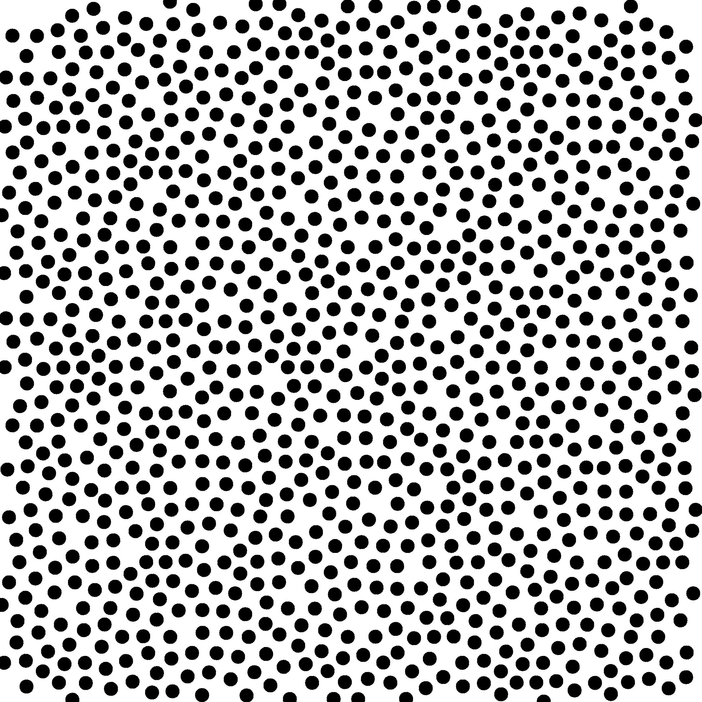
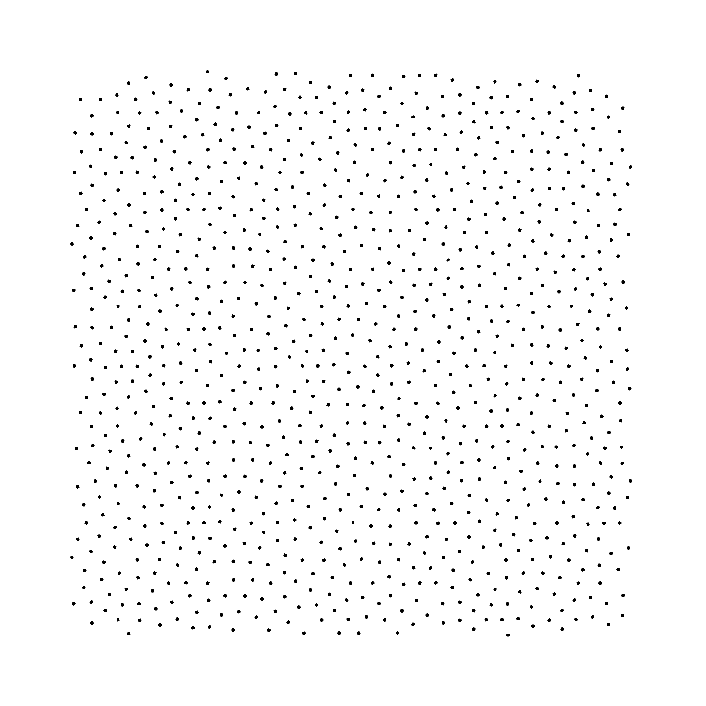
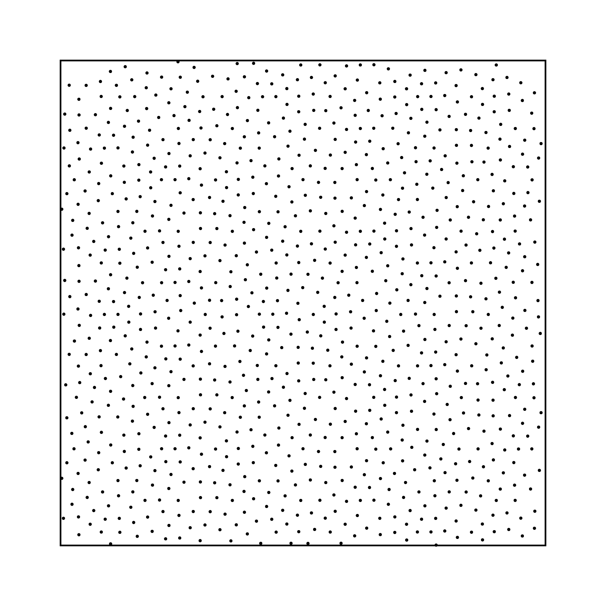
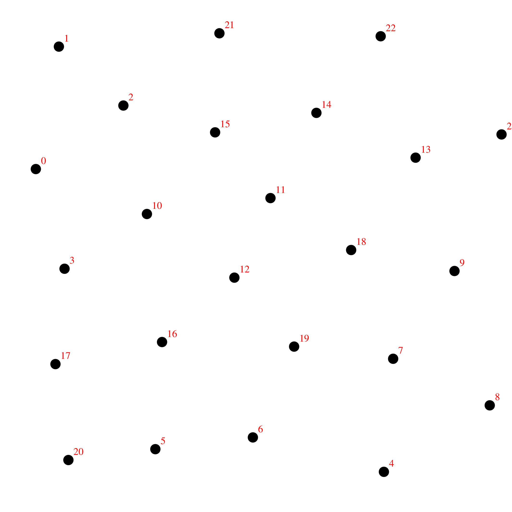

# Draw Pointset

## Files

    src/bin/utils/draw_fromfile_2dd.cpp  

## Description

An executable that returns a illustration of a 2D input pointset.

## Execution

```
Parameters:  

	[HELP]
	-i [string]		 		The input pointset
	-o [string]		 		The output image
	-h					Displays this help message
	--radius [0< double <1 =0.0025]		The point radius
	--tiled 	 			display 3x3 tiling of the point set
	--numbering 	 			Numbered samples
	--fontsize [int=10]			Font size
	--offset [0 <= int < 0.5 =0]		Border size
	--border 	 			Numbered samples
```


Note the input pointset should be either a 2D pointset defined in the domain [0,1], or a 2D pointset with a ebin or edat format.

To draw a pointset one can use the following client line command

     ./bin/utils/draw_fromfile_2dd -i pointset_file.dat -o pointset_draw.ps

Or the following C++ code:

``` cpp    
    double radius=0.0025;
    bool tiled=false;
    bool numbering=false;
    bool drawborder=false;
    double offsetsize=0;
    int fontsize=10;

    Pointset<2, double, Point<2, double> > pts;

    PointsetReader<2, double, Point<2, double> > pts_reader;
    pts_reader.open("pointset_file.dat");
    pts_reader.readPointset(pts);
    pts_reader.close();

    PointsetIllustrator<2, double, Point<2, double> > illu;

    illu.setBorderSize(offsetsize);
    illu.setNumbered(numbering);
    illu.setFontSize(fontsize);
    illu.setTiled(tiled);
    illu.setPointRadius(radius);
    illu.open("pointset_draw.ps");
    illu.setColor(0, 0, 0);
    if(drawborder)
    	illu.drawRectangle(offsetsize, offsetsize, 1-2*offsetsize, 1-2*offsetsize, 0.0025);
    illu.drawPointset(pts);

    illu.close();
```    			

## Results

     ./bin/utils/draw_fromfile_2dd -i penrose1024.dat -o pointset_rad001.ps --radius 0.01

Input Pointset  
[penrose1024.dat](data/draw/penrose1024.dat)

Output image  
[](data/draw/pointset_rad001.png)

.PS File  
[pointset_rad001.ps](data/draw/pointset_rad001.ps)

     ./bin/utils/draw_fromfile_2dd -i penrose1024.dat -o pointset_rad0005.ps --radius 0.01

Input Pointset  
[penrose1024.dat](data/draw/penrose1024.dat)

Output image  
[](data/draw/pointset_rad0005.png)

.PS File  
[pointset_rad0005.ps](data/draw/pointset_rad0005.ps)

     ./bin/utils/draw_fromfile_2dd -i penrose1024.dat -o pointset_tiled.ps --tiled

Input Pointset  
[penrose1024.dat](data/draw/penrose1024.dat)

Output image  
[](data/draw/pointset_tiled.png)

.PS File  
[pointset_tiled.ps](data/draw/pointset_tiled.ps)

     ./bin/utils/draw_fromfile_2dd -i penrose1024.dat -o pointset_offset.ps --offset 0.1

Input Pointset  
[penrose1024.dat](data/draw/penrose1024.dat)

Output image  
[](data/draw/pointset_offset.png)

.PS File  
[pointset_offset.ps](data/draw/pointset_offset.ps)

     ./bin/utils/draw_fromfile_2dd -i penrose1024.dat -o pointset_offsetborder.ps --border 0.02 --offset 0.1

Input Pointset  
[penrose1024.dat](data/draw/penrose1024.dat)

Output image  
[](data/draw/pointset_offsetborder.png)

.PS File  
[pointset_offsetborder.ps](data/draw/pointset_offsetborder.ps)

     ./bin/utils/draw_fromfile_2dd -i penrose25.dat -o pointset_nb.ps --numbering --radius 0.01

Input Pointset  
[penrose25.dat](data/draw/penrose25.dat)

Output image  
[](data/draw/pointset_nb.png)

.PS File  
[pointset_nb.ps](data/draw/pointset_nb.ps)

     ./bin/utils/draw_fromfile_2dd -i penrose25.dat -o pointset_nb_font.ps --numbering 		--radius 0.01 --fontsize 15 

Input Pointset  
[penrose25.dat](data/draw/penrose25.dat)

Output image  
[](data/draw/pointset_nb_font.png)

.PS File  
[pointset_nb_font.ps](data/draw/pointset_nb_font.ps)
